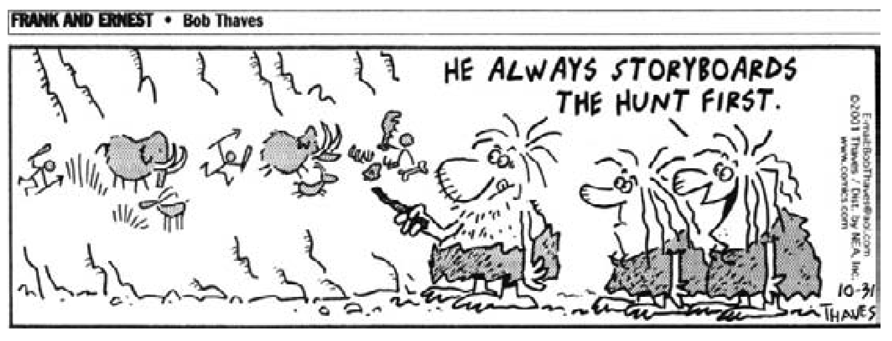
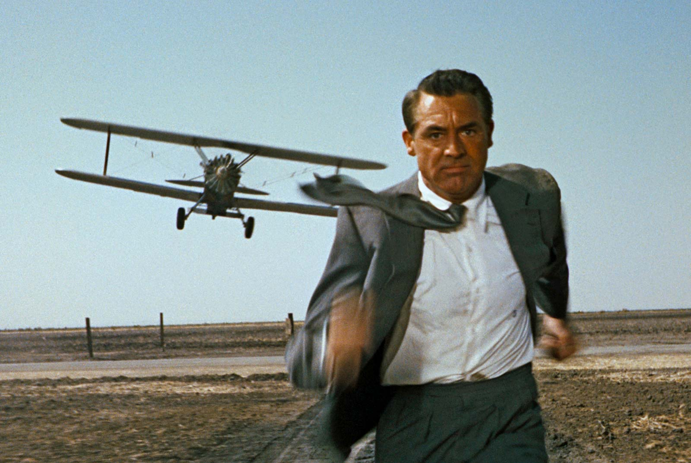
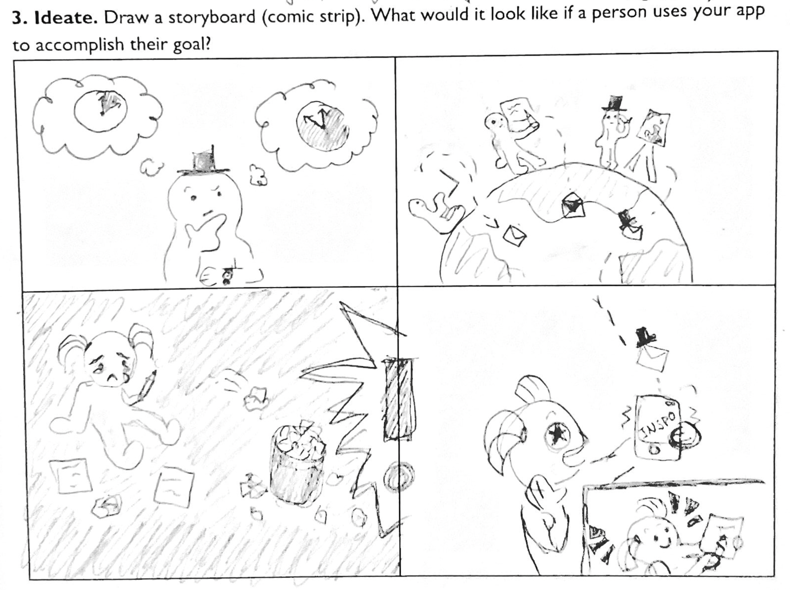
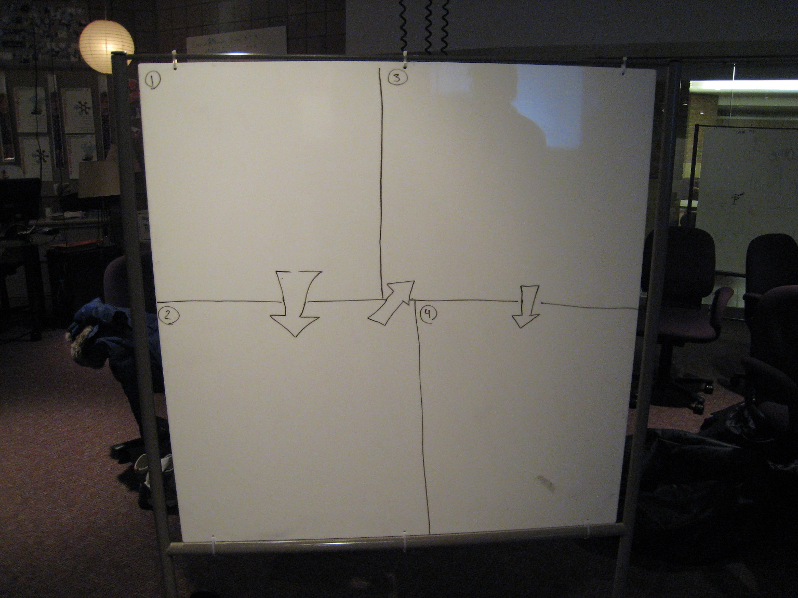
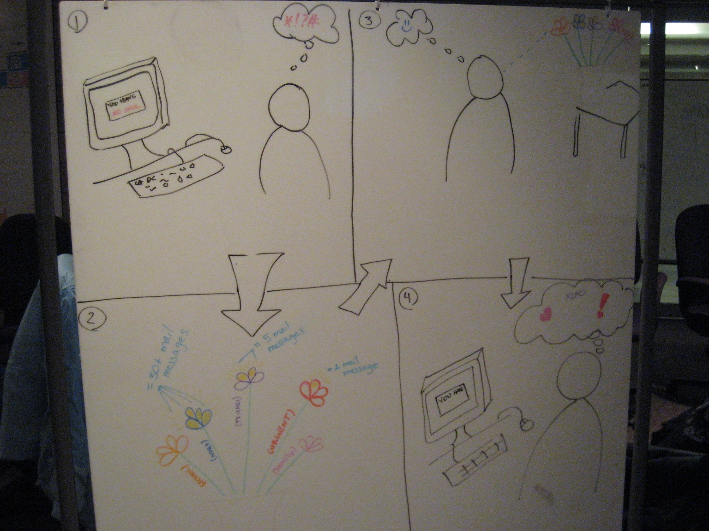
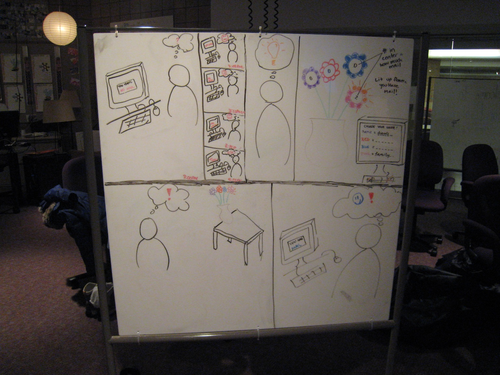

::: {.r-fit-text}
Week SIX
:::

# Scenarios

##

::: {.notes}
We suspect storyboards are a longstanding tool of humans, but we can't be sure exactly how old they are. This cartoon was reprinted in @Simon2007.
:::

##
{fig-align="center"}

::: {.notes}
Detail from the cover of @Costola2022

Scenarios have been a building block since at least 1545, when Commedia dell'Arte began in Italy. There, the scenario consisted of ingredients that actors could use to improvise a comic routine.
:::

##
{fig-align="center"}

::: {.notes}
Now we fast-forward to 1955, when Alfred Hitchcock, like many filmmakers, used storyboards to plan his projects. Hitchcock hired a sketch artist and zoomed around his office with his arms outstretched to simulate the menacing airplane in this scene from *North by Northwest*.
:::

##
{fig-align="center"}

::: {.notes}
The storyboard was a means to an end and the end is seen in this still from *North by Northwest*.
:::

##
{fig-align="center"}

::: {.notes}
Beginning of the Picking Up a Key exercise from @Mccloud2006

Storyboards are sometimes an end in themselves in comics, although they are used to plan comics. You did an exercise in using a storyboard to tell a complete story with *Picking up a key*.
:::

##
{fig-align="center"}

::: {.notes}
Example from @Aaseng2020

You don't need much skill to draw the figures you need in a storyboard. Try imitating this action pose.
:::

##
{fig-align="center"}

::: {.notes}
Example from @Aaseng2020

There are many ways to convey dialog or thoughts in storyboards. You don't always need words but, when you do, you can contextualize them in many types of balloons.
:::

## Difference between scenarios and storyboards
- The *scenario* is the concept
- The *storyboard* is the implementation
- Both words are often used interchangeably

## How to use scenarios

::: {.incremental}
- represent the story of the work
- represent a successful process
- inject the personas into their work
- illustrate what you found from contextual inquiry
:::

## types of scenario frames

## Characteristics

::: {.incremental}
- Readable like a comic strip
- One step per frame
- Rough user interfaces
- Manual actions
- Cartoons of people
:::

## Evaluate the scenario
- include words where a stranger would not understand
- show storyboard to someone: ask what it says
- check for
  - confusion
  - inconsistencies
  - too much detail

## Advice
- avoid design choices
- avoid cut and paste artwork
- use hand drawn pictures
- show a progression
- tell a story

## More advice

::: {.notes}
Here's an example from class where the student used the hat and the ponytails to easily identify the two main characters. Matt Groenig, the inventor of the Simpsons, claims that each character needs an easily identifiable characteristic to differentiate that character from others.
:::

## example: from Nielsen Norman group

[https://youtu.be/bNh54LNUtv8](https://youtu.be/bNh54LNUtv8)

## let's do a storyboard in Figma

## divide up canvas like a comic book page

## set a timeline

- amount of time to decide what each panel will convey
  - 10 min to plan
- amount of time to spend on each panel
  - 5 × 4 = 20 min on four panels ✓

## Process
- start at beginning
- then add the end
- finally, fill in the middle

## storyboard topic

- use a project idea if you have one
- else ... use Luigi!
- Mick wants to buy from Luigi
- can be a case or strap

## Parameters
- Mick is concerned about appearance of camera in case or with strap
- Mick is concerned about size and placement of straps when carried
- Mick is concerned about comparative prices
- Mick is impressed by aura Luigi has among photogs

## remember the blank panels?

## after feedback, they tried again

# Up next, Framer and Penpot tutorials

# References

::: {#refs}
:::

---

::: {.r-fit-text}
END
:::

# Colophon

This slideshow was produced using `quarto`

Fonts are *League Gothic* and *Lato*

