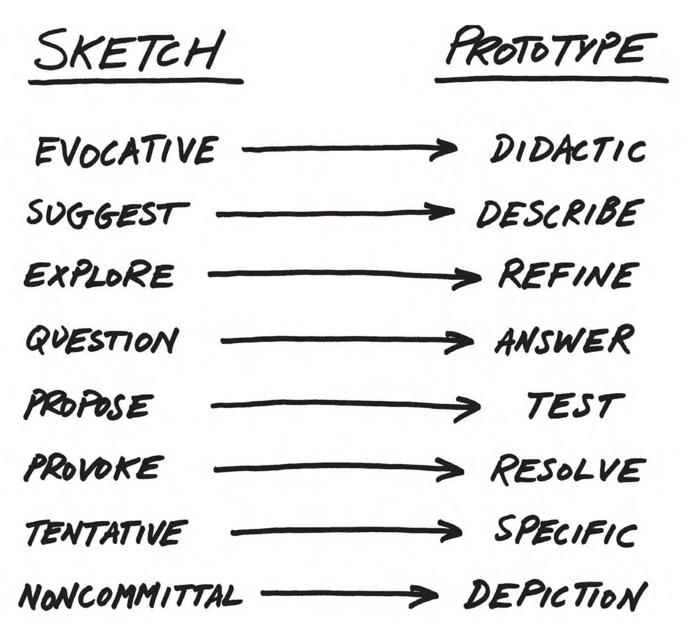
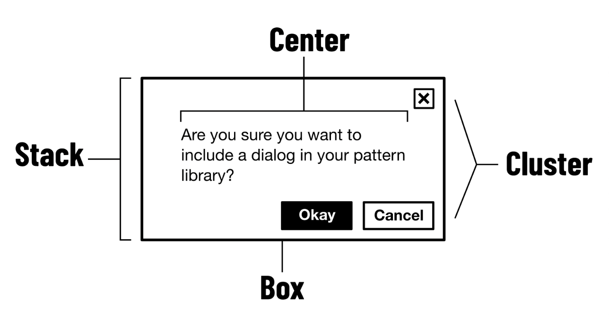
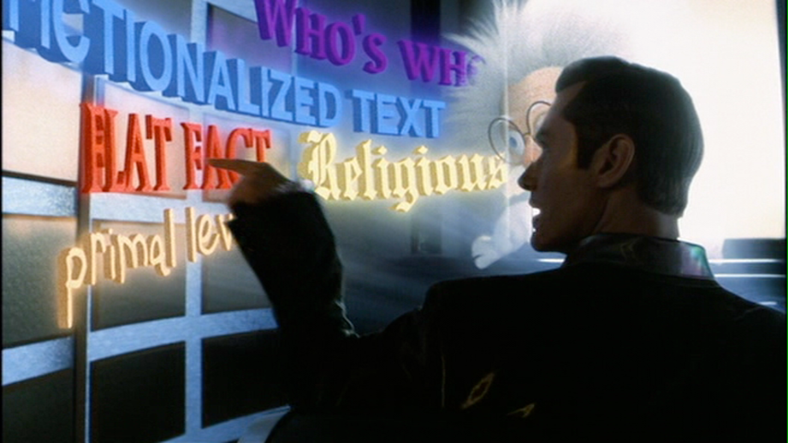
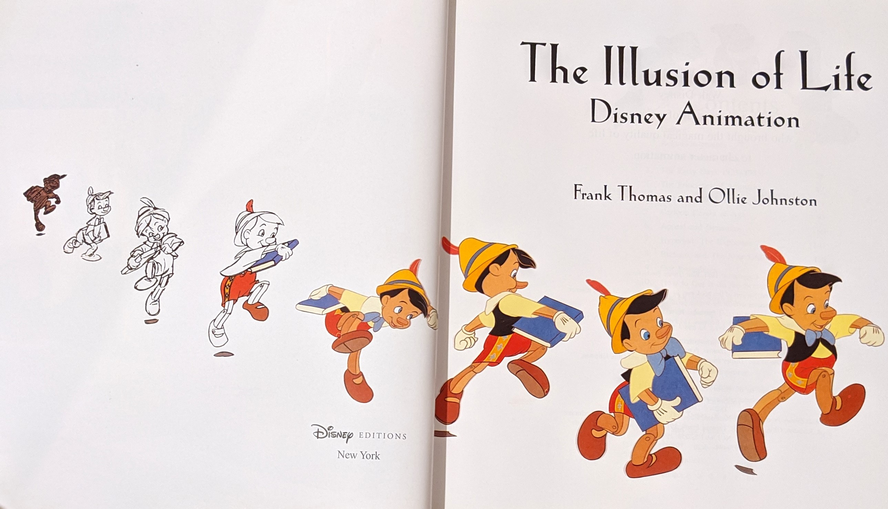
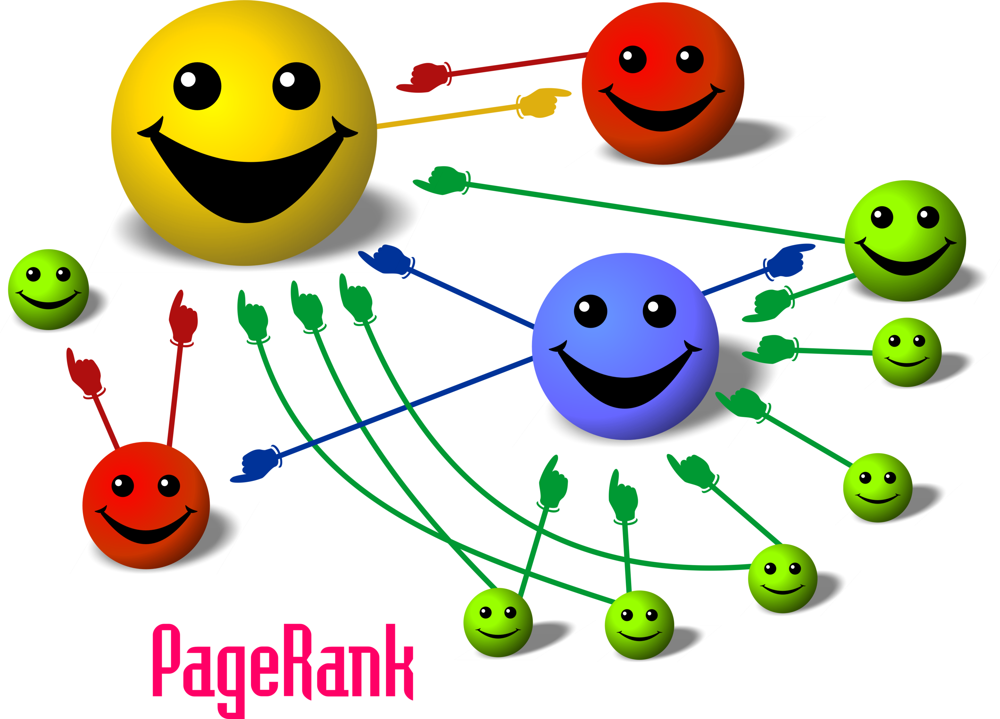
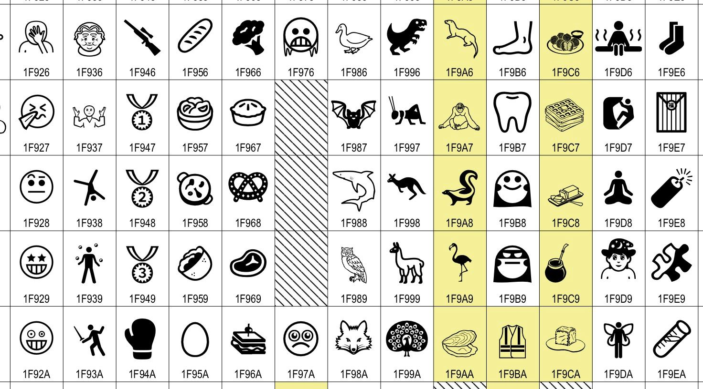
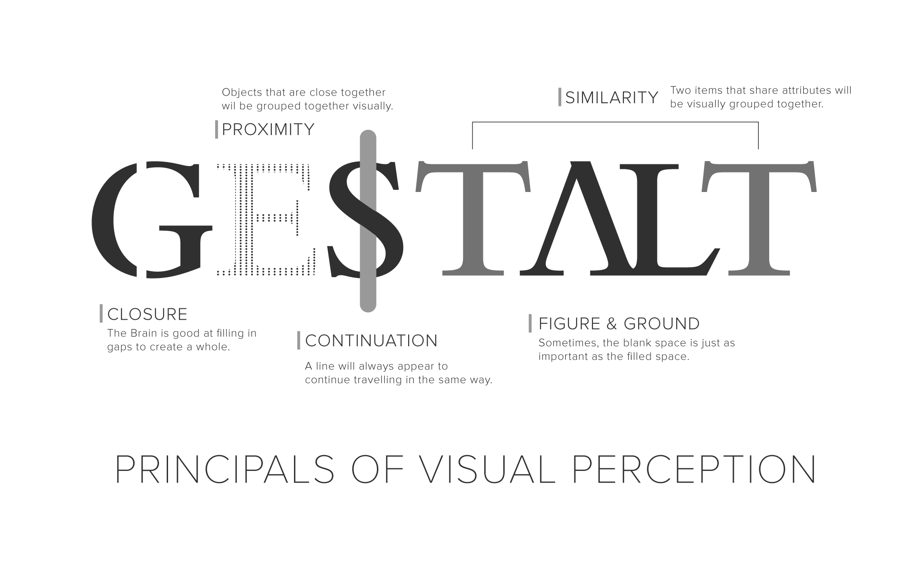
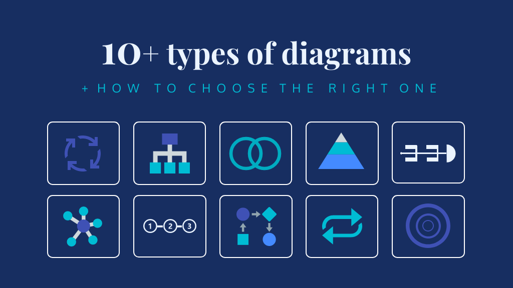

# [Week FOURTEEN]{.r-fit-text}

# Summary

## Two things
- interaction design
- information design

## Interaction design
- design thinking
- iterative design cycle

##

##

## Sketching

## Positioning

## Audiences

## Interaction Design
- Contextual Inquiry
- Personas
- Scenarios
- Prototypes
- User Testing

## Contextual Inquiry

## Personas

## Scenarios

## Prototypes

## Prototypes - Lofi vs Hifi

## Prototype Components - Layout

## Prototype Components - Type

## Prototype Components - Color

## Prototype Components - Microinteractions

## Prototype Components - Animation

## Information
- Personal Information
- Finding Information
- Navigating Information

## Personal Information

## Finding Information

## Navigating Information

## Information Design
- Visual Information
- Theory
- Practice

## Visual Information

## Theory

## Practice


