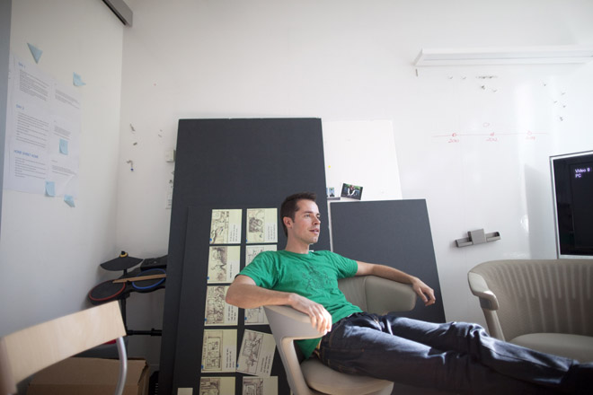
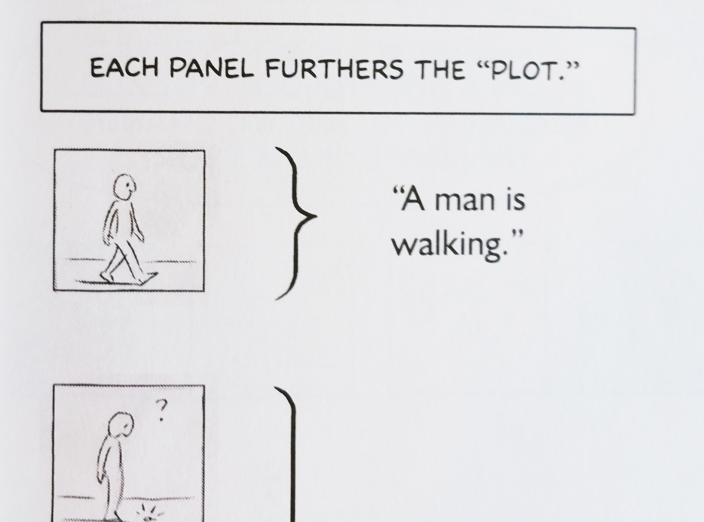
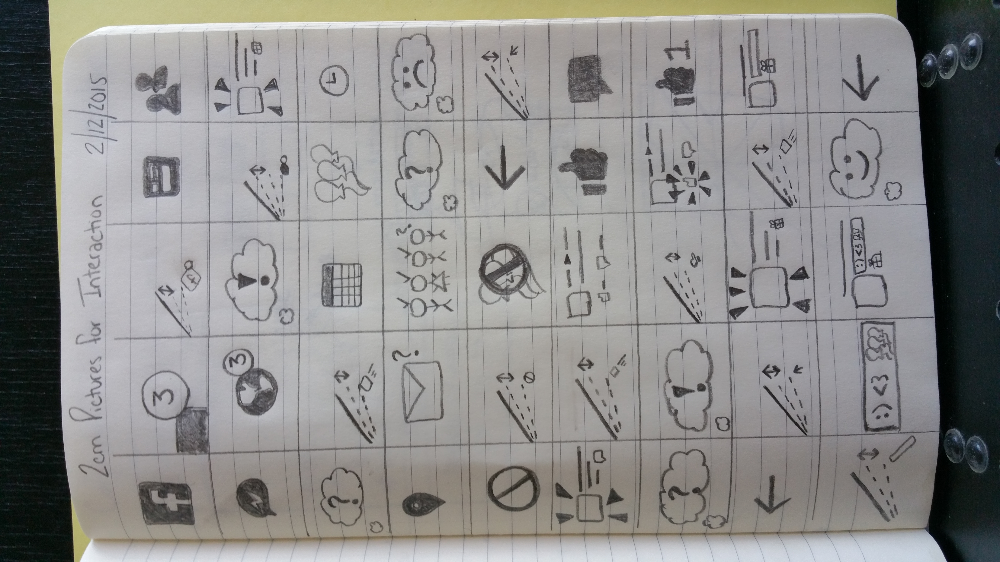

# Exercises

This section has four parts. It starts with things to think about when completing exercises. Next is the *Exercise list*. Third, there are a few paragraphs beginning with *Exercise reflection* about using the exercise experience to build your understanding. Fourth is a list of specific exercise objectives.

## Completing exercises
The following paragraphs give general guidelines about your sketchbook, your process, time constraints, and a storytelling model for exercises.

### General directives
Please do not create zip files. If I ask you to put a picture into a dropbox, please do not enclose it in a zip file. If you put a series of pictures into different files, please number the files, e.g.,

- 01pickingUpAKey.jpg,
- 02pickingUpAKey.jpg,
- 03pickingUpAKey.jpg.

Your name and a lot of numbers will be automatically added to your file name. There is no reason for you to include your name in the file name. There is no reason to include your email address in the file name. A sequence number and the name of the exercise, preferrably with NO SPACES in the name, will work best. Your name really only needs to appear on the first page of the notebook. It should not be too challenging to read your name.

The pictures this time were all in acceptable file formats. I can work with jpg, png, pdf, tif, and some other formats. I can NOT accept doc, docx, ppt, pptx, xls, xlsx, bmp, wmf and some other formats. If you must use an adobe format such as psd, please be aware that I do not necessarily have the ability to read it---I have some versions of adobe software on some computers, but if I can't read it immediately, I will just give it a zero. This is so I can spend more time on things more relevant to class than trying to read proprietary file formats.

The current date should appear on at least the first page and preferrably all the pages, handwritten in your notebook in tiny characters. This is the date on which you did the work, not other dates like dates of handing things in. If you find yourself picking up in the middle of a page on a different day, you should be able to subtly indicate that by including a thin horizontal line and the new date written in tiny characters.

As we look through the pictures, you will notice that some have remarkably small file sizes. If you have any options in transmitting your pictures to me, please opt for the largest possible file size. It will help with interpreting details in the picture. If you notice a lot of camera shake, please try to retake the photo, perhaps bracing the camera against a solid object or slamming the exposure button with slightly less hammerhead force.


### Using your sketchbook



Michael Smuga, studio manager, Windows Phone 7 Development HQ, is seen relaxing while the press photographs him to show that Microsoft is no longer uncool as part of a large publicity campaign prior to the launch of WP7, circa 2010.  Note what appear to be hand-sketched storyboards behind him and I dare you to tell me that this is not an advertisement for doing sketchbooks in this class!

### Diverge then converge
For each exercise, you must diverge or your ideas will be boring. Then you must converge or you will not meet deadlines.
Another way to say this is that you must spend part of each exercise trying to play followed by some time trying to produce.

How do you know whether you have played and produced?
We spoke of the concept of flow and you know that you have that you are playing when you have achieved flow. That is an internal measure you may assess for yourself. An external measure might be a judgment of creativity. Your output is more likely to be assessed as creative if you have played but beware. Your output may be assessed as not creative for another reason. If you fail to converge, you will not have adequately conveyed your creativity. Thus you may find converge a necessary but not sufficient condition for others to appreciate your creativity.

Leonardo was a terrible example of failure to converge. He rarely finished his work and much of it only began to attain prominence centuries after his death. Mona Lisa, for instance, was not widely touted as the greatest example of oil painting until about the past hundred years.

It's easier to see the outcome of convergence than divergence since you have a series of sketches that people can or can't understand.
You have to ask yourself whether people get the message you conveyed.That is separate from whether or not you conveyed a good message. So your creativity may be judged by how good the message was. Your convergence can be defined as how well you conveyed the message you intended to convey.

### Allocate your time
In each exercise, you should try to work within a severe time constraint and prepare a presentable artifact in that time. You should improve your ability to complete each step so that you have something to show at the end. You have to get to know yourself well enough to know what you need to spend the most time doing. Do you struggle with the problem definition? Are you indecisive about which aspect to tackle? Do you struggle with rendering your ideas? Each exercise should contribute a little to your picture of what you need to do to grow.

### Tell a story
Every single exercise from the picking up a key exercise until the last exercise offers the opportunity to tell a story with your solution. Storytelling is one of the oldest and most defining human activities. You must be a good storyteller to be a good designer. People expect to experience stories and you can take advantage of our human predisposition to experiencing storytelling to communicate your design ideas.

Many, perhaps most, great stories are not told in linear time. Stories do not unfold stepwise, like appliance manuals. (Actually, Ikea does assembly manuals that approach storytelling.) You have to develop a way to tell story that takes the viewer's experience into account. This is often starting with a detail and expanding to a big picture or starting with a big picture and drilling down to a detail. It may start with a use case and end with an argument. However you plan a story, you must plan a story.

## Exercise list
Following are exercises used in past versions of the course. The only exercises to be submitted for grading during the current term are those listed in the syllabus.

## Draw a face

Draw two horizontal lines to divide your notebook page into three parts, so each part is about 2 and half inches high.

Step 1 is to draw a human face in left-facing profile in the top third of the page. It is important to do this before looking at steps 2 and 3. Looking at those steps will affect how you do this step, so quit reading this now and draw the face!

Step 2 is to first make sure you have already drawn a face in left-facing profile before reading further. Quit reading! Draw that face in the upper third of your page. Are you sure you've drawn it? Really? Okay, then, step 2 is to draw another face in the middle third of the page but, this time, make one change. Carefully plan this head so that the eye is halfway between the top of the skull and the chin.

Step 3 is to draw a third human face in left-facing profile in the bottom third of the page. This time, use a dime and a half dollar as aids. (This exercise was conceived in an era when half dollar coins were common---your teacher can supply an appropriately sized disk as a substitute.)

This exercise is drawn from the 1964 book *Thinking with a pencil* by Henning Nelms, @Nelms1964, a great book that was just reprinted in June of 2015 for the first time in 30 years. The picture captioned *step 3 of drawing a face* is a photo of my copy of the book.

\begin{figure}[htbp]
\centering
\includegraphics[width=0.72\linewidth]{fiDimeHlfDllr.jpg}
\caption{step 3 of drawing a face, from Nelms (1964), page 17}
\end{figure}

## Picking up a key
Your task is to produce a comic strip of 7 to 9 panels based on a five sentence story, where you alter the last of the five sentences and the identity of the main character.
The exercise comes from
@Mccloud2006, Chapter 1.  On page 13 is a
five-sentence story, told in 8 panels.  The character is
supposed to be a man.  Change the character to a woman
or creature or a different man.  Change the last
sentence (about the lion) to a different ending.  Choose
your own number of panels, anywhere from 7 to 9 panels.
Tell the story your own way. The five sentences are (1) A man is walking. (2) He finds a key on the ground. (3) He takes it with him, then he comes to a locked door. (4) He unlocks the door. (5) Then a hungry lion jumps out. The first panel and part of the second panel are shown in the picture captioned *fragment of making comics, p 13*.



## Harrison Bergeron
In class, someone advanced the claim that we must design for the lowest common denominator if we design something that will be used by people of all levels of technological sophistication. I can think of many arguments against this claim.

Two of the arguments I can think of are advanced in the Kurt Vonnegut short story *Harrison Bergeron*, 1961. Be aware when you consider it that it has been interpreted literally and as meaning the precise opposite of its literal meaning. In other words, it has been interpreted by some as warning against the dangers of catering to the least common denominator and by others as warning against the dangers of worrying about catering to the least common denominator. The former interpretation is favored by Fox News. The latter interpretation is favored by literary critics and the author of the story. I do say that in the hope of prejudicing you in favor of the latter interpretation but the fact that the story functions to support two opposing points of view serves to illustrate the fact that a device can serve two completely different groups of social commentators with two completely different kinds of analytical skills and abilities.

Please discuss the notion of a design target population and reaching them with respect to this least common denominator idea and alternatives. 
Please produce some written assertions in a Google Drive document.
These may contradict each other but should come to some kind of resolution in a summary. When I say resolution, I don't mean that you must agree. That resolution could be that there are two (or n) points of view. In such a case, the summary will enumerate and briefly descrbe them. If you are in agreement, then describe that upon which you agree.

## Extreme emphasis

Draw about eight panels in your sketchbook from the Robin Williams monologue in the file extreme-emphasis.mp3. This has been sometimes available on Youtube under the title, *Good Morning Vietnam - First Time on Air.* Your goal is to letter the monologue in a way that conveys the extremes of expression in the comedian's voice and face.  The drawings and continuity are not the issue here---any eight moments from the sequence will do. Note that you are not asked to draw pictures of a person, a microphone, a room, nor any other representation that the comedian mentions. You are being asked to draw pictures of the words themselves. Icons or pictures that support the words are okay, but the depictions of the words is the central theme.
This exercise is from @Mccloud2006, Chapter 3, page 157, exercise 5.

## Record interaction

Spend a total of 25 minutes interacting with an app and documenting your experience, using mainly a series of about three dozen to four dozen pictures, each about 2 cm to 3 cm square. The interaction itself may last only a minute of the 25 minutes or perhaps it is used intermittently during the 25 minutes. Employ very few words. Pictures should tell the story. Make it clear how the app display changes and what your interactions with the app are. Be specific. I should not have to wonder what the consequence was of pushing a particular button. I'm not looking for impressionism as much as something that the developer of the app could learn from. Only include enough about the surroundings to clarify the interaction. In other words, if it is a jogging monitor app, I don't need to see a bunch of pictures of a person running around. One at the start and end are probably enough unless you have issues caused by the surroundings.



One strategy might be to start with a screen recording and then to determine which frames are critical to understanding, then to draw only those frames and use drawing skill to make them come alive so that we see action rather than stasis.

## Identify domains and skills

As a group, create an interface
to help you select project groups.  This interface
should help you understand each other's domains of
interest, as well as each other's skills.  Assume that
you want to form project teams with similar domains of
interest, but different skills.

As you work, think about how you approach this as a
design problem and how you cope with the constraints on
the problem.

As an example, last semester's students created a table
with one column for each domain (or, eventually, each
possible project), and rows for each identifiable skill.
Each student was free to enter his or her name into as
many cells as they wished.  When this table was printed,
one could develop a project group by drawing a squiggly
oval around the people interested in a domain, but with
different skills.

Last semester's solution had a lot of drawbacks, some of
which did not become apparent until many people
tried to use it.  One problem was that it became
difficult to identify exact rows and columns as it
expanded.  Another problem was that people wanted to
describe their skills or domains in greater detail than
was practical in the margins of a table.  For instance,
several people felt they had differing levels of skill
using Photoshop, so that a *Photoshop* row was
too generic to be useful.  A third problem was that some
skills were discovered to be universal, causing needless
clutter as everyone announced that they could do *xyz*.
A fourth problem was that students could not edit the
table at the same time and all the relevant information
was contained in the one table.  It was very useful to
have all the information at a glance, but very difficult
to manage all that information in one big object.

I can think of a design that might be better suited to
the wiki you have available, but I prefer that you
discover your own design.

## Widget redesign

For this exercise, define a widget to be an object on a
device that permits the user of the device to change its
state in some way, such as the ubiquitous five way
rocker switch on classic feature phones or 
a knob.  Find a real widget in one of the following
contexts and redesign it: automobile, department store,
kitchen, parking lot, public transit (these are
overtly physical contexts, as distinct from cultural or
other contexts).  Present it to the class and receive
critiques from other students.

produce a picture in your
notebook as the focus of the exercise.  The picture
should include (1) a rendering of the widget as you found
it, (2) a rendering of the widget as you redesigned it,
(3) some text explaining the problem, (4) some text
explaining why the redesign is a solution to that
problem, (5) directions for interacting with the
redesigned widget, and (6) a list of other real widgets
that are similar due to either human interaction or
system input.

The pictures will be assembled into a file for the entire class to see.
Critique the work of other students according to three
criteria, selection, solution, and craft.  Selection
means to critique the selection of the particular
widget.  Question whether it really is a widget and
whether it warrants redesign.  Solution means to
evaluate whether the redesign really does improve the
widget.  Craft means to critique the visual appeal of
the picture.  Question the picture as a communication
design.
(This exercise was developed by John Zimmerman at CMU.)

## Ambient notification

Develop an
ambient notification *device* to improve email.
Notification can be of anything related to email.
Device means a physical device. This device is not a PC or phone or smartwatch. It is a device that blends into the environment and provides some kind of notification of something related to email. You have a lot of discretion because I do not specify the environment, only that it has to blend into some environment. You must choose some specific environment but it is fine if that environment is kitchen, bedroom, office, car, or something else. The device will presumably be able to receive signals of some kind, such as wifi network or other but do not assume that it is a multipurpose device receiving signals for other reasons. Just limit yourself to its ability to provide something that relates to incoming email. The notifications may appeal to any or all senses: sight, sound, smell, touch, taste. Bear in mind that all interruptions have a cost to attention, sleep, social activities, or whatever is being interrupted. You must record the device in situ in your sketchbook and upload a photo or photos to the dropbox.
(This exercise was developed by John Zimmerman at CMU.)

## Thousand floor elevator

Design an elevator for a building with 1,000 floors.
This is a single elevator compartment that can travel to
any floor from ground to the top.  You must design a
system for selecting floors and for displaying selected
floors, as well as for displaying the current location
of the elevator.  You are free to imagine any
inhabitants of the building, any users of the elevator,
but not any extraordinary speed of the elevator.  In
other words, assume only current technology is available
to physically move the elevator compartment.  As
with the previous exercise, present this to the class
and receive critiques from other students.

As before, create a poster for your elevator.  The
poster should include (1) renderings of any displays and
controls, (2) some text describing what the displays
mean and how to operate the controls, 
(3) some text about the users of the elevator
and their destinations, (4) some text about any problems
related to the extremely large number of possible
destinations, and (5) some text about how you solve any
problems related to the very large number of possible
destinations.

As before, you will critique the work of other students.
Consider roughly the same three criteria, problem and
user
statement, solution, and craft.  Question whether
the poster really addresses problems with a 1,000
floor elevator and its users, whether the presentation
offers genuine solutions, and the craft of the poster.

## Corporate directory navigator

For this exercise, assume your design will be accessed
on a QVGA (320 $\times$ 240) phone.  There may be a
numeric keypad and a five way rocker button, but not
much else.

Design a system to navigate a corporate hierarchical
directory.  Plan it for Globocide Corp., which has
40,000 employees worldwide.  There are seven main
hierarchies of unequal depth and we'd like to be able to
traverse them.  We'd like to be able to find the path
from any given employee to the CEO.  We'd like to get a
picture of an employee's surroundings.  How dense is the
region around an employee?  How many are above or below
a given employee?  Who are the peers of an employee?
We'd also like to get a picture of a division in
comparison with its peers.  How many are in the
division?  How tall is its hierarchy?  How does its
shape differ from peer divisions?

Your design should be shown in a series of sketches that
work at QVGA resolution and show interactions and their
effects.

## Business card calendar

This exercise comes from a blogger whose 48 year old
mother complained that she could not read the tiny
business card sized calendars given away by her bank or
other businesses.  The blogger noticed that the same
numbers were repeated 12 times on the card and proposed
a design challenge to improve this design for
readability and instant recognition.
Design a business-card sized calendar
for a blogger's 48-yo mom.
It should be immediately understandable.
maximize type size or meaningful features.
It must span 1 year.
For any date number, be able identify which month,
weekday.
Minimize steps to know a date's data.
Holidays / special days should be easy to mark.
Be able to count days between nearby dates.

## Signifier matrix

Before class, take pictures or collect
pictures of signifiers on devices that afford pushing,
squeezing, or turning.  Arrange the best of these
pictures in a 3 $\times$ 3 (or 4) matrix, with pushing on
the first row, squeezing on the second row, and turning
on the third row.  Bring your matrix to class for
critiques as to how well these signifiers suit the
named actions, how well you have documented the
signifiers, and whether your matrix is pleasing to look
at. In class, form a group and develop a *best of*
matrix for your group, including only the very best of
your individual matrices.  This is part one of a two
part exercise, to be done with the same team throughout.

## Signifier device

This is the second of a two-part exercise.
Work in the same group with which you developed the
signifier matrix.
Before class, create an
interactive object in the shape of a cube that invites
the user to push it, turn it, and squeeze it.  All three
of these should be interaction modalities for the
cube-based object.  develop the
physical object itself
during the week between classes and be ready to
share it with your classmates at the beginning of the
class listing this as the exercise.
During class, put the device into a central location and
take the device of another group.  You will introduce
that device to the class without any input from the
group that created it.

Your device should have
the general look and feel of a cube, even if you choose
to add or subtract from its shape so that it is not
*precisely* a cube.  People should think
*cube* when they see it.  The signifiers
you choose should show what you learned in the
signifier matrix exercise.  The signifiers may be
visual, aural, or tactile.  Although you have taken them
from instrumental examples, do not reproduce the actions
caused by the interactions.  This is probably obvious in
the case of a steering wheel, to which you do not need
to attach an actual automobile to demonstrate the effect
of steering (and which may complicate your
presentation!).  It may be less obvious in the case of a
switch, where you may want to include a light that acts
as a signifier but not a light that acts as
illumination (the purpose of the interaction).
Do not work on the
actions that will be accomplished by pushing, turning,
or squeezing it.

## Revisit picking up a key

Earlier in the semester, you storyboarded a five
sentence story about picking up a key and using it to
open a door.  Using what you have learned since then,
improve upon that storyboard.  Work in pairs or trios
and either refine or replace the elements you used
before when you did the exercise alone.

## Anti-signifier matrix

A 1 square kilometer toxic dump must be marked so it
will remain undisturbed for 10,000 years.
Create an *anti-signifier matrix* of 1 square
kilometer.
The components of the marking system should be robust but
have little intrinsic value (note that this does *not*
mean that it will be cheap to implement) so that they
will not be destroyed or recycled.
Use a *Gestalt*, so more is received than sent, 
use a *systems approach*, so
  elements of the communications system link to
  each other, index to each other, are
  co-presented and reciprocally reinforcing, and 
use *redundancy*, where some elements of the
  system can be degraded or lost without substantial
  damage to the system's capacity to communicate. 

## Waiting in line

Create an approximately eight panel comic of a person
waiting in line and using mobile technology.  Connect
the mobile technology to what the person is waiting for
or to other people waiting along with the person.  We
should understand what the person is waiting for and
experience the entire wait from start to finish.
(This exercise is not in *Making Comics*.)

## Favorite movie

Tell the story of a favorite movie in
pictures alone with no words.  A peer should be able to
tell us what happens in the movie without having seen
it.  Do not write the name of the movie on it!
This exercise is from @Mccloud2006, Chapter 1, page 56.

## Packing

Create an approximately eight panel comic of a person
packing.  It could be a person packing for a daily
commute or for a vacation or business trip.  Do not
include any dialog.  We should be able to identify the
kind and duration of the trip and should be able to
learn a good deal about the person doing the packing.
We should experience the entire time of packing from
start to finish.
(This exercise is not in *Making Comics*.)

## Unoccupied room

Draw an
unoccupied room in enough detail that a peer can tell
ten meaningful things about the person who lives there.
Again, this exercise should be completed in a picture
alone with no words.  Except the date of completion and
the name of the exercise.
This exercise is from @Mccloud2006,
Chapter 1, page 57, exercise number 7.

## Two characters

Create two characters, one with
five key life history aspects that are the same as your
own and one whose life history is different in every one
of the five aspects.  Include at least two sketches of
each character.
This exercise is from @Mccloud2006,
Chapter 2, page
127, exercise number 1.

## Captions

Create a series of about eight
panels to illustrate the following paragraphs from the
novel *1984* by George Orwell.  Select captions
from the following text.  Don't use all the text (!) and
don't use any text that is not in the following excerpt.
Do not try to reveal every detail in the following
excerpt---it's purposely long to promote some
flexibility and variety between the approaches of
different students.  Make choices that convey what is
happening in the scene.  This should require some design
compromise on your part.  You should choose what is
important and leave out what is not important.  This
exercise is largely about sharpening your ability to
choose what is important.  After you have completed the
eight panels, do the exercise again, using
*exactly* the same captions but a different
series of pictures.
This exercise is from @Mccloud2006,
Chapter 3, page
157, exercise number 1.

*Begin excerpt from __1984__*

Outside, even through the shut window-pane, the world
looked cold. Down in the street little eddies of wind
were whirling dust and torn paper into spirals, and
though the sun was shining and the sky a harsh blue,
there seemed to be no colour in anything, except the
posters that were plastered everywhere. The
black-mous\-tachio'd face gazed down from every commanding
corner. There was one on the house-front immediately
opposite. `BIG BROTHER IS WATCHING YOU`, the caption said,
while the dark eyes looked deep into Winston's own. Down
at street level another poster, torn at one corner,
flapped fitfully in the wind, alternately covering and
uncovering the single word `INGSOC`. In the far distance a
helicopter skimmed down between the roofs, hovered for
an instant like a bluebottle, and darted away again with
a curving flight. It was the police patrol, snooping
into people's windows. The patrols did not matter,
however. Only the Thought Police mattered.

Behind Winston's back the voice from the telescreen was
still babbling away about pig-iron and the
overfulfilment of the Ninth Three-Year Plan. The
telescreen received and transmitted simultaneously. Any
sound that Winston made, above the level of a very low
whisper, would be picked up by it, moreover, so long as
he remained within the field of vision which the metal
plaque commanded, he could be seen as well as heard.
There was of course no way of knowing whether you were
being watched at any given moment. How often, or on what
system, the Thought Police plugged in on any individual
wire was guesswork. It was even conceivable that they
watched everybody all the time. But at any rate they
could plug in your wire whenever they wanted to. You had
to live--did live, from habit that became instinct--in
the assumption that every sound you made was overheard,
and, except in darkness, every movement scrutinized.

Winston kept his back turned to the telescreen. It was
safer; though, as he well knew, even a back can be
revealing. A kilometre away the Ministry of Truth, his
place of work, towered vast and white above the grimy
landscape.  This, he thought with a sort of vague
distaste--this was London, chief city of Airstrip One,
itself the third most populous province of
Oceania. He tried to squeeze out some childhood memory
that should tell him whether London had always been
quite like this. Were there always these vistas of
rotting nineteenth-century houses, their sides shored up
with baulks of timber, their windows patched with
cardboard and their roofs with corrugated iron, their
crazy garden walls sagging in all directions?  And the
bombed sites where the plaster dust swirled in the air
and the willow-herb straggled over the heaps of rubble;
and the places where the bombs had cleared a larger
patch and there had sprung up sordid colonies of wooden
dwellings like chicken-houses? But it was no use, he
could not remember: nothing remained of his childhood
except a series of bright-lit tableaux occurring against
no background and mostly unintelligible.

The Ministry of Truth--Minitrue, in Newspeak
$[$Newspeak
was the official language of Oceania. For an account of
its structure and etymology see Appendix.$]$--was
startlingly different from any other object in sight. It
was an enormous pyramidal structure of glittering white
concrete, soaring up, terrace after terrace, 300 metres
into the air. From where Winston stood it was just
possible to read, picked out on its white face in
elegant lettering, the three slogans of the Party:

~~~
              WAR IS PEACE
              FREEDOM IS SLAVERY
              IGNORANCE IS STRENGTH
~~~

The Ministry of Truth contained, it was said, three
thousand rooms above ground level, and corresponding
ramifications below. Scattered about London there were
just three other buildings of similar appearance and
size. So completely did they dwarf the surrounding
architecture that from the roof of Victory Mansions you
could see all four of them simultaneously. They were the
homes of the four Ministries between which the entire
apparatus of government was divided. The Ministry of
Truth, which concerned itself with news, entertainment,
education, and the fine arts. The Ministry of Peace,
which concerned itself with war. The Ministry of Love,
which maintained law and order. And the Ministry of
Plenty, which was responsible for economic affairs.
Their names, in New\-speak: Minitrue, Minipax, Miniluv,
and Miniplenty.

The Ministry of Love was the really frightening one.
There were no windows in it at all. Winston had never
been inside the Ministry of Love, nor within half a
kilometre of it. It was a place impossible to enter
except on official business, and then only by
penetrating through a maze of barbed-wire entanglements,
steel doors, and hidden machine-gun nests. Even the
streets leading up to its outer barriers were roamed by
gorilla-faced guards in black uniforms, armed with
jointed truncheons.

Winston turned round abruptly. He had set his features
into the expression of quiet optimism which it was
advisable to wear when facing the telescreen. He crossed
the room into the tiny kitchen. By leaving the Ministry
at this time of day he had sacrificed his lunch in the
canteen, and he was aware that there was no food in the
kitchen except a hunk of dark-coloured bread which had
got to be saved for tomorrow's breakfast. He took down
from the shelf a bottle of colourless liquid with a
plain white label marked `VICTORY GIN`. It gave off a
sickly, oily smell, as of Chinese rice-spirit. Winston
poured out nearly a teacupful, nerved himself for a
shock, and gulped it down like a dose of medicine.

Instantly his face turned scarlet and the water ran out
of his eyes. The stuff was like nitric acid, and
moreover, in swallowing it one had the sensation of
being hit on the back of the head with a rubber club.
The next moment, however, the burning in his belly died
down and the world began to look more cheerful. He took
a cigarette from a crumpled packet marked `VICTORY
CIGARETTES` and incautiously held it upright, whereupon
the tobacco fell out on to the floor. With the next he
was more successful.  He went back to the living-room
and sat down at a small table that stood to the left of
the telescreen. From the table drawer he took out a
penholder, a bottle of ink, and a thick, quarto-sized
blank book with a red back and a marbled cover.

*End excerpt from __1984__.*

## Exercise reflection

After you complete exercises, reflect on them. Please don't read this section until you have completed your exercises. Reading it first will diminish the value of your education. I would rather you give me your tuition to waste on brandy and cheap cigars than to see you waste it by going to college and looking at the answers before you do the thinking. Think of yourself as flushing the tuition money down the drain and waving goodbye to it if you become one of those people who looks at the answers right away.

### Critiques

Critiquing design choices and implementations is among the most difficult and important activities any designer practices. And I do mean practices. You can only be good at this through practice. You can only practice with other people. Young people often overestimate their talent for this activity and fail to learn and apply techniques.

We can approach critiques in several ways. The way we will approach them today is to just jump right in and try. In golf, a pro once told me that so much is going on that you have to have a swing thought for every swing. You can not possibly bring everything you know to bear, at least not consciously. You have to pick one or two things you need to think about right now.

Each time you offer or receive a critique, you may find yourself in the same position as the golfer. You can read and discuss and think about the critical process but you can not think about too many things at once. So let's start with a few things likely to come up during this critique.

### Domination

Some students abhor silence. If I ask people to answer a question, studies show it takes students an average of at least 45 seconds to formulate an answer. Some students squirm during that 45 seconds and wind up answering every question. These very few students, usually only one or two per class, get a lot of experience speaking in class, but others do not. It is often better to allow the uncomfortable moment to continue than to be the student who speaks most in class.

### Parochialism

You may be surprised to find out about the diversity of user experience and the variety of reasons for design choices. Students often say that *no one* does this or *no one* wants that. Often, students supply anecdotes showing how everyone does things one way. Plenty of research shows that anecdotal evidence is more persuasive than statistical evidence. It should be easy to peruse a blog that covers new products like *Engadget* and see in the comments that every new product was designed by idiots who have no idea what is going on in the world. It is even possible to dig through tweets from celebrities to show enthusiastic greetings for failed products and damning criticism of what later turned out to be game-changers.

### THINK acronym

My eight-year-old's class is being inculcated with the admonition to THINK before speaking, asking if what they propose to say is true, helpful, inspiring of confidence, necessary, and kind. I would be happy if I could just figure out the helpful, necessary, and kind parts.

A famous quote, popularized by William S. Burroughs in *Naked Lunch* and in the game *Assassin's Creed*, and sometimes attributed to 11th Century thinker Hassan Sabbah, says *Nothing is true; everything is permitted*. Some discussions of the meaning of this have to do with our shifting perceptions of truth. We can not learn everything all at once. Sometimes we use scaffolding to be discarded after we use it. This includes a lot of assertions that are helpful but not true.

For example, you may have been told to sit with a straight spine. This has the helpful effect of distributing and reducing stress on the muscles that support your head. On the other hand, no one has a straight spine. The s-shaped curve of the spine is a remarkable shock absorber and to straighten it would mean disaster for your physical well-being.

From time to time, you have to think more carefully about what will be helpful to say rather than what will be immutably true. You can not always tell immediately what will be helpful. Sometimes you have to listen and watch very carefully to see the effect of what you say. Have you ever told someone to calm down? If not, let me warn you that such an admonition usually has the opposite effect.

### Identify interactions
You should be using the exercises to refine your picture of what constitutes interaction and what is outside the boundaries of interaction. How much of the user do we need to see? What aspects of the user do we need to know about? Does the user have arthrities? Can the user hear? Do we need to know that an ironing board is set up in the kitchen precariously close to the table where the user is wearing headphones and conducting an online conversation? Every sketch reveals something and hides something else. You must be conscious of both revealing and hiding details that matter or don't matter.

### Display information
Information comes in many forms and has many characteristics. You should be thinking, since the corporate directory exercise, about the characteristics of information. How is information best stored, transmitted, and processed? Is information hierarchical or tabular? Is information structured, semistructured, or unstructured? Is information personal or relevant to a group or to a community or to the public? What visible characteristics of information are most salient to consumers, color, position, texture, shape?


## Exercise objectives
Following are the objectives for exercises.

### Graphical self intro
I was once asked for clarification on the parameters of the graphical self intro.

I want you to express yourselves as fully as possible. If I give you a list of parameters, I'm afraid that the graphical self intros will all look alike. It would be as if I told you how to dress and how to cut your hair so that you would all look uniform. That might please me if I were running an army, but that is not a good way to start a graduate design class. Learning to follow instructions teaches you to follow instructions. Is that really what you want from a graduate design class?

Of course, there are always constraints in design. In fact, it has been said that design is all about constraints. But don't ask for more constraints than are already imposed upon you. For this assignment, I want to make a nice pdf of all the submissions. That gives you an important constraint to make it easy to view. You'll want to use really good lighting to get the best picture of the page you draw. That should be constraint enough. (Some people really struggle to meet that constraint despite the widespread presence of sunlight!) Another constraint is that the picture should be in focus. (If you can't figure out a way to focus a picture, or don't care enough to do so when you're given a week to do it, I question your commitment.) That is constraint enough. Whether it's landscape or portrait is really up to your creativity and how you want to lay out the elements you draw. Whether you illustrate yourself, or objects meaningful to you, or words that describe you, or something completely abstract that puts your feelings in the foreground, or something that I haven't imagined yet---all that is completely up to you. You should be glad of this freedom and use it to make something you really like!

### Drawing a face
Show that you can improve your sketching by technique. Show that *I don't have talent* is not a valid reason to refrain from sketching.

```{=latex}
\begin{figure}[hbtp]
\begin{center}
\includegraphics[height=0.6\linewidth,width=0.60\linewidth]{fiSharaku.png}
\caption{A portrait print by Sharaku, sketched by Eisenstein, from Eisenstein (1949), page 33.}
\end{center}
\end{figure}
```

A further objective is to reflect realism and naturalism in drawing. In @Eisenstein1949, translated by Leyda, Sergei Eisenstein sketched a portrait print by Sharaku and made the following observations.
*... the proportions of the portrait print are simply impossible. The space between the eyes comprises a width that makes mock of all good sense. The nose is almost twice as long in relation to the eyes as any normal nose would dare to be, and the chin stands in no sort of relation to the mouth; the brows, the mouth, and every feature---is hopelessly misrelated ... he repudiated normalcy ... proportions have been subordinated ... He set up the essense of the psychic expression as the norm for the proportions of the single features.*

Eisenstein seems to highlight the difference between a realism that can be measured by instruments and a naturalism that appeals to the psyche. When you sketch, your work may consciously or unconciously reflect one of these aims: to represent for instruments of measurement or to represent to the psyche.

```{=latex}
\begin{center}
\includegraphics[width=0.98\linewidth]{fiChildFace.jpg}
\end{center}
```

Here are a child's instructions for drawing a face, based on writing the word dojob first and embellishing after. Is this trick any different from Nelms's use of coins?

### Picking up a key
Develop narrative progression using pictures. Use imagination to change the viewer's perspective. Use storytelling. Simplify pictures. Sharpen the focus of a message by simplifying pictures. Work within time and space limitations. Find a way to show sequence in a series of simple pictures. Show the order in which pictures should be viewed.

### Widget redesign
Learn to identify signifiers and the lack of signifiers.
Take the environment around an interaction into account.
Work on your sense of which problems are worth solving.

### Record interaction
Learn to describe interaction.
Notice how difficult it is to isolate the interaction from its surroundings.
Try to disambiguate what you are communicating in each picture.
Plan the narrative.

### Small interaction
See how much difference a single constraint can make in a design.
Improve the clarity of a picture by removing some elements.
Consider the number of pictures required and the amount of information conveyed in each picture.
Plan your time.

### Corp directory
Understand that the medium, a tiny square, is not suited to the message, a large outwardly fanning tree.
Learn some characteristics of one of the two most frequently occurring information structures (trees).
Think about users in identifiable groups.
Think about user characteristics such as the number of users, frequency of use, purpose of use, nearness to other users, and power and influence.

### Model work
This exercise did not have an objective in the sequence of the other exercises. This exercise was simply meant to improve your milestone 2 preparation.

### Elevator
Work on a problem for which the obvious solution model (existing elevators) is inappropriate or intractable.
Think about a completely unfamiliar situation and try to identify its salient characteristics.
Think abstractly.
Narrow your focus to a subset of possible users, situations, and relevant problems.


### Ambient notification

The following two graphics come from an article called ... 
[Notification Hell](http://www.theverge.com/2015/3/26/8292213/olio-smartwatch-hands-on).

It may be worthwhile to revisit your ambient notification exercise with this in mind. Also, you may want to consider the article, 
[Tyranny of the Minimum Viable Product](https://medium.com/\@jonhpittman/the-tyranny-of-the-minimum-viable-product-fb25e2e57e6e),
which describes a problem that startups in the Internet of Things seem to exhibit when they try to apply *design* to their efforts.

```{=latex}
\begin{center}
\includegraphics[
  height=0.39\linewidth,
  width=0.49\linewidth]
{fiOlio1.png}
\end{center}
```

The problem exemplifies the long-standing clash between holistic design as described in the classic *Zen and the Art of Motorcycle Maintenance* and analysis-based design, more concerned with enumeration of features than with user experience. IoT startups may be the latest in a series of feature-lists-as-design victims.

```{=latex}
\begin{center}
\includegraphics[
  width=0.89\linewidth]
{fiOlio2.png}
\end{center}
```
