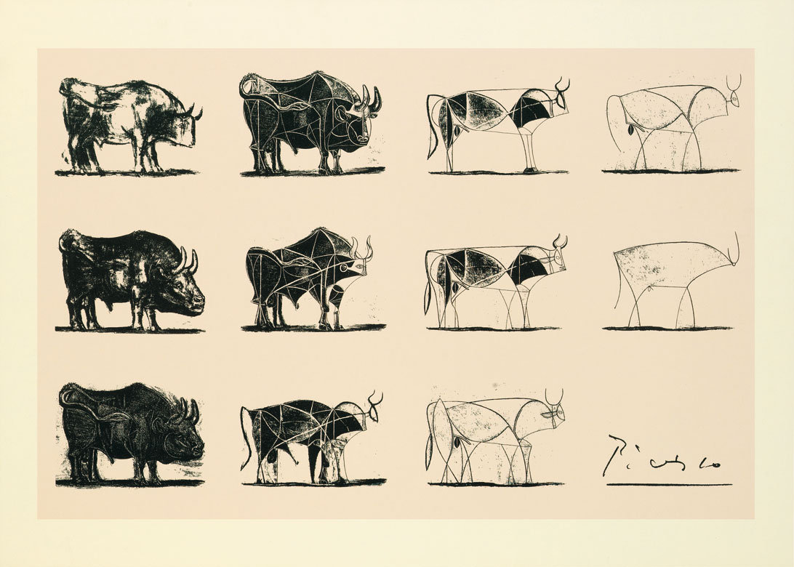

\thispagestyle{empty}
\setlength{\emergencystretch}{2em}
\begin{center}

\hrulefill

\vskip48pt

\textsc{study guide}

\vskip6pt

\rule{196pt}{0.5pt}

\vskip12pt

%{\large \textcolor{gray}{\it Information and Interaction Design}}
{\large \textcolor[rgb]{0.0,0.2,0.35}{\it Information \& Interaction Design}}

\vskip6pt

\rule{196pt}{0.5pt}

\vskip12pt

\textsc{fall 2021}

\vskip148pt


\textsc{michael j m{\scriptsize c}quaid}

\vskip24pt

{\large \ding{46}}

\vskip18pt

\textcolor{lightgray}{\textsc{this revision produced \MakeLowercase{\today}}}

\vskip18pt

\hrulefill

\end{center}
\thispagestyle{empty}
\pagebreak

\phantom{0}

\vfill
Information and Interaction Design, Fall 2021

\textcopyright \the\year, Michael J McQuaid

\thispagestyle{empty}
\pagebreak

\tableofcontents

\pagebreak

# Introduction

## Materials You Need

You need a sketchbook, pencil, and a phone or other device containing a camera.

### (A) Sketchbook

The sketchbook should be similar in size and shape to the Moleskine Cahier Journal, which is approximately 5 $\times$ 8 inches and 80 pages and sells for about 4USD. The brand is not important and there are many competitors to Moleskine offering similar journals. The reason for my request for uniformity is so that I can more easily manage collecting them and returning them to you. I have had students insist that they need larger or smaller or spiral bound notebooks or artist sketchpads and it has been problematic. Please restrict yourself to this approximate dimension. If you run out of pages, you can start a new notebook. Most brands offer these unlined, lined, or graph. Since my request for uniformity is related to size and shape to make them easier for me to carry around, I have no requirement for which page style you choose. I recommend unlined but many HCI people recommend graph paper or dotted paper.

Document examples of good design as you encounter them.  You can't get a perfect score on the design sketchbook without adding some good design examples each week.  You should plan to sketch for half an hour per day, three days per week to make a difference in your drawing skill and to receive full credit for the sketchbook.  There should be a noticeable progression in the quality of your results as the semester progresses, so there's no need to start as a perfectionist. This work is to help you express your design ideas, not to identify the most talented artist. Plan to turn in the notebook twice during the semester and expect examples from it to be used for this class and future classes, so don't include anything in it you'd prefer to not share with the class. 

Please use pencil for the notebook. The characteristics of a pencil figure prominently in a few exercises.  Many exercises could be done in pen and some can benefit from color but, for the most part, departure from pencil will be a distraction and a waste of your time and will lead to a lower grade. You can prevent your drawings from smudging by applying spray fixative to them.  Many artists use Krylon Workable Fixative, for about 7USD per can.  The word *workable* in the name signifies that you can apply a layer after your first layer of pencil, then begin drawing over it again.  You can do this repeatedly to prevent smudging drawings in progress.  Googling the term fixative just now led me to a lot of warnings about using it outdoors to avoid the toxic effects.  As with any other chemical, you must exercise appropriate caution and use sensible practices.

### (B) Camera

You will need a camera or a device with a camera, such as a phone, tablet, or computer. You will have to upload pictures of sketches to myCourses in a timely manner.

### (C) Prototyping Tools

As described in the syllabus and the course catalog, you must have experience with at least one prototyping tool, such as Sketch, Figma, or Adobe XD,  and will be expected to create prototypes in the course without any instruction in a prototyping tool. It is essential that you learn how to adapt to the vastly many software packages that may attain flavor of the month status during your career so feel free to use a different package than you've used in the past.

## Definitions
We need working definitions of the words in the course title and description, even though these words are notoriously resistant to definition.

### (A) Information

Defining information is the subject of a lot of fighting among people who get paid by the word. Some valuable information about information can be found in a dictionary.

\lstset{language=generic}

\small
```bash
From The Collaborative International Dictionary
of English v.0.48 [gcide]:

  Information \In`for*ma"tion\, n. [F., fr. L.
     information representation, conception.
     See {Inform}, v. t.]
     1. The act of informing, or communicating knowledge
        or intelligence.
        [1913 Webster]
              The active informations of the intellect.
                --South.
        [1913 Webster]

     2. Any fact or set of facts, knowledge, news, or
        advice, whether communicated by others or
        obtained by personal study and investigation;
        any datum that reduces uncertainty about the
        state of any part of the world;
        intelligence; knowledge derived from reading,
        observation, or instruction.
        [1913 Webster +PJC]
              Larger opportunities of information.
                --Rogers.
        [1913 Webster]
              He should get some information in the
              subject he intends to handle.
                --Swift.
        [1913 Webster]

     3. (Law) A proceeding in the nature of a prosecution
        for some offense against the government,
        instituted and prosecuted, really or nominally,
        by some authorized public officer on behalf of
        the government. It differs from an indictment in
        criminal cases chiefly in not being based on the
        finding of a grand jury. See {Indictment}.
        [1913 Webster]

     4. (Information Theory) A measure of the number of
        possible choices of messages contained in a
        symbol, signal, transmitted message, or other
        information-bearing object; it is usually
        quantified as the negative logarithm of the
        number of allowed symbols that could be
        contained in the message; for logarithms to the
        base 2, the measure corresponds to the unit of
        information, the hartley, which is log210, or
        3.323 bits; called also {information content}.
        The smallest unit of information that can be
        contained or transmitted is the bit,
        corresponding to a yes-or-no decision.

     5. (Computers) Useful facts, as contrasted with
        raw data; as, among all this data, there must
        be some interesting information.
        [PJC]

From WordNet (r) 3.0 (2006) [wn]:

  information
      n 1: a message received and understood
           [syn: {information}, {info}]
        2: knowledge acquired through study or
           experience or instruction
        3: formal accusation of a crime
        4: a collection of facts from which
           conclusions may be drawn;
           "statistical data"
           [syn: {data}, {information}]
        5: (communication theory) a numerical measure
           of the uncertainty of an outcome; "the signal
           contained thousands of bits of information"
           [syn: {information}, {selective information},
            {entropy}]

From The Free On-line Dictionary of Computing
     (20 July 2014) [foldoc]:

  information

     <data> The result of applying {data processing} to
     {data}, giving it context and meaning.  Information
     can then be further processed to yield {knowledge}.

     People or computers can find patterns in data to
     perceive information, and information can be used
     to enhance {knowledge}.  Since knowledge is
     prerequisite to wisdom, we always want more data
     and information.  But, as modern societies verge
     on {information overload}, we especially need
     better ways to find patterns.

     1234567.89 is data.

     "Your bank balance has jumped 8087% to $1234567.89"
     is information.

     "Nobody owes me that much money" is knowledge.

     "I'd better talk to the bank before I spend it,
     because of what has happened to other people"
     is wisdom.

     (2007-09-10)
```
\normalsize

Of particular note in the above definitions is that people define information according to their work. Claude Shannon popularized the notion of information as a message received and understood because that notion served his development of information theory, which underlies the field of network communication.

Some pundits like to posit a hierarchy of data, information, knowledge, and wisdom to support their work in a field called knowledge management. This field was popular about a dozen years ago and its influence had waned by the time the last definition above had been added to the Free Dictionary of Computing.

### (B) Interaction

If we do the same dictionary exercise with the word Interaction,
we'll find that it has a little more
substance.  It means reciprocal action or influence and
that is something we can work with---how the computer and the human influence each other. Reciprocity is a key to understanding and influencing interaction.

### (C) Design
Design
is one of the best of all possible words.  I
always like to look up words in the dictionary, but not
many have the power of the word design.  It's no
accident that it is chosen by propagandists in the
Intelligent Design wars.  It's a very powerful word.
It's all about making conscious choices.
One definition you will find in in a dictionary is

*a plan or drawing produced to show the
look and function or workings of a building, garment, or
other object before it is built or made*

## Groups
Expect to form a semester-long project group and also to work in ad hoc groups on exercises.
Peer evaluations will count! Your semester-long projects will be graded as groups but you will submit anonymous peer evaluations that may affect individual grades.
I suggest that you form your semester-long project group by first forming a duo with someone like you, then putting together two dissimilar duos.

The ad hoc group work will also be evaluated, in part, on what you put into your notebook. Thus, two people in the same group could receive different grades for the differing quality of their notebooks.

## Grading

Students often come to me after receiving a grade of less than a hundred percent and ask what they did wrong. Even after I have provided critiques of the class work in general and have raised the issues I have seen in the questioning student's work about some other work. Still they walk up to me after class and say, what did I do wrong?

It's a tough question to answer. There are several things to say about it. 
I'd like to devote a few words to each aspect of it.

First, there is the notion that it should be easy to obtain a perfect score if you simply learn the eccentricities of the teacher and cater to them. Do you see perfection in the world? Are hundreds of companies succeeding at making smartphones? Cars? Anything? Ask yourself whether you have ever given a negative review on a website. Judging by the number of negative reviews I have seen, not only has everyone on the planet given one but some have given more than their share! If you submit your work to the public, will the public give you a perfect score? And yet, in graduate school, teachers are encouraged to grade A as acceptable, B as bad, and C as catastrophic. It seems almost as if students feel entitled to a good grade by virtue of doing something.

Second, there is the question of the difference between your work and perfection. When you ask me this question, I feel as if you have not listened to the critiques given or you have dismissed them as not applicable to your work. Can I tell you some step you could complete to make your work perfect? Can I provide a box to check that will improve your work? What will happen to your work if I make it more to my taste? Teams at the CHI Student Design Competition under my coaching have competed very successfully against teams following checklists from other coaches. Let me provide you with the benefit of my experience.

The preceding point should suggest that you need to gain insight, not instructions. The only instructions most of you need right now are very very simple. I find myself constantly asking some students the same question: Can you please apply more ink / lead to the page? Until they do that, there is not much more to say. It is no accident that the most famous sports stars do goofy exercises like pushups even after they attain fame. There is very little for a teacher to say to most students. It is much more useful for me to listen to you than to speak to you, especially so early in the semester. The most important thing that anyone said to me on last Thursday was *My hand hurts*. That made me believe that the student (actually three different students said it) had finally put enough lead on the page, for then. Now my task is to exhort you to keep that up, a very simple task, simpler than continuing to listen to you, which remains my main task.

Next, there is the question of what *the other teachers do*. I really do appreciate it when students tell me what other teachers do. I also hope you appreciate that you should get a different perspective from each teacher. Your education should bring you into contact with methods you may not yet understand, methods you may find disagreeable. Yet the role of the student is to *suspend disbelief* and try something new, even if uncomfortable. Unfortunately, the tyranny of student evaluations prevents teachers from being too daring. I would prefer to have student evaluations conducted two to five years after the course is taken because I believe many students evaluate their comfort level right after they take a class. They evaluate their certainty about what they have learned. A contrasting view would be that, if you are so certain about it, you have not changed much, you have not learned much. You have simply filled in some cracks in the structure you already created. In fourteen weeks you can't do a complete renovation of your way of thinking and doing.


One of my own mentors said you can't effectively judge your own past for seven years (plus or minus). He wrote autobiographical books and plays and he claimed that, after more than seven years (plus or minus), memories get rusty and before seven years (plus or minus) you are too close to events to see how you have changed. So I ask you to suspend disbelief for a while and try something new and later see if you agree that you have changed for the better.

## Whether perfect should be average
One approach to education is to provide students with a clear, simple list of instructions to follow. Those students who follow the instructions receive a perfect score and the others have only themselves to blame. They had the opportunity to achieve a perfect score because there were clear instructions. Only their own laziness or obstinacy is to blame for ratings below excellent.

The above approach leads to high satisfaction among current students. Students often feel as if they are in control of their education with this approach. They may say that it empowers them. Because young people often have little control over many aspects of their lives, the sense of control can feel like an education. Students often feel that, by taking responsibility for following clear instructions, they are learning a lot. They report favorable learning outcomes after taking courses that follow this approach and, increasingly, they are perceived as customers whose satisfaction is essential to the operation of colleges facing spiraling costs due to mushrooming administration.

As a result, this approach is spreading like a disease across all universities. Once a student has experienced this sense of power, they never want to return to the sense of uncertainty they may have experienced as an alternative. Once this approach is the norm in any department or college, it becomes irresistible for outliers.  Individual teachers may claim that you should use college as a place to experiment with new approaches and maintain an open mind to trying different things, but that argument is ignored if GPA is the only criteria for scholarship, internship, or employment selection. The very same sponsors and employers who bemoan the lack of imagination and inventiveness of recruits encourage this lack by using crude numbers for selection.

I (Mick) strongly believe in quantitative information. When people say that something is not quantifiable, I often find myself disagreeing. The problem is that quantification often requires more time, money, space, or other resources than are practically available. Grading is an example of poor quantification practices tyrannizing thoughtful people.

I need to balance several things in order to provide adequate grades. I need to compromise with the "perfect is average" environment but I also need to find a useful way to score that I can believe improves education rather than simply robbing me of my value as an educator. I need to reevaluate educational goals and techniques because the rest of the world has moved into a new era and the education establishment does not seem to be catching up.

Incredibly, students often complain that I change things and insist that my courses should be cut and dried without deviation from the beginning of one semester to the end. Then, if I want to try things differently, I should begin the next semester differently and remain consistent with the new thing throughout that semester. These same students often complain that education is stuck in the past, yet they contribute to that problem by their very insistence on a glacial pace of change.

## Powerlesspoint
A student once wrote to me expressing that she had a hard time "wading through the lecture notes." In the same message, she suggested that I use Powerpoint, assuring me that it can work well for certain purposes.

I want to help you. I want you to extend yourself. Being a student means exposing yourself to new and different ways of doing things. I want you to abandon your reliance on Powerpoint this semester and try to use different ways to understand and present material.
To support you, there are a few readings that may help.

First, there's a file called Tufte2003.pdf under Content > misc on MyCourses. This chapter presents a repudiation of Powerpoint based on its information content and suitability to intended purpose.
Tufte invokes Feynman as someone who was appalled by bullet points. Feynman's Lectures on Physics are perhaps the most important vehicle for college students learning physics and they may present an alternative to which educators can aspire.

The second is actually a video. Visit Youtube and search for pixar storyboarding. There are many videos about the storyboarding process at Pixar. I have a DVD (remember those) of Pixar Shorts that includes such a video. I have since discovered that there are so many on Youtube that it is pointless to put something on myCourses. Any of these videos show the appropriate use of storyboarding and should make it clear that slide show software is inadequate to the task. The individual "slides" are attached to walls of conference rooms at Pixar and someone talks through the story while pointing at the relevant pictures on the wall. Participants are free to run around and examine each frame, engage in sidebars, sketch their own alternatives on paper and put them up on the wall, and otherwise engage in a collaborative process.

Third is a profile of a team of high-school students who won a robotics competition in 2005. During the question and answer round of the competition, they raised the judge's eyebrows because they did not provide a Powerpoint. When asked why, they answered that Powerpoint was for people who did not know what to say. The judge was impressed by their responses to questions. They won. They defeated a team from MIT, among other teams, all of whom had slick PP shows.

Please bear in mind that no important works in history have been accomplished in Powerpoint format. The only valuable Powerpoint of which I have ever heard was an experiment by David Byrne and Brian Eno to create art out of Powerpoint.

H.R. McMaster hates Powerpoint. Like Lou Gerstner at IBM, McMaster banned Powerpoint among his staff. Googling these names will lead to more interesting articles decrying PP.

Beware of "good" Powerpoint. Students sometimes tell me that the problem with PP is that it is not well done. I have one student whose father built a lucrative second career out of preparing slick PP for others. He had been a photo slide show specialist in the days when Kodak was big and had simply learned its replacement. I have no doubt that he does "good" PP. He makes a very good living at it. That does not excuse the people who pay him for it and the audiences who evaluate it (the PP) rather than whatever the subject of the PP is. There is, of course, an industry of PP consultants to tell you what colors and words and transitions and fonts and punctuation to use. Do not waste your time, at least this semester, listening to them. Everything that they say is either wrong or is a diluted version of information you can obtain straight from @Arnheim1974 or @Bertin2011 among other sources. Go to the source to learn about design. Avoid mixing your design education with a PP education.

# Background Radiation

## Roles
Industry defines many roles for you, including interaction designer, interface designer, user experience designer, user experience researcher, and more. The bewildering variety of job titles for the same kinds of positions needs to be addressed even though no universally accepted dictionary exists for these terms.

Suppose we consider the *look and feel* of a digital artifact. Can we distinguish between *look* on the one hand and *feel* on the other hand? One distinction I have seen in practice is that *look* refers to interface and *feel* refers to experience. You can see this, for instance, in the Material Design guidelines from Google. Some guidelines refer to the look and some to the feel. We could say that the UI designer emphasizes the former guidelines and the UX designer emphasizes the latter.

A blogger variously named Min Ming Lo or Lo Min Ming has written a couple of articles trying to distinguish between these roles. These have appeared at 
\url{http://bold.pixelapse.com/minming/recruiting-a-designer-heres-what-you-should-know}
and
\url{https://www.fastcodesign.com/3032719/ui-ux-who-does-what-a-designers-guide-to-the-tech-industry}.
He's listed typical tools, typical remarks, typical job search descriptions, and industry quotes. My interpretation of these articles can be summarized in a triangle.

!include fiTriangle.md

The vertices of the triangle represent emphases or influences. The job titles are positioned to reflect the strength of the emphases. For example, graphics is the strongest influence on a visual designer. The UI designer is positioned closest to the center because it is often the catch-all for all these positions. Note that there is no *information designer* in the picture nor in the Lo articles. If I were to place information designer on this graphic it would be midway between graphics and coding, just below UI designer. This is a rarely used job title, though. *Visual analytics specialist* might be what people think of instead of information designer. It also may be a synonym for information architect in some minds.

## People

### Rudolph Arnheim
Major definer of artistic principles via his most famous book, *Art and visual perception*, (1974).

### Chris Bangle
Influential automobile designer who points out each era has had a technology that defines what is possible and, therefore, what designers like to showcase. Bangle called the five-way milling machine the defining technology for automobiles in 2005, contrasting it to metal lathes as the defining technology of a century ago.

### Bill Buxton
A longtime mainstay of HCI at Microsoft Research, formerly a voice in the wilderness, now a Grand Old Man.

### Matias Duarte
Head of design for Android, spokesperson for Material Design.

### Jonathan Grudin
The self-appointed historian of academic HCI, one of his strengths is organizing his view of history in a synthetic way so that he generates insights rather than summarizing the past. His blog, for instance, is essential reading.

### Jony Ive
Head of design for Apple, prefers flat design not skeuomorphism, allegedly ousted skeuomorphism proponent Scott Forestall after Steve Jobs's passing.

### Steve Krug
Noted for a popular book admonishing designers to not make him think, Krug's ideas form an excuse for designing to the least common denominator. His basic notion seems terribly flawed to me (Mick). It appears to saddle designers with the responsibility to make interactions seem natural to users so that they can think about what they are doing rather than the computerized tools enabling them to do things. Krug's influence may be waning since this core concept so rigidly contradicts flat design. Flat design celebrates the active examination of the interface and the pleasant discovery of features in the interface.

### Peter Morville
Popularized the term information architecture before moving on to various other interests---at the time of this writing, his major tagline seems to be *everything is connected*.

### Jakob Nielsen
Business partner of Don Norman, author of influential evaluation heuristics and controversial blog.

### Don Norman
Most popular figure in HCI world. His first popular book, *The Psychology of Everyday Things*, was retitled as *The Design of Everyday Things*, whereupon it became the biggest seller of any HCI-related book ever published. Norman has a detailed knowledge of vastly many subjects. Even when he writes in a popular accessible style, do not discount the vast scholarship underlying every word. He popularized the word *affordance* which is the most identifying concept in HCI. Unfortunately, his interpretation of that word may differ from that of his mentor, J.J. Gibson, who coined the term. Norman's interpretation may have overshadowed the original meaning in a way that the HCI world can only reevaluate in the twenty-first century, in light of advances in neurology unavailable to the cognitive psychologists of Gibson's era.

### Dieter Rams
Popular industrial designer in 1960s, idol of Jony Ives, described in the documentaries *Objectified* and *Helvetica*, both of which are required viewing for aspiring HCI people.

### Jeff Raskin
Frequently referred to as the inventor of the Macintosh, author of *The Humane Interface*.

### Aza Raskin
Son of Jeff, has participated in high-profile startups and is a popular speaker. I was especially impressed by an application he once created that took advantage of insights about Google search terms. People in the past decade have become used to thinking about getting what they want by remembering short sequences of keywords. This is much like the ancient command line interfaces except that it is forgiving and provides you with *some* result for each attempt. Command line errors used to just evoke the response *bad command or filename* without any further help. Of course, Google has the advantage that you send every single search string to google and that you typically either reformulate it or click on one of the results, all of which options provides Google with more information about whether you made a mistake. Command lines could historically be executed without anyone but the end user knowing their contents or their aftermath. So Raskin's interface faced a stiff barrier unless it could incorporate some kind of feedback loop. But it seemed like an insightful idea whatever its limitations.

### Edward Tufte
Popular for a series of beautiful books whose distinctive style has been widely imitated.

## URLs

I have sometimes listed URLs of importance to HCI people. Link rot has attacked each such list with a relentlessness that has left me relying more and more on Google and Wikipedia, as well as pdf captures.

There is a vast amount of scholarship on link rot as of 2015, some of it in the legal arena because of its impact on reading US Supreme Court opinions. Schemes to overcome link rot such as doi and URI have been proposed, developed, and ignored since the beginning of the web.
There are vastly many services designed to defeat link rot, from Pinboard to the Internet Archive's Wayback Machine, to URL shorteners, but link rot appears to be winning.

Take the people listed above. Some of them have a blog for a while, then abandon it and start a blog with a different title to reflect their current interests. They may use Twitter or Instagram or other means to convey their ideas, yet it is the people themselves who remain important over time, not the different addresses of their various activities.

The same can be said of institutions. Many institutions have *shadow* websites to their official websites, since official websites require administrative oversite and may operate at a slower pace than productive workers.

## Institutions

HCI academic programs in North America include Berkeley, Carnegie-Mellon, U Colorado - Boulder, Georgia Tech, U Indiana, U Iowa, U Maryland, U Michigan, MIT, U Toronto

The *New York Times* has adapted amazingly to its online home in the past ten years. The rapidity with which the *Times* updates its view of information design is exemplary and at this time, you should certainly be studying it as an information artifact as much as you may use it.

## Technologies

JavaScript is certainly the language of the web. You will find yourself terribly disadvantaged in design if you don't at least understand this ubiquitous language.

CSS is another required technology. You should understand enough about the use of CSS to at least provide different views of the same content, either for different audiences or platforms. You should be able to do the kinds of things that can be done with the *Stylish* plugin for Firefox but on whatever platform you choose.

JSON is one of the most important ways of organizing information online, another being XML. You should be able to manipulate structures in at least these two containers. You may use any language to do so, including JavaScript, but understanding JSON and XML requires study separate from that of JavaScript.

## Design Guidelines from Vendors

Much of the design action in the world today is taking place in the battle between Android and iOS for market share and mind share. Some other firms, primarily Samsung and Microsoft, have published meaningful design guidelines. Most interaction designers today, whether or not they work in the mobile space, are familiar with the following three sets of guidelines.

[Material Design](https://material.io/design/)

[Apple Human Interface Guidelines](https://developer.apple.com/design/human-interface-guidelines/)

[Fluent Design](https://www.microsoft.com/design/fluent/)

Formerly, I gave the following URL for Microsoft. It still exists, although the Fluent Design URL above is probably better.
[Windows Guidelines](https://docs.microsoft.com/en-us/windows/desktop/uxguide/guidelines)

## Misc

Watch the documentaries *Helvetica* and *Objectified* as well as the videos by Bill Moggridge that accompany his textbook on HCI.

*Hacker News* is my preferred news source. You should try to at least skim it weekly to improve your picture of information technology in general.

*Krebs On Security* is the only information security blog you should read. Again, check it at least weekly or whenever anyone asks you about information security issues. Bear in mind when you read about security that it represents a terrific opportunity for con artists. Some IT security people thrive on producing no measurable output and are often smooth talkers, able to answer any argument decisively but without imparting any understanding. IT security will typically demand all kinds of knowledge about every aspect of an organization and is in a position to use that to improve its power position within an organization.

Blogs and bloggers exemplify resources that are
underdocumented in the academic literature.  Many
designers look to *A List Apart* or
*Alertbox* for ideas and inspiration.  A very
long list of "celebrities" maintain an online presence
with a remarkable influence on contemporary designers.
They include
danah boyd,
Jesse James Garrett,
Joi Ito,
Mimi Ito,
Aza Raskin,
Jared Spool,
and many more.
Unfortunately, some of these people are more famous for being famous than for anything else. You have to read critically to separate what is important from what is only viscerally appealing. As a straw man, look at a speech by President Snow in the *Hunger Games* and imagine you know nothing else of the plot. What he says may *feel* reasonable taken out of the context of the movie, which identifies him as a villain for your convenience. Now, imagine you hear this speech in real life, where there may be no behind-the-scenes view. It can be harder to analyze public pronouncements than it looks.


Plenty of online tools are part of a typical designer's
workday, such as
*kuler* for color palettes.
Some platform specific tools like
*Sketch*,
*Principal for Mac*,
*Adobe XD*,
*Figma*,
*Axure*,
*Balsamiq*, 
and
*Invision Studio*, 
have big
followings.
Some students have also mentioned Framer JS, Framer Studio, Tumult Hype, Invision Classic, Visio, Flash Catalyst, Dreamweaver, and coding in straight Actionscript. If you google prototyping tools you will find reviews of Justinmind, Marvel, and more.

During Fall 2015, we discussed the survey at
[http://tools.subtraction.com/index.html](http://tools.subtraction.com/index.html). (That page has vanished but its message remains relevant.) This survey examined six categories of tools used by designers: brainstorming, wireframing, interface design, prototyping, project management, and version control / file management. The most popular tools, one per category among the five thousand designers self-reporting, were:
pencil and paper (brainstorming),
Sketch by Bohemian Coding (wireframing),
Sketch by Bohemian Coding (interface design),
HTML / CSS (prototyping),
Slack (project management),
and Dropbox (version control / file management).

The survey received a lot of media attention because of the first result---few non-designers would have guessed that pencil and paper still hold a preeminent position. It is this preeminence among the practicing designers I query that leads me to keep the paper and pencil sketchbook every semester, a choice that frequently puzzles non-designers. Another noteworthy aspect of the survey is the presentation of results. If you explore the above site, you may be pleasantly surprised by the amount of interactive exploration of results made possible by ... wonderful design!

One kind of prototyping tool you may have thought too rudimentary to mention would be any graphics package with layering, such as Photoshop or Sketchbook Pro. You can use different layers in the same file to represent transitions from one app state to another. The advantage of using a tool like this is that you may already know the tool and won't waste time on it, instead spending your time on developing your ideas.

A more recent survey can be found at
[https://uxtools.co/survey-2018](https://uxtools.co/survey-2018) where you will see that paper and pencil still dominates brainstorming.

A still more recent survey is at [https://uxtools.co/survey-2020/](https://uxtools.co/survey-2020/) where they specifically only ask about software tools.

I use Wikipedia as a reference for many topics.  For instance, the Wikipedia entry on HSV color space provides a good introduction to terms about color.  Wikipedia urls have a format so that if I refer to the entry on HSV color space, you may assume that the URL (for the English language version) is [HSV_color_space](http://en.wikipedia.org/wiki/HSV_color_space). Wikipedia remains controversial among many academicians.

A resource for HCI literature may be found at [hcibib](http://www.hcibib.org).  You may find it helpful for much of your work.

## Being the center of the universe
Before we get too far into the semester, I have to tell you a very long story. Understand that this story is told to help you avoid embarrassing yourself ... at least as much as you would if I did not tell the story. Inevitably, the early part of the semester includes some discussions that begin with one person saying that "Everyone does X" or, more often, "No one does X".

Here I mean X as a placeholder for some kind of software (or hardware, for that matter), but it can be a software-related practice. Sometimes the discussion will heat up when someone says "Oh, so you're one of the two or so people left in the world who uses X."

This kind of conversation has led me into the field of HCI. Here is one semi-legitimate academic discipline where I can smack someone who says "No one uses X." Everywhere else, computer users can put on a set of blinders and insist that, if they don't do it, no one else does either. Of course, I am leading up to the fact that HCI people, though they supposedly know better, are terrible offenders.

My favorite story to illustrate this pot-kettle phenomenon comes from a contest at CHI to develop an app to improve public transit. One of the contestants developed a hardware device to support the conductors on buses in India. The conductor would hold this device in one hand and click on icons on it with the other hand, all while conversing (yelling) with bus passengers.

I should interrupt this anecdote with two facts: buses in much of India have conductors. The CHI contest was in California. There was some communication difficulty from the audience as to whether the 1.1 billion people of India were total idiots for not running their buses in the same manner as the buses within five square blocks of the auditorium. Oh, well.

Back to my anecdote ... The intrepid developer of the Conductor Assistance Device, hereafter CAD, fielded a lot of "questions" about whether conductors should be eliminated from all Indian buses based on the sage advice of CHI attendees. Then he received the showstopper.

The showstopper, in any presentation, is dreaded by the presenter because the contest is effectively lost after the showstopper question is asked. There is no recovery from the showstopper. The developer may have put in a year of work and the project may have considerable merit but it does no good in the face of the showstopper.

Sometimes, it's not clear whether a question is a showstopper. Most questions in CHI presentations are variations of these three timeless questions.

1. "Have you seen my important work in this area?"

2. "Isn't this really just a minor revision to some project from a previous decade and, since you know nothing about that project, we can't really discuss it but you should know that you're wrong?" (What, you don't think that is a question? How little you know!)

3. "You have done a thing. Why didn't you do this other thing which I just thought of and will now describe at some length while everyone waits for me to finish and for you to reply that it is an interesting prospect for further work?"

These three questions are the bulwark of any academic community and, if you think I am saying that from personal bitterness, then, no I do not have tenure.

Anyway, back once again to the anecdote and now to the showstopper. An observant audience member asked, "Why not just develop a system that allows passengers to use their cell phones rather than communicate with the conductor?"

The presenter, as so often happens, did not realize that the showstopper had just been asked. He patiently explained that Indians are too poor to have cell phones and that, therefore, we can't have a system that would rely on cell phones the way we would in the wealthy, elitist environments of the West. He pointed out that we need compassion for the poor, who are the most prevalent users of buses anyway.

The presenter blathered on about poverty for quite some time, finally slowing as he realized something strange was going on in the audience. He petered out altogether as he realized that many in the audience were pointing at the screen behind him, where he was displaying a mosaic of photographs of Indians on buses, with a conductor prominently displayed in many of the photos.

After he turned to examine his own photos, it finally began to dawn on him that many, if not most of the bus passengers visible were holding cell phones. His hopes of winning the contest wafted away like smoke on the wind as he very quietly acknowledged that in these particular cases everyone had a cell phone and tried to quickly think of some reason why these cell phones might not be adequate to the task of communicating extremely simple information about bus stops. He rambled for a while and even tried out a phrase like "Most people don't have cell phones" to see how it would sound but it didn't sound too good in the face of his own photos.

Let me underscore two things about this anecdote. First, the audience was very dismissive of the notion of conductors on buses, violating the principle that not everyone is like you. Second, the presenter was very dismissive of the notion of poor people having cell phones, another violation of the same principle. Sure, the presenter was the one who suffered that day but everyone was guilty. The scuttlebutt was "Wow, he really screwed up!" but the larger truth was that he committed an infraction no different from that of many vocal members of the HCI community.

Does that mean that these people all suck and are cultural imperialists? No, it means that it is hard to put yourself into the shoes of another. Every day I read in the blogs that Samsung or Google or Apple is a complete idiot because of some UI feature that someone doesn't like. Really? *Really?* No, they are not idiots. They have a hard job.


# Audience

## Academic Communities

The topic has been studied by three main academic
communities, human factors in schools of engineering, human
computer interaction in computer science schools, and
management information systems in b-schools.
Each of the three has specialized to some extent but
there are overlaps.

*Human factors* is usually the experimental study of how
people operate complex machines like automobiles, ships,
nuclear reactors, and aircraft. Since the researchers
who identify themselves this way are usually funded by
the military, they emphasize military applications
although their findings are usually applicable to some
degree outside the military.

*Human computer interaction* was, until recently,
primarily the study of one person
interacting with one computer system. This field began
with the study of users of expensive computers
performing specialized work tasks. At this time,
researchers mainly studied how the user interface affected
some measure of productivity, usually in laboratory
studies. The second period of human
computer interaction research studied how people
interact casually with computers. This involved field
studies with very small groups of participants (formerly
called users) and very limited conclusions, appropriate
to the increased pace of change in user interfaces.

It's easier to identify past epochs than current ones.
It appears that human computer interaction has diverged
into two areas in the current era but the distinction is
harder to be certain of without the advantage of years
of hindsight. The two current branches appear to be
*ubiquitous computing* and *computing communities*.

*Ubiquitous computing* is an old term referring to computers
embedded in other devices and able to communicate with each
other. When first coined by Marc Weiser around 1991 (see
@Weiser1991), the term meant anything that was not a desktop
computer and concerned a small, well-defined community. Today,
almost no interaction between computers and people can be
defined with respect to only a desktop computer, rendering the
original definition moot. Now it seems to encompass all
computing.

*Community computing* is not a broadly used term by
itself. I am using it here to refer to the change in focus
from a single person (formerly a user) to many people
forming a community. Two types of communities exist,
communities that occur in computer networks and
communities that exist in the physical world. Since the
latter may share sewers, electrical utilities,
telecommunications utilities, roads, schools, local
governments, and other aspects of physical
infrastructure, it differs greatly from a network-only
community such as Facebook.

Communities that can function remotely, such as
Facebook, are the focus of study of Social Network
Analysis and Data Science, closely related fields whose
work is enabled by monitoring electronic communication
networks.

Communities that exist in physical space, such as
neighborhoods and cities, are obviously the subject of
study of architects, social workers, and people in many
other disciplines. Recently, many of these researchers
and their sponsors have aligned with computer scientists
identified with human computer interaction.

Note that the above bifurcation is a matter of opinion. Many different perspectives exist about how to divide the academic community, such as the tracks of CHI. Most of the perspectives that I (Mick) have encountered divide the community into a very large number of segments. You should develop your own perspective with exposure to the community.

*Management Information Systems* is professed in some
business schools, and has long been concerned with the adoption and
diffusion of technological innovation in productive
organizations. This concern has led to many psychological
studies of groups of users of information systems in
organizations.

## Industrial and Government Communities

\begin{quotation}
\noindent
You want me to deprioritize
my current reports until you advise
of a status upgrade?

\medskip

\noindent
Make these your primary
action items.
\end{quotation}
\hfill ---dialog from *Fight Club*, 1999


### Suppliers of IT


Who are suppliers of IT in 2019? How do you measure? Public awareness? Market Capitalization? What industry codes are applicable?

The most influential suppliers are those with interface guidelines for public-facing apps that you may choose to follow or reject: Google, Apple, Microsoft. But there is a wide world outside Silicon Valley as well, so it makes sense to think about suppliers in broader terms. Even within Silicon Valley there are CRM and ERP vendors who determine interaction guidelines for large swaths of b2b computing yet receive little public attention.


### Customers of IT

This group can best be defined by students.

## Historical perspective
A historical perspective might divide the study of HCI into several periods. The first period could be characterized by costly computers, nondiscretionary users, and the struggle to improve the speed and quality of productive output of computing, led by Herbert Simon and Allan Newell at Carnegie-Mellon. The second period could be characterized by a focus on human concerns, discretionary use and better adapting the computer to suit an imperfect person. The third period could be characterized by a focus on workgroups, groups in general, and computing within human activities where computers may not be the focus. Finally, the current period could be characterized by a focus on communities of place and the role of computing in the fabric of everyday life.

## Idealized user
The idealized user was studied intensively by Herbert Simon and his associates at Carnegie-Mellon. They broke tasks into very small components and investigated the state of mind of users at every moment.

## Nondiscretionary use
When computers were individually expensive, HCI professionals, like others, were focused on making the best use of the very expensive time of these machines. They sought to understand how and why time was wasted and what would be needed to waste less of it. For example, the IBM subsecond study found that people would lose their train of thought if the computer took more than roughly a second to respond to keystrokes. This led to the purchase of faster IBM computers but also had some positive effects.

## Hierarchical collaboration
During the 1980s, most academic HCI research was funded by the US Department of Defense. That organization was interested in using computers to collaborate within and across rigidly defined organizational hierarchies. Some HCI research during this period found that known organizational psychology phenomena could be instantiated in software to achieve desired group dynamics.

## Workgroup cooperation
The rise of networked computers in the 1980s and nineties led to a community of HCI researchers, coalesced around the Computer-Supported Cooperative Work conference, seeking answers to questions about groups of computer users without a specific hierarchical arrangement.

## Discretionary computing
As the price of computers has fallen, more and more HCI work has been focused on discretionary use of computers. This includes studies of games and other recreational, non-workplace activities.

## Ubiquitous computing
The term *ubiquitous computing* was coined over 25 years ago by a visionary named Mark Weiser. Unfortunately, Weiser died at a young age and the notion of ubiquitous computing floundered for a time. Nevertheless there has been a small stream of research on this topic since about 1991.

## Communities of Practice

Communities of practice were studied at the dawn of HCI within the study of nondiscretionary use of computing. By far the most famous study of a community of practice was the study by Barley of radiologists and their adoption of new technology. Elsewhere I have mentioned that Barley acquired an M.D. in the course of this, one of the most extensive ethnographic studies related to information technology.

## Communities of Life

To distinguish between communities of practice and
communities of life, let's consider the phenomenon of
community development which gained a higher media profile
when a community organizer was elected President of the USA
in 2008. Community development was again highlighted when a
presidential candidate in 2012 claimed to have had a *real*
job in contrast to the President's job as a community
organizer. Of course, mainstream media presents a
confused picture of community organizers as socialists,
terrorists, and even vegans.

A clearer picture of community development comes from
speaking directly with community organizers, who can be
found throughout the USA, especially in areas impacted by
poverty. I (Mick) have been privileged to speak with a few
and, although I have not read much of their literature, I am
confident in describing one aspect of community development.

Communities are complicated, fragile entities. They depend
on investment from businesses and the presence of productive
enterprise. A number of factors can drive businesses away
from a community and, when any of these factors appears,
others are likely to follow. Collectively, we can call most
of these factors deficiencies in infrastructure.
Infrastructure includes
housing,
health care facilities,
quality of air and water,
postal and shipping services,
roads,
other transportation facilities,
schools,
utilities,
waste removal,
sewage,
watershed maintenance,
and probably several others.

The one thing I have omitted from the above list is people.
Specifically, a community must have a high proportion of its
members in the workforce, meaning that a high proportion of
its members must be of an age, 18--65, to be eligible for
the workforce. Children and the elderly need care and, if a
community consists mainly of members in these age groups,
who will care for them?

If any of the above infrastructure elements is missing, the
others are threatened. Working age parents will often refuse
to settle in otherwise attractive communities that lack
highly-rated schools. Businesses can not meet their
schedules in a community suffering frequent brownouts or
blackouts.

Community organizers are typically not very successful. One
community organizer told me that, if she could help a single
family out of poverty, she would consider it an important
and infrequent accomplishment. If should could help a dozen
families out of poverty, she would have a successful career.
These are dauntingly small numbers.

Most efforts at community development suffer from a
phenomenon named just like a somewhat similar problem in
information technology, stovepiping. This means that any
single initiative tackles one of the above infrastructure
problems. The results are usually irrelevant to the health
of the community as a whole because
the complicated, interdependent relationships between the
people and the infrastructure elements are more sensitive to
damage than to repair. A substantial number of elements must
be improved to support any given individual element.

It is very difficult to avoid stovepiping in community
development as it is information technology. People usually
have expertise in one domain, access to resources in one
domain, and a mandate in one domain.

As an example, many community development efforts focus on
improving skills of individuals to make them more
employable.
One problem with the jobs/skills approach is that historically it has
actually weakened poverty-challenged communities, since programs like
this are used by the brightest and fastest learners as an exit
strategy from the community. One big challenge is how to add skills
without creating an exodus from the community. There is no easy answer, but
the jobs / skills focus might help if the skills have an immediate local
application. The problem is that to keep the newly skilled you have to
add roads, housing, sewers, cable-modem lines, cell-phone towers, and
everything else that businesses need to move into the area and employ
people locally.

One horrible example in my (Mick's) experience is Tucson, AZ, which made the decision a long time ago to attract "call centers" that semi-retired military people there could work for part-time. These call centers became the biggest private industry in Tucson and they don't train anybody to do much of anything, and they feature high turnover and low wages.  Seniority is a problem for management because of demands for increasing wages with experience, so they routinely lay off the more experienced workers seasonally and bring them back with a new clock the following year.

All of the foregoing leads to a definition of communities of
life as depending on a fragile, complicated network of
physical infrastructure and working-age people for health.
Notice that this is a normative definition of community. You
may feel that it has delved too deeply into details for a
course in human computer interaction. I assure you that, if
anything, it does not provide enough details. The community
of practice known as HCI has made a conscious and long-term
decision throughout the past two decades to try to make a
difference to communities of life. All too often, these
efforts have led nowhere because of an inadequate
appreciation of the details of challenges faced by communities
of life. Many high-profile HCI projects have struggled
for this reason and a few have enjoyed success. I'll list
a few examples.

(1) A project in Kenya involving HCI students from Michigan
was concerned with the uncertainty faced by small farmers
selling milk at a distant market. Picture this: A small
farmer trudges down a dusty road with a single animal laden
with a couple of barrels of milk. Pretty soon, he is met by
a man in distress. Through his tears, the man explains that
the bottom has dropped out of the milk market from which he
is returning and that he was forced to sell his milk as well
as his only animal for almost nothing. He shows the farmer a
pittance in his gnarled hand and walks on. Now the farmer is
shaken and, before the piteous cries of the man have died
away, he meets a jolly yokel. The yokel says that he is
thinking about dairy farming and wants to buy an animal and
some milk with the all the money he has saved. That amount
turns out to be considerably less than the farmer had hoped
for at market, but more than pitiful man had claimed to
receive. So the farmer takes the small price and considers
himself lucky, unsure whether he has been bilked by a pair
of con men or has narrowly averted disaster.

The project realized that anyone could get a cell phone in
this region and that even the poorest of the farmers had
one. It was a small step from there to setting up a dial-in
service (no, there was no wifi in this rural district) that
texts the current market price of milk to a caller on even
the most primitive cell phone. The farmer need not even be
literate to take advantage of this system, just numerate.

(2) A Ph.D. student in HCI at Stanford was funded to do a
project with free cell phones in a rural district in India.
She was herself Indian in origin, although she was operating
in a completely unfamiliar state. These phones, running the
old Symbian operating system, could support $240\times160$
video. Her plan was to provide health education to
illiterate pregnant women using the videos. She even
persuaded local officials of a rank of approximately mayor (I
don't know the correct term) to record videos endorsing her
project.

The project was a resounding failure because she did not
understand household relations. The
husband's mother typically lived with the family and was the final
authority on health care for the pregnant wife. By bypassing
the mother-in-law and going directly to the pregnant woman,
she believed she was appealing to a new generation more open
to contemporary health practices. Instead, she was
threatening the dominion of the mother-in-law, whose
authority in the household kept her clothed and fed in a
society that offered her no alternative. The mothers-in-law,
feeling threatened with displacement,
proved to be dedicated, relentless foes of the project, no
matter the health benefits.

By the time the Ph.D.~student came to understand the
dynamic, the funding had dried up, preventing her from
trying in a different rural community where she could make
the mothers-in-law the focal point of the plan.

(3) Also in India, a well-known HCI scholar (from Berkeley?)
devised a microfinance system around a series of paper forms
with QR codes, a cell phone for each village, a tiny wooden
platform for aiming the phone at the papers, a single
printer serving many villages, and the Indian postal system
to deliver the printed forms. This initiative brought
together a small group of women in each village who would
collectively save money and decide on small purchases. It
took advantage of the presence of the postal
system to overcome the issue of printing forms and used QR
codes as an information storage and transmission system,
enabled by the ubiquitous give-away phones running Symbian,
an operating system too primitive to appeal to first-world
consumers. The developer used the phone and wooden platform as
an excuse to bring the group together to converse and make
financial decisions, knowing that these meetings might have the
potential to serve other purposes.

(4) Finally, an Indian example I had the misfortune to
witness was a CHI design competition where an Indian student
had devised a hardware / software platform to assist bus
conductors in a rural state. This was a small tablet-like
device that would be carried by the conductor who would
talk to the passengers to learn their destinations and enter
them into the device, and be able to shout out stops to the
driver at appropriate times. It was a complicated
bottlenecky system. To
show the audience that there were conductors on buses and
that crowding on buses made it difficult to communicate
stops, he showed many slides to
illustrate. When someone asked why not let
passengers communicate with their cell phones and remove the
bottleneck, he explained that rural Indians were too poor to
afford cell phones, a claim contradicted by dozens of the
people pictured in his slides! He was also an example of a
person who would not let his teammates speak, preferring to
control the entire presentation and question-answer session.
I have to think that he needed to acquire more sensitivity to the
population he was trying to serve as well as to the
colleagues with whom he was trying to do important work.

An observant student pointed out that @Irani2010 describes a similar incident in rural India where HCI professionals tried to improve the lives of poverty-stricken people with water quality problems. When they could not find poverty-stricken people with water problems (!), they took their pre-existing solution to these problems elsewhere. @Irani2010 tells a few such stories of postcolonial computing in this fascinating paper. @Merritt2011 offers theoretical support for thinking about HCI4D.

To summarize, communities of life can be served by HCI, but
not without seeking some understanding of complicated
fragile networks of infrastructure that account for so much
of the variation in health between communities.

## Disability-specific design
RIT is notable for its emphasis on accessibility. The HCI group features a number of world class researchers in this area. Your advanced study in HCI can include work with some of the leading minds in the field. Although this introductory course does not introduce accessibility, you should be introduced to some of the terms and literature in this community.

@Shinohara2016 identified four different approaches to disability-specific design and listed some of the research in each approach, which I will repeat here:

- universal design: @Bigelow2012, @Mace1991
- user-sensitive inclusive design: @Newell2000, @Newell2011
- design for user empowerment: @Ladner2015
- ability-based design: @Wobbrock2011

Other design approaches of note include

- value-sensitive design: @Friedman1996
- design for social acceptance: @Shinohara2012

You should investigate the above-listed resources to prepare for studies in accessibility and design and you are uniquely positioned at RIT to take up such studies.

## Popularization via bad design

Don Norman is the single person who has done the most to popularize HCI in the public consciousness. He is a brilliant thinker and I don't mean to criticize him for this, but one thing he did that brought him amazing popularity yet did little to educate people was to popularize the discussion of poor design. His most popular book is fraught with examples of bad design and it is inevitable that any teacher of HCI can boost course evals by allowing students to waste a lot of time critiquing bad design. The problem with this is that it is so hard to get design right that noticing that much of it is poor is, by itself, a minute step.

Most bad design examples remind us of the importance of affordances and the danger of cognitive dissonance.

- that aspect of a thing you can interact with that
suggests how to interact with it
- can be done well or poorly
- central concept for individual user
- often skeuomorphic
- flat design opposes notion of need for affordance

### Flat design risks

\begin{center}
  \includegraphics[width=4.0in]{fiFlatDanger.png}
\end{center}

[dangers-of-flat-design](http://blog.uxpin.com/2526/5-dangers-of-flat-design/)

### Bad door

\begin{center}
  \includegraphics[width=4.0in]{fiDoorPull.jpg}
\end{center}

### Bad and less bad door

\begin{center}
  \includegraphics[width=4.0in]{fiPushPull.jpg}
\end{center}

### Anti-ADA door

\begin{center}
  \includegraphics[width=4.0in]{fiAffordBig.jpg}
\end{center}

### Bad dryer

\begin{center}
  \includegraphics[width=4.0in]{fiAffordance.jpg}
\end{center}

### Bad iPad

\begin{center}
  \includegraphics[width=4.0in]{fiNiceIpad1.png}
\end{center}

### Bad iPad's ancestor

\begin{center}
  \includegraphics[width=4.0in]{fiDarkHorse.jpg}
\end{center}

### Bad elevators

\begin{center}
  \includegraphics[width=1.0in]{fiElev1.jpg}
\end{center}

\begin{center}
  \includegraphics[width=1.0in]{fiElev2.jpg}
\end{center}


# Interaction Design
For the next four sections: contextual inquiry, personas, scenarios, and prototyping, we are concerned with interaction design. After that, we'll think more about information design. The method of interaction design we'll practice in our prototypes in this course requires the use of these tools so that interaction designs are centered around users. There are two main textbooks for this study, both available electronically from the RIT library so that you should not need to buy either of them.

## Contextual Design
Please read @Holtzblatt2005, available electronically from the RIT library for the most complete introduction to the topic.
I can tell you
frankly that I look closely at the quality of the
affinity diagrams
for evidence of effective work on the contextual inquiry milestone.

## Three ways to study users
Spinuzzi (@Spinuzzi2000) compares contextual inquiry with other
approaches, so you can see why we emphasize contextual
inquiry and what we might do instead (ethnography or
participatory design).

## Contextual inquiry
The key sentence in @Spinuzzi2000
suggests using contextual inquiry to make radical
changes in a short time frame. It relies on an
underlying work structure that reduces the amount of
time you have to spend to understand the workplace, so
it's not suitable for completely alien work processes.
It requires minimal client time because of its reliance on underlying structure.

## Participatory design

@Spinuzzi2000 recommends participatory design for making incremental changes and empowering users. It requires a great deal of client time, used to improve user acceptance of the design.

@Bannon2018 invite us to reimagine participatory design and briefly discusses its roots in 1970s Scandinavia as a politically-oriented approach to democratizing the process of design between designers and other stakeholders. They note that the political dimension of participatory design has diminished over the years and invite a rethinking of what democracy means today. They call on researchers in an era of globalization and political extremism to use design in service of a more equitable world. They claim that that pursuit can be shaped by core emphases of participatory design, including
public participation,
sensitivity to social conflict,
shared trust,
mutual learning,
security,
and fairness.

## Ethnography

Ethnography works best if a great deal of time (both
client time and designer time) is available and a
detailed understanding of work is required.  The classic example
of this in information technology is Stephen Barley's
studies of technology adoption by radiologists. Barley
obtained an MD in the course of his incredibly long study in order to better understand the work of radiologists.

@Spinuzzi2000 claims that ethnography can be used to effect radical changes and is the only possible choice in an exotic workplace. It requires maximal client time.

@Holtzblatt2005
describes the most commonly used of the above three methods.
It's the most common for a chain of reasons. First,
the reliance on an underlying work structure minimizes the
need for client time, always an attractive feature in a
resource-constrained workplace. Second, the direct manipulation of
the underlying work structure means that existing design
artifacts can be sidestepped and radical changes are 
possible without time-consuming study and modification of
existing design artifacts.

# Contextual Inquiry Process

Because contextual inquiry and its umbrella, contextual
design, have been so successful and so inexpensive to
implement, you are more likely to participate in it in the
workplace than in any other design method.
One hallmark of contextual design you may experience is the
method's reliance on extremely large numbers of post-it
notes containing atomic observations about the subject work.

A team conducting a contextual inquiry typically immerses
itself in a mass of these post-it notes, following a
structured
method for grouping and regrouping the notes to make sense
of the subject work and to organize the observations of the
client participants to reveal the essential characteristics
that will inform the new design.

## Immersion
Figure \ref{fig:fiAffinity.pdf}
shows the picture of immersion from @Beyer1999.

\begin{figure}[htbp]
\begin{center}
  \includegraphics[width=4.0in]{fiAffinity.pdf}
\caption{aftermath of an immersive session}
\label{fig:fiAffinity.pdf}
\end{center}
\end{figure}

## Share interview techniques

You have to share your successful and unsuccessful interview techniques in a conversation. I can start the conversation with a few suggestions but you have to take from there. So here are a few commonly mentioned points about interviews.

The most successful interview has two interviewers. One takes notes and the other speaks. Don't divide the speaking. The one who takes notes should rarely speak and then only because the speaking interviewer has forgotten something. The speaking interviewer tries to maintain engagement with the subject. The speaking interviewer tries to keep the subject talking as much as possible and on-topic as much as possible. That job requires the full concentration of one person. That person should not try to do other things at the same time.

Avoid recording devices. If you do use a recorder, make it one that is very easy to operate and not intimidating and leave it on the table between you and the subject. Invite the subject to turn it off if they need to *go off the record*. You may want to turn it back on after the secrets have been shared. On the other hand, your experience may tell you that it has been inhibiting the subject or been the focus of the subject's attention. You may want to announce that we don't need it further and pocket it in that case. There is a balance, by the way, in the user interface of a recorder. It has to be able to tell you it is recording but it also has to fade into the background. Lots of recording devices, including one I often use, go too far one way or the other.

The most typical problem students have in interviews is that they fear silence. Can you allow enough silence to elapse to let your subject gather their thoughts? If not, what can you do?

Look puzzled. If there is too much eye contact, just write a question mark on your notepad or draw a simple shape like a circle or square and look puzzled again.

Look at artifacts. Any diagrams you generate in your interviews are artifacts that you can look at silently with your interview subject. Just don't say anything at all and look intently at each artifact.

Ask the same question over and over. If the subject is reluctant to speak, just ask them to *say more about that*.

Ask hypothetical questions. Activate the subject's imagination by asking them to place themselves into a situation and say what they would do.

Allow the initial speech, then stay on topic. Experience shows that subjects have rehearsed a certain speech about whatever is bothering them. They have to be allowed to declaim that speech. If not, they will keep losing track of your questions as they seek an opportunity to insert the speech. Once that is out of the way, let them refer back to it but do not allow them to repeat the whole speech or to give the certain speech about another issue. If you interview a subject about something they would like to be different, the interview may trigger associations with other things they would like to be different. You may feel the need to express empathy and tell analogous stories from your own experience. You should rehearse any such stories beforehand so you can abbreviate them as much as possible.

Overtly display respect and appreciation for the subject. I may have mentioned the robotics team of undocumented alien high-schoolers from Phoenix who defeated MIT in 2005. (There's a Wired profile of it that gets linked from various blogs every few months.) One of the key reasons they are thought to have defeated MIT was that, when they interviewed experts in underwater robotics, they treated the experts much better than did the haughty MIT team. One of the experts, interviewed by Wired later, said he gave them a lot more help than he gave the MIT team and that he began to think of himself as a member of their team. You can't buy that kind of help.

Don't bother to ask if a subject can think of anything else. Instead, stimulate them to think of something else. You can stimulate them by asking them about situations. When was the last time X happened? If they say something never happens, keep searching for that one time.

## Protocol and verbal analysis

Let us contrast two ways to find out about tasks through the words of people doing those tasks, protocol analysis
described by @Ericsson1984
vs.
verbal analysis
described by @Chi1997.

protocol analysis $\rightarrow$ *think-aloud process*

The main idea in Ericsson (1984) is to elicit
information from a person *while* they accomplish
a task by asking them to think aloud about the
information they attend to while solving problems, but
not to describe or explain.

verbal analysis $\rightarrow$ *knowledge representation*

@Chi1997 contrasts protocol analysis with an
approach designed to elicit the structure of knowledge
of the problem solver, rather than the problem solving
process.

The output of protocol analysis $\rightarrow$
 *process map*

The output of verbal analysis $\rightarrow$
 *knowledge map*

# Personas and Scenarios

For the personas milestone, let me make the very strong suggestion that you use @Cooper2014. You can obtain this electronically from the RIT library, searching for *About face the essentials of interaction design*. Chapters 3 and 4 outline the processes. You should pay special attention to Figure 3-5, Overview of the persona creation process to develop personas. (We'll talk about Chapter 4 next time.) This figure outlines eight steps to take. When I look at the milestone output, I should believe that you really followed or at least considered these steps in some detail.

How should you read @Cooper2014? I'm glad you asked. This is a very good example of why you don't need slide shows. The book is organized in a way that brings out its main points. Let's briefly review some items that identify structure and guide your assimilation of the information therein.

- Table of contents
- Orange headings
- Black headings
- Boldface terms
- Italicized emphasis
- Figures with sequences
- Figures with comparisons
- Examples
- Justifications
- Answering objections
- References
- Order of presentation

Most of the items in the list are self-explanatory. The last one, though, needs a little explanation. The order in which Chapter 3 is presented could be called a series of steps, including think, do, and reflect. First, the authors present the idea of personas, then tell you how to do them, then reflect on some of the thoughts you might have as a result of experience with personas or with alternative methods. This organizing principle might remind you of the plan-do-check-act cycle that is a foundation of quality improvement work. You could think of learning a new approach to interaction design as an example of quality improvement work. If you do, then you might think about integrating aspects of the persona approach into your larger toolbox, the lifelong toolbox you will carry with you outside of graduate school.

\begin{center}
\begin{tikzpicture}
  \filldraw[fill=green!20!white, draw=white] (0,0) circle (1.21cm);
  \filldraw[fill=white, draw=white] (0,0) circle (0.77cm);
  \path
    [decorate,decoration={
      text along path,
      text={ PLAN DO CHECK ACT \ },
      text color={green!50!black},
      text align={fit to path stretching spaces},
      reverse path}
    ]
    (0,0) circle (0.9cm);
  \path
    [decorate,decoration={
      markings,
      mark=at position 0.3cm with {\arrow[green!50!black,line width=0.40mm]{triangle 90 reversed}},
      mark=at position 1.8cm with {\arrow[green!50!black,line width=0.40mm]{triangle 90 reversed}},
      mark=at position 3.8cm with {\arrow[green!50!black,line width=0.40mm]{triangle 90 reversed}},
      mark=at position 4.9cm with {\arrow[green!50!black,line width=0.40mm]{triangle 90 reversed}}
      }
    ]
    (0,0) circle (0.99cm);
\end{tikzpicture}
\end{center}

The PDCA cycle can be traversed over and over, indefinitely. There are four main stations of the cycle.

- Plan investigations to understand the current situation
- Do implement short term fixes and long term plans to overcome root causes of problems
- Check to see the effects of implementing fixes and plans
- Act to standardize fixes and plans that succeed

Also see @Pruitt2003.

# Prototyping

Prototyping can be practiced in many different ways. This course requires you to have used an interface prototyping tool before you start. This is because you must construct prototypes of your projects as milestones 4 and 5. These prototypes are likely to look nothing like each other. That is because the first prototype should surface discussion of your idea such that you change your idea quite a bit. The power of prototyping is revealed in part in such changes. To see how prototyping fits, let's look at the larger picture of which it is a part.

## Iterative development

The iterative method for software development follows a simple cycle 
without a predetermined number of repetitions: design, 
build, evaluate. The following example
substitutes the word prototype for build and lists some
common techniques for each phase.

## Iterative model diagram

The diagram shows prototypes as arising from design activities. We can think of design as making choices and prototyping as the implementations of these choices. Hence, in this course, I ask you to work on this link in the process. In other courses, you will sharpen you evaluations of prototypes. Here we will do very little with the evaluate node in the iterative circle. Instead, you will primarily do design activities and instantiate them in prototypes.

\begin{figure}
  \begin{center}
\tikzstyle{background rectangle}=[rounded corners,fill=yellow!10]
\definecolor{protocolor}{rgb}{0.9,0.50,0.55} 
\definecolor{designcolor}{rgb}{0.9,0.1,0.0} 
\definecolor{evalcolor}{rgb}{0.3,0.4,0.5} 
\definecolor{arrowcolor}{rgb}{0.7,0.8,0.9} 
  \begin{tikzpicture}[show background rectangle] 
\node (p) at (0,2)
  [shape=ellipse,draw=none,fill=protocolor,text=white,scale=0.85]
  {\sf prototype};
\node (pa) at (-1.5,2.6)
  [shape=rectangle,draw=none,fill=protocolor!60,text=white,scale=0.5]
  {\sf lowfi, hifi};
\node (d) at (4,3)
  [shape=ellipse,draw=none,fill=designcolor,text=white,scale=0.85]
  {\sf design};
\node (da) at (4.7,4.3)
  [shape=rectangle,draw=none,fill=designcolor!60,text=white,text
  width=4cm,scale=0.5]
  {\sf contextual inquiry, personas, scenarios, sketching};
\node (e) at (2,0)
  [shape=ellipse,draw=none,fill=evalcolor,text=white,scale=0.85]
  {\sf evaluate};
\node (ea) at (4,-0.8)
  [shape=rectangle,draw=none,fill=evalcolor!60,text=white,text
  width=5cm,scale=0.5]
  {\sf heuristic evaluation, user testing};
\draw [->,very thick,arrowcolor] (d) to [bend right=45] (p);
\draw [->,very thick,arrowcolor] (p) to [bend right=45] (e);
\draw [->,very thick,arrowcolor] (e) to [bend right=45] (d);
  \end{tikzpicture} 
  \caption{the iterative development cycle}
  \end{center}
\end{figure}

## Expense of iterative development

This method is inherently more expensive than the 
waterfall method for a given size of computer program.  
That is often difficult for students to understand 
because the waterfall method is usually employed when 
larger computer programs are contemplated. Therefore it 
must seem that the average cost of a program developed 
via the waterfall method is more expensive than the 
average cost of a program developed via the iterative 
method. Such an intuition is good but it ignores the fact 
that people know the iterative method costs more per line 
of computer code, so they simply don't use it on large 
programs except under certain specific conditions.

## Lack of planning detail in iterative method

The expense of the iterative method involves several 
factors. One is that it is more flexible, not planned 
out in as much detail. It's easier to save money if you 
can plan each person's schedule six months in advance.  
In an iterative project there are always more meetings 
and these meetings are often spontaneous results of 
unanticipated discoveries.

## Extra products of the iterative method

Another aspect of the expense of the iterative method is 
that it produces many intermediate results that are not 
intended to be part of the final project. To illustrate, 
consider one of the cardinal rules of the iterative 
approach: that each cycle should occupy no more than *n* 
days. Typically, *n=5* so that the evaluation step 
occurs on a weekly basis. This means that something must 
be designed and built every week. The tools used to 
design and build things quickly typically lead to proof 
of concept prototypes that can not be directly used in a 
production version of a system. Often, these tools 
involve crayons, construction paper, and flippy movies 
and no computer-based artifacts at all. The purpose of 
these prototypes is to ensure that each member of the 
team has a mental model of the system that agrees with 
that of the mental model of other members, both customer 
and developer.

## Getting everyone on the same page

A simple way to phrase the foregoing is that much of the 
expenditure of the iterative method is to get everyone on 
the same page. This very regularly turns out to be a 
non-trivial task. A good project for students is 
sometimes to develop a paper prototype after talking to 
customers and then to *overhear* the customer reaction 
to the paper prototype when shown it by others. Although 
customers may not want to hurt the feelings of the 
students when face-to-face, student groups have found 
that they will typically unleash a firestorm of 
disapproval over the most surprising things when 
reacting to a third party.

## Evaluation in iterative development

\noindent \llap{``}I had a guaranteed military sale with ED 209 - renovation program, spare parts for twenty-five years ... Who cares if it worked or not?''

\hfill--Dick Jones, character in *Robocop* (1987)

Evaluation is very important but we are skipping it in this class except for a casual mention of heuristic evaluation and a brief discussion of data analysis in user studies. Evaluation is well covered in the HCI curriculum. This course focuses on the design phase.
The only evaluation we will do is on-the-spot critiquing, which is a small part of evaluation.

## Another perspective on iteration

Paul Boyd, VP of User Experience at Oracle Global Health Systems, came to campus early in 2019 and described his approach to design thinking. It resembles, but is a little more sophisticated than the picture of iterative design above. Figure \ref{fiListening} shows the process. The process starts with listening and resembles the traditional design thinking process, which includes five stages: empathize, define, ideate, prototype, and test.

\begin{figure}
  \begin{center}
    \includegraphics{fiListening.png}
  \caption{The listening, ideate, build cycle}
  \label{fiListening}
  \end{center}
\end{figure}

## Fidelity of prototyping
Prototypes are often categorized according to how true they are to the finished product. A high-fidelity prototype looks more like the finished product while a low-fidelity prototype looks less like the finished product. It should be much faster to produce a low-fidelity prototype than to produce a high-fidelity prototype.

It is usually psychologically easier to criticize a low-fidelity prototype than to criticize a high-fidelity prototype. I have told students to draw a picture in ball-point pen on a torn-out piece of spiral binder paper to show a customer in order to free the customer from the need to accept undesirable work because it appears to have been so effortful.

It may be easier to alter a low-fidelity prototype during its use than to do the same for a high-fidelity prototype. If a participant suggests a change in an interface, you may be able to show the participant the effect of the change more immediately in a low-fidelity prototype.

## Paper prototyping

Paper prototyping enjoys a large following. Formerly it was much faster than any other method. Artists with paper-related skills enjoy it. The fact that it consists of many pieces of paper rather than a single digital file makes it easier for people to work on it at the same time.

@Sefelin2003 says that you might prefer a paper
prototype when
(a) available tools do not support the relevant
components / ideas,
(b) team members lack software skills $\Rightarrow$
risk of disenfranchisement,
or
(c) tests are likely to lead to drawings for discussion.

@Hendry2005 tells how you might evaluate a paper
prototype on the street instead of in the lab.

## Your second prototype

Milestone 5 for this course is to construct a second prototype (in Milestone 4 you constructed a first prototype). For this prototype, please do *not* polish your Milestone 4 prototype. As a learning experience, consider completely throwing away your previous prototype. Do not expect to receive a lot of credit for polishing the previous prototype, no matter how good it was. As a learning experience, it is more important for you to do the things that lead to the prototype than refining the prototype itself.

## Design as an input to a prototype

Design can be thought of as a two part process. The first part is a divergent process, wherein you generate alternatives. The second part is a convergent process, wherein you make choices that reflect external constraints. A prototype can be construed as the implementation of those choices. Keep in mind that the implementation of a choice is not the same thing as the choice itself. The implementation is even more constrained by technology than is the choice in many cases.

You can think of a prototype as one possible concrete expression of your design, a design already filtered through alternative generation, choices reflecting constraints, and implementation.

## Alternative generation
To begin your design, you can make sketches, whether concrete sketches on paper or sketches in your mind's eye. At this stage, you should be comfortable with sketching and should be able to sketch design ideas in your sketchbooks. Those sketches will be evaluated when I collect your sketchbooks. You should blend pictures and words this time.
Be careful not to rely on words if you feel weak at sketching. On the other hand, do not avoid words when they illuminate details that may be intrinsically hard to sketch, such as timing.

The National Science Foundation recently observed that there are insufficient computer-based tools available for the alternative generation phase and established an initiative to research creativity. I mention this because the literature that resulted from this initiative, as well as my discussions with some of the participants, awoke me to the problem that quite a bit of design software enforces its own look and feel. For this reason, I suggest that you begin your divergent process using paper or other non-software-based means. You may have noticed in class when we looked at prototypes that some of the prototypes had a very distinctive look, often an appealing look. Some of this may be connected to the tools used. I would like you to introduce prototyping tools as late in the process as you can because they are convergent rather than divergent. Their bread and butter is to get you from idea to product, not to broaden the scope of your ideas.

If software won't help with alternative generation, what will? The most reliable tool we have is to meet as a group and to share ideas without censorship. When we critique ideas, the first thing that may come to mind may be objections. When we generate ideas, we need to self-censor objections. The only things we might say that look like objections are occasional requests for clarification. Imagine, though, that you only have a few such requests in your clarification bank. If you ask for clarification too often, you will slow alternative generation down to a crawl.

I personally love to use image googling during alternative generation. This practice has been criticized by some with whom I have shared it, so it may not be for you. For me, it jogs my memory and reminds me of what I have seen before. It is rare that I pursue a completely unfamiliar image that appears in this process. It is more likely that, comparing images, I notice what it is that connects them in my mind. Consider the example of image googling the word *clustering*. I conclude that the image most closely associated with clustering is an unattractive picture of a scatterplot of red, green, and blue dots. This is not a new image to me but image googling helped me discover it as an alternative in introducing the clustering concept.

One issue in alternative generation is that it is difficult to quickly clarify a particular alternative to your colleagues. Rapid sketching helps but there is surely an art form to knowing how far to go with presenting one alternative before moving on to another. While you generate alternatives, you have to be sensitive to your coworkers, not to their judgment of your ideas, but to their understanding of your ideas.

A second issue is timing. Most design students, given a three-step project, will spend more than half their time on step one, then panic and underdo steps two and three. It is important to budget time for alternative generation. If you establish a clock in advance, it may free you to keep generating alternatives until the signal to stop, rather than constantly monitoring for a *good enough alternative* to run with further. You need to keep diverging until the end of the time for diverging, not latch on to one idea.

## Choices reflecting constraints
Charles Eames once said that design is all about constraints. The way he said it avoided saying that it was about balancing constraints, or compromising over constraints, or choosing which constraints to honor. By saying that it is about constraints, I think he acknowledges that great design may transcend constraints. Even so, it is the transcendence of the constraints that matters. The constraints that were transcended may not be apparent to an individual observer. For example, I once criticized a Disaster Response Workers prototype as being too desktoppy. The response was that the client requested it. That is a constraint. I still feel my critique was valid and that it is too desktoppy. While acknowledging that I may be wrong about that, I hoped the team would figure out a way to meet my constraint that it not look too desktoppy, while meeting the client's constraint that that they focus on the desktop. Notice that they could ignore my constraint, compromise to show they acknowledged it, or do some third creative thing that makes me feel one way about the solution and makes the client feel a different way about the solution. It is a hallmark of much successful design that it admits differing, even conflicting interpretations, but that these varying interpretations all include a wish to adopt the design.

Choice expresses your talent. You could say that your talent is revealed by your choices. There are analytical choices that may be arrived at by accounting practices or statistical practices or diplomacy. Those can be learned procedurally. What you must work on yourself is your insight. You must hone something within you that transcends that which is easily learned as procedure.

This is not to devalue accounting, statistics, or diplomacy. The big picture is made up of countless small parts and each learnable skill has a role to play in piecing together the big picture. For instance, Napoleon was often credited with a diabolical ability to foresee the future, but explained this as an outgrowth of his accounting ability. He could, for instance, tell off the top of his head how many horseshoe nails his army would require between Vienna and Austerlitz. With his encyclopedic knowledge of the details of the army, he could easily predict the details of the armies of his enemies, and know what choices faced them.

Napoleon is an easy example of how someone can assemble details into a clearer picture than anyone else, but you might be surprised to know that this characteristic is ascribed to many famous military leaders. Grant, Jackson, Patton, and Rommel are all examples of generals purported to have some kind of sixth sense which, upon inspection, appears to have been fed by encyclopedic knowledge of details.

Although the above examples are military, the lesson is not by any means confined to the military. Because I grew up in a military family I was exposed to many accounts of military success. Since then, though, I have observed the same phenomenon in art, science, and business. Talent can be cultivated through learnable skills but in some people, a point of transcendence is reached that is at least somewhat mysterious. You may find it worthwhile to strive for this level of transcendence for its own sake. All I can do is to urge you to try and to assure you that someone is likely to recognize when you have achieved it.

## Implementation
Implementation is what we will see when you complete the final milestone. There will doubtless be some confusion as to what you have done because we will be seeing evidence of divergence and convergence, not those processes themselves. The main thing that implementation adds is craftsmanship.

## Craftsmanship
Craftsmanship in constructing your prototype should clarify the choices you have made. Unfortunately, clarification of your choices is not the goal of Balsamiq, or Axure, or IndiegoStudio. The goal of these tools is get you from idea to completion as effortlessly as possible and perhaps to add some sparkle to your idea.

To decrease effort, the easiest thing for a toolmaker to do is to make some of your choices for you. This may lead to confusion about your ideas since we may not know which choices you have made and which choices the toolmaker has made for you. It may also distract us from thinking about the choices and redirect our attention to the sparkle.

Sparkle is certainly nice but it does not translate into successful design. If you review Dieter Rams's list of the elements of successful design, you will find evidence that dazzling presentation of design is not important to design.

Think of your your prototype as a vehicle for your ideas and think about evaluating it on that basis.

## Social presence
Often prototypes benefit from social presence indicators. You may especially want to emphasize social presence indicators that work when very small numbers of people are using your prototype.

You must also consider the problem of manipulation of social presence indicators. Astroturfing is a common online problem. In an age when gold farming is profitable and Amazon's Mechanical Turk has been studied from many angles, there is plenty of reason for a casual observer to question social presence indicators.

## Form factor
Some prototypes may benefit from being useful on different devices. You may benefit from thinking about how you can make platform hopping transparent.

## Project focus
In one past case, I questioned whether the focus of a prototype for a language learning game was language learning or game development. These are both gargantuan topics in their own right, so it may help to rank your goals to decide what is most important about your project in case resources such as time become an important constraint.

# Personal Information
Information can be controversial to define. Widespread agreement exists, though, about some properties and uses of information.

## Personal information systems

Extensive research over the past twenty years, some of
it by Tom Malone at MIT and Susan Dumais at Microsoft
Research, has explored how people organize personal
information.

One example that helps people understand the problem of
personal information is the knife analogy, described
below.

One important finding about personal information
management has been that people are prone to do one or
some combination of these two things: filing and piling.

After reviewing the following topics, conclude the
study of personal information systems by doing the
*share best practices* exercise.

## Knives in the home

Suppose you have just won a complete set of knives for
your home. Where should you put them? You could have a
single cabinet to store all knives, but it is more
likely that you will distribute the knives to different
rooms, placing them near where they will be used: steak
knives in a buffet in the dining room, cooking knives in
the kitchen, handyman knives in a garage workshop.

When you need a particular knife, it will be in the
context of a current task, such as preparing food,
setting a table, or cutting a length of rope for a
clothesline. In each room, there is some place where the 
tools appropriate to the tasks performed in that room 
are stored.

## Filing: using hierarchies to organize information

Filing refers to organizing items according to
categories or classifications or clusters.
(Researchers define these three words differently.)
If a filer looks for information, it is found in a
place where like information is found. That information 
may be in a nested structure containing more general 
information at the higher levels and more specific 
information at the lower levels.

For example, information relevant to your work as a
student may be kept in files on a usb drive in a folder 
called schoolwork. Within that folder may be a separate 
folder for each course, as well as a separate folder for 
administrative documents not related to any given 
course. There might be a folder for each term containing 
a schedule for that term, grades for that term, and 
more. On the other hand, you may divide such folders 
differently: into group work and individual work. Or you 
may organize according the types of files, with videos
in one folder, music in another, and text documents in 
another.

## Piling: using tags to organize information

Piling refers to dumping information where it is most 
convenient. The piler makes no effort to move 
information around. Instead, the piler usually uses tags 
of some kind to find information. The piler may create 
these tags or take advantage of existing tags.

For example, Mac users employ Spotlight, a local search 
engine to find files using (mostly) words in the files.  
Those words are automatically indexed by Spotlight into 
a tagging system, especially while the computer is 
otherwise idle. As another example, the IMDB has a file 
containing keywords for each movie recorded---if someone 
cares enough about that movie to type in keywords. You 
can search for a movie by entering any of these 
keywords.

What's problematic about such a system? One issue is 
that a given user does not necessarily know what 
keywords are available to describe a given concept. The 
IMDB tries to overcome this be presenting a display of 
all the keywords that appear in movies that share the 
keyword being searched. How else could you try to 
overcome this limitation?

Another limitation of tags is that words have different 
*senses* so that searches for words like net and rock 
return results that may not be of interest depending on 
whether the search is for tennis or the web or music or 
geology. How can you try to overcome this limitation?  
One way is to use context. For instance, your browser by 
default saves the most recent URL you visited as a 
*referrer* and makes it possible for the administrator 
of the next URL to identify it. If my referrer has the 
string *wimbledon* in it, am I more likely to be looking 
for tennis or the web?

A typical business use of tags can be found in Adwords, 
the main way Google earns revenue. An adword is a tag 
associated with an advertisement. A business can pay to 
be advertised when an adword appears in the Google 
search window.

## Exercise: share best practices

1. Form an ad hoc group of four (four is an ideal
   number---three or five if you must).

2. Share a google doc between the four group members and
the instructor.

3. Each member of the group writes three paragraphs
   describing your personal information process. The first
   paragraph describes what you do. The second paragraph
   describes what works well about it. The third
   paragraph describes what does not work well about it.

4. Discuss the resulting paragraphs

5. Write two paragraphs as a group describing 
strengths of individual members you all agree should be
carried forward and the weaknesses of individual members
you all agree you do not want to include in your
personal information management process. These two paragraphs should constitute a summary of what you all agree on. If you feel that a point of disagreement merits sharing with the rest of the class, you may optionally add that as an additional paragraph.

Some valuable readings can be found at the following
URLs. These were all obtained by googling the expression
*pilers-vs-filers* and appeared in the first three pages
of results. These are replicated in the resources folder on
MyCourses. The names are the MyCourses files, while
the links are the google result links.

[FilersVsPilersForbes](http://www.forbes.com/sites/bwoo/2013/02/20/are-you-a-filer-or-piler/)

[FilersVsPilersEconomist](http://www.economist.com/node/1489224)

[Jones2011](http://books.google.com/books?id=byN4SPUt6RgC&pg=PA212&lpg=PA212&dq=filers+vs+pilers&source=bl&ots=d_4Bm_sAaG&sig=78Fkf46OjWKAbNb56L3sUKQfULY&hl=en&sa=X&ei=M5PVUu-eNoLmoAS-kYII&ved=0CEkQ6AEwBDgU#v=onepage&q=filers vs pilers&f=false)

Note that each of these readings has a different form of
credibility, to be discussed in a later section of the
course. When you use a search engine to discover
information about a topic, you must be sensitive to
issues related to the search engine and to the
information sources linked. Here, I will just give a
brief blurb about each source.

Forbes was a US magazine for decades before it created
an online presence. It cultivates an image as a maverick
business publication, espousing values favoring
considerable social and economic freedom for
individuals, and a blunt style, connecting business
success to individuals rather than organizations.

The Economist is a conservative British weekly magazine.
A policy advisor to US President Clinton once told me
that The Economist is the most widely read publicly
available weekly publication among presidents and prime
ministers of nations worldwide.

The Google Books result is a page from a book
 called *Personal Information
Management*, edited by William P Jones and Jaime Teevan.
This book is a collection of chapters by scholars who
write about information systems. This book
introduces the mainstream academic thinking about
personal information management. It introduces what
scholars who do studies about personal information
management have concluded over the past thirty years of
study.

## Advice on PKM
[Hacker News](https://news.ycombinator.com/item?id=17892731) has repeatedly visited the issue of *personal knowledge management* (PKM) with discussions of advice on how to accomplish it. It is instructive to read several of these discussions to see what changes and what remains the same over time. Many posts prescribe particular software packages for PKM. Others suggest practices the authors find useful, such as using the filesystem to organize artifacts. Alarmingly, some authors claim to have practiced their preferred method for as little as a few days! Consequently, it is harder to view these as prescriptions as much as they are viewpoints.

One major issue raised by many of these posters is the problem of link rot. Saving bookmarks to websites may be less effective than copying the entire website.
Bloat can be a severe problem as one poster claims to have a OneNote file of over 8GB that can no longer be synchronized and can not be easily exported. The OneNote user also touches on the problem that proprietary formats bring lock-in. The problem of lock-in may not be apparent until a large investment of time and energy has been made that would be expensive to replicate.
One credible suggestion is to submit bookmarks to public archive sites to overcome link rot and take advantage of distributed storage as well as to avoid proprietary formats and participate in creating a public good.
Distributing storage to the web may reduce bloat but also reduces privacy and increases reliance on an uninterrupted network connection.


# Information

People studied *information overload* long before the
Internet made it a tired phrase. In psychology classes
you may have seen videos of famous experiments such as
passing the basketball. In this experiment, a person
watches a group of people passing basketballs and is
asked to count the number of total passes and keep them
in mind. The person is told that accuracy is very
important. The real purpose of the basketball passing is
to overload the person with information. Meanwhile, a
person wearing a gorilla costume walks through the room.
After the exercise, the researchers ask the person if
anything unusual happened. The person invariably replies
that nothing unusual has happened. The researchers then
show the person a video of the preceding few minutes,
including the person in the gorilla costume. Invariably
the person is shocked. The person almost *never* accepts
that someone in a gorilla costume walked in front of
them until they see the video evidence. This
demonstrates the astounding power of information
overload to shut down our perceptions of our
environment.

Similar experiments abound. There is, for instance, one
experiment where a researcher with a map in hand walks up to
someone on a crowded London sidewalk and asks for
directions. While the bystander tries to think of the
best route, two uniformed workmen walk between the
researcher and the bystander, carrying a large heavy
mirror. Concealed behind the mirror is another
researcher of a different race and sex but carrying an
identical map in the same folded orientation. The
original researcher moves along with the two workmen who
speed past so that there is only a moment when the
bystander can't see the researcher. The new researcher,
of a different race and sex, tries to carry on the same
line of questioning as if nothing had happened. Video of
the encounters suggests that the bystander usually does
not realize the change because of the information
overload resulting from trying to visualize the landmark
under discussion and the route information.

Both these experiments and similar ones are
described online under information overload or cognitive
overload or related terms such as change blindness or selective attention.

In addition to studying the effects of information,
there are many scientists studying information itself
and the characteristics that define information and
distinguish one kind of information from another.

Following is one approach to examining information. There are others. Notable examples include Information Theory, first promulgated by @Shannon1948 and typically introduced to students via @Cover2006. This introductory textbook describes entropy, data compression, channel capacity, rate distortion, and multi-user theory. It has applications in communicatons, statistics, complexity theory, and investment. A second example is the view popularly called Information Architecture, espoused in @Rosenfeld2015. This view is mostly concerned with the organization of large websites. A third example is similar but is often called Information Design, and is espoused by @Redish2014 and is concerned mostly with the organization of text on websites. I (Mick) have chosen a set of topics that seem relevant to HCI specialists and have little overlap with the above-mentioned texts, so I refer the diligent reader to those texts for different perspectives.

## Unstructured information

The term unstructured information may be a bit 
misleading. It typically refers to information that is 
indeed structured but whose content does not follow very 
strict rules.
For example, a news article or a blog post could be 
considered unstructured information. An article usually 
has a title but not always. It does not follow a strict 
rule as to whether or not it is titled or subtitled. It 
may or may not have pictures. It may have varying 
numbers of paragraphs, tables, diagrams, comments from 
users, links to related articles, or other features. The 
key is that it is completely flexible about these things 
and the person who presents the article does not have to 
think about conveying the structure of the article to a 
computer program, only to a human reader. Human readers 
are much more forgiving of lapses in structure than are 
computer programs.

This lack of structure is really a matter of degree and 
is best understood by comparing it to the following 
terms.

## Semistructured information

Semistructured information refers to labeled information 
such as is found in forms filled out by people. When you 
fill out a form, each place where you can insert 
information contains a label telling you what kind of 
information belongs there. There are some rules but it 
is often quite easy to break rules for completing forms.

Some forms enforce rules by not allowing you to type in 
any information that violates the rules. A good example 
of this can be found in income tax forms online.

Yet most online forms allow the person filling them in 
some flexibility and may contain instructions that can 
be disobeyed. For instance, you may be transgendered and 
asked to fill in M or F in a box marked gender. You may 
be able to enter a T or leave the box blank, depending 
on how much time and money was spent on developing the 
form. If you do enter something unexpected, the person 
or program processing the form has to decide how to 
handle it.

It is a hallmark of semistructured information that some 
human intervention is required to process it because 
some entered information can not be anticipated.

## Structured information

Structured information obeys strict rules and can be 
processed rapidly in large volumes and 
can be aggregated easily to determine, for instance, how 
many orange shirts in size L were ordered on game days in 
the 2013 season. Structured information is often passed 
from one computer program to another. Systems that 
process structured information use various techniques to 
diminish the effects of human error, including bar code 
readers, credit card readers, qr code readers, nfc 
readers and similar devices to obtain information. When 
human input is needed, it is often restricted. For 
instance, when a fast-food cashier takes an order, they 
often press a touchscreen area with a picture of the 
item being ordered rather than trying to type a name or 
a price, both of which are supplied by a computer 
program reading the touchscreen.

Most structured information in and between large organizations is presented in one of two main ways, as relations or as hierarchies.

## Relational data

By far, the most prevalent form of data in large organizations 
today is relational data, stored in database products 
such as Oracle, SQL Server, and MySQL.

Relational data is presented in tables consisting of 
rows and columns.  The rows refer to entities and the 
columns refer to attributes of the entities. An example 
of an entity is a customer. An example of an attribute 
is a zip code for that customer.

A key characteristic of relational data is that the rows 
and columns of one table are linked to the rows 
and columns of many other tables. In order to speed 
processing of relational data, a given table should be 
long (many rows) and thin (few columns). So, rather than 
have a table that describes a customer, the information 
about a customer may be spread over many tables, each 
with only a few columns.

## Hierarchical data

The second most frequent way to store enterprise data is 
in a hierarchical format. XML and JSON are among the 
most common hierchical formats in general use.
To illustrate what the term *hierarchical* means, 
consider a waybill as an example.
One international waybill used by FedEx has four main 
headings and some required subheadings and optional 
subheadings. For instance, there can be an intermediate 
consignee in addition to an ultimate consignee.
The description of commodities to be shipped has a 
number of subheadings, not all of which are applicable 
to every kind of commodity. Hence, for each commodity 
there is a choice of entering number or unit in addition 
to quantity. Each commodity has a number, a description, 
a weight, and a value.

So an example hierarchy might look like this

```bash
 Sender
   Sender Name
   Sender Address
   Sender Account Number
 Recipient
   Recipient Name
   Recipient Address
 Commodities
   Commodity 1
     Quantity
     Unit / Number
     Weight
     Value
   Commodity 2
     Quantity
     Unit / Number
     Weight
     Value
 Authorization
```

A key characteristic of this hierarchical form is that 
it can present exactly the same data as in the 
relational form above. In other words, the above 
hierarchy could be converted to tables of rows and 
columns. Many computer programs just translate between 
one form and the other, depending on immediate needs.

## Big data

The term *big data* refers to collections of data that 
can not be processed on a single computer. The 
traditional tools of computing are inappropriate for 
*big data* because they require that the data be 
available for processing on a computer.

A major breakthrough for everyday computing occurred 
when the founders of Google developed a way to process 
*big data* using large numbers of very inexpensive 
connected computers. The method they used has become the 
standard for working with *big data*. MapReduce was the 
name Google gave to its original framework and it has 
become a generic term, like Kleenex, to describe other 
examples of the framework, such as Hadoop, the most 
popular implementation.

The way in which these very inexpensive connected 
computers work together is in a kind of tree structure, 
where one computer at the top of the tree gives orders 
to other computers in the tree and receives results from 
them.

Two key characteristics of this approach are that no one 
computer in the tree has all the data and that no one 
computer is unique. These two characteristics enable
scalability and fault-tolerance.

## Memes

@Dawkins1976 coined the word *meme* in the following paragraphs, which follow a discussion of the primordial soup and of the gene as the prevalent replicator on Earth.

\begin{quotation}
The new soup is the soup of human culture. We need a name for the new replicator, a noun that conveys the idea of a unit of cultural transmission, or a unit of imitation. Mimeme comes from a suitable Greek root, but I want a monosyllable that sounds a bit like gene. I hope my classicist friends will forgive me if I abbreviate mimeme to meme. If it is any consolation, it could alternatively be thought of as being related to memory, or to the French word mme. It should be pronounced to rhyme with cream.

Examples of memes are tunes, ideas, catch-phrases, clothes fashions, ways of making pots or of building arches. Just as genes propagate themselves in the gene pool by leaping from body to body via sperms or eggs, so memes propagate themselves in the meme pool by leaping from brain to brain via a process which, in the broad sense, can be called imitation. If a scientist hears, or reads about, a good idea, he passes it on to his colleagues and students. He mentions it in his articles and his lectures. If the idea catchs on, it can be said to propagate itself, spreading from brain to brain. As my colleague N. K. Humphrey neatly summed up an earlier draft of this chapter: `$\ldots$ memes should be regarded as living structures, not just metaphorically but technically. When you plant a fertile meme in my mind you literally parasitize my brain, turning it into a vehicle for the memes propagation in just the way that a virus may parasitize the genetic mechanism of a host cell. And this isnt just a way of talkingthe meme for, say, belief in life after death is actually realized physically, millions of times over, as a structure in the nervous systems of individual men the world over.'
\end{quotation}

In the years since Dawkins coined the term, it has become popular to study the concept of memes and to track memes, thanks to the Web. Our awareness of memes as a force informs our interaction design in many ways. There can be no doubt that the most successful users of the web, such as Google and Facebook, maintain a keen sensitivity to memes. As a thought exercise, examine an electronic artifact, such as a website or smartphone app, and try to identify the presence and influence of any memes upon it. As a similar thought exercise, try to identify memes in your own work.

## Organizing information

Designers use an almost folkloric understanding of how people organize information to design information artifacts to work with rather than against people. Some of the borrowings from other disciplines studying the organization of information include the following.

## Labeling
We can group information together under labels or without labels. The latter activity is usually called clustering while the former is often called categorization. If we have labels, the question arises as to where the labels come from and who gets to identify them.
Famously, Melvil Dewey reserved many labels in his library classification system for items familiar to him and European men like him, but few labels for items that were familiar to the vast majority of humans.

## Card sorting
Card sorting is a common way to elicit labels. You can give a person a set of cards with terms written on them and ask the person to sort the cards into piles of similar terms. Then ask them to name the piles. This is typically called an open card sort, described by @Spencer2009. An alternative might be to provide a set of category cards in addition to the content cards and ask a person to place the content cards adjacent to the appropriate category card. This exemplifies a closed card sort, described by  @Spencer2009. There are many variations of card sorts and an extensive literature on using them to label concepts.

## Interrater reliability
After you conduct a card sort, how do you evaluate your results? If you've recorded several people sorting the same cards, you can measure interrater reliability, using Cohen's $\kappa$ (pronounced Kappa). Wikipedia gives a good definition of Cohen's $\kappa$ as
\begin{equation}
\kappa \equiv \frac{p_o-p_e}{1-p_e} = 1 - \frac{1-p_o}{1-p_e}
\end{equation}

where $p_o$ is the proportion of observed agreement between raters and is identical to accuracy (which Wikipedia seems to define as the number of agreed items divided by the total number of items), and
\begin{equation}
p_e= \frac{1}{N^2}\sum_k n_{k1}n_{k2}
\end{equation}
for $k$ categories and $N$ items and the number of times rater $i$ predicted category $k$: $n_{ki}$. Cohen's original 1960 article also defines $\kappa$ in terms of frequencies of observed agreement, $f_o$, and agreement expected by chance, $f_c$:
\begin{equation}
\kappa = \frac{f_o-f_c}{N-f_c}
\end{equation}

Why should you use this measure of interrater reliability? The problem is that people will agree to some extent by chance. You should try to account for chance agreement in a measure of agreement. Here's a synthetic example in R.

Suppose you have two raters and twenty items. Each item can be rated as 0 or 1. You can simulate this easily with random binomial draws as follows.

```r
theta <- 0.5
N <- 20
rater1 <- rbinom(n = N, size = 1, prob = theta)
rater2 <- rbinom(n = N, size = 1, prob = theta)
twentyitems <- cbind(rater1, rater2)
twentyitems
```

The output of `twentyitems` is as follows in one example run. Each run will differ because of the random number generation.

```r
      rater1 rater2
 [1,]      0      0
 [2,]      0      0
 [3,]      1      0
 [4,]      1      0
 [5,]      0      0
 [6,]      1      1
 [7,]      1      1
 [8,]      1      0
 [9,]      0      1
[10,]      0      1
[11,]      1      0
[12,]      1      1
[13,]      0      0
[14,]      1      0
[15,]      0      0
[16,]      0      1
[17,]      0      0
[18,]      1      0
[19,]      0      0
[20,]      0      0
```

You can see that there is plenty of agreement and plenty of disagreement between the two raters from the above table. Now load the `irr` package to first see how much the two raters agreed.

```r
if (!require(irr)) {
  install.packages("irr")
  library(irr)
}
agree(twentyitems,tolerance=0)
```

The output of `agree()` is as follows.

```r
 Percentage agreement (Tolerance=0)

 Subjects = 20
   Raters = 2
  %-agree = 55
```

The `tolerance=0` parameter says that you don't allow similar scores to be interpreted as the same. For example, suppose instead of 0 or 1, the raters could choose any integer from 0 to 100. You might want the difference between 50 and 52 to be interpreted differently than the difference between 10 and 90. You might even say that they agree if their scores are 50 and 52. The `tolerance` parameter allows you to tune for this.

Now calculate Cohen's $\kappa$ to adjust for the possibility of chance agreement.

```r
kappa2(twentyitems)
```


```r
 Cohen's Kappa for 2 Raters (Weights: unweighted)

 Subjects = 20
   Raters = 2
    Kappa = 0.0625

        z = 0.294
  p-value = 0.769
```


The score should be smaller than the percent agreement although your results should differ from mine because we're both using random number generators. When I last ran it, $\kappa$ was negative. Different books recommend different cutoffs for an acceptable $\kappa$ value for action. I was taught 0.7. The appropriate procedure if you have a lower $\kappa$ is to discuss your views and re-rate independently. In other words, you discuss your views without looking at specific items then re-rate without looking at each other's items.

You may be able to guess that the hardest part of this process is coding the table of ratings. You need numbers and those numbers can be 0 or 1 to signify yes or no or a series of coding numbers to signify different bins.

It is harder to conduct this procedure for open coding than for closed coding. As a reminder, in closed coding you supply the labels and the participant associates each item with one of the labels. In open coding, the participant creates labels after sorting the items into different groups. You have to decide whether to accept synonymous labels or to have some additional disagreement based on different labeling schemes.

Now suppose you have five piles of cards in a closed card sort. I can simulate this with random numbers uniformly distributed from 1 to 5.

```r
N <- 5
rater1 <- round(runif(n = N, min = 1, max = 5))
rater2 <- round(runif(n = N, min = 1, max = 5))
rater3 <- round(runif(n = N, min = 1, max = 5))
rater4 <- round(runif(n = N, min = 1, max = 5))
fiveitems <- cbind(rater1, rater2, rater3, rater4)
fiveitems 
```

The output of `fiveitems` is as follows. Note that your results will differ with the same code because of random number generation.

```r
     rater1 rater2 rater3 rater4
[1,]      2      5      1      2
[2,]      4      2      3      5
[3,]      3      4      3      4
[4,]      4      2      3      4
[5,]      3      4      1      3
```

You can't use the exact same function as with two raters but there are a couple of other $\kappa$ functions for multiple raters.

```r
library(irr)
agree(fiveitems)
kappam.fleiss(fiveitems)
kappam.light(fiveitems)
```

The output for `agree(fiveitems)` is

```r
 Percentage agreement (Tolerance=0)

 Subjects = 5
   Raters = 4
  %-agree = 0
```

The output for `kappam.fleiss(fiveitems)` is

```r
 Fleiss' Kappa for m Raters

 Subjects = 5
   Raters = 4
    Kappa = -0.0965

        z = -0.975
  p-value = 0.329
```

The output for `kappam.light(fiveitems)` is

```r
 Light's Kappa for m Raters

 Subjects = 5
   Raters = 4
    Kappa = -0.0286

        z = NaN
  p-value = NaN
Warning message:
In sqrt(varkappa) : NaNs produced
```

When I run these, they give slightly different results. I'm not sure how much that matters but my guess is not much. You should report which function you used. One nice thing about Fleiss's $\kappa$ is that it allows missing values. That is to say that, if you have some piles that differ from others, you could leave part of a row blank if only some raters have a score for it.

Light's $\kappa$ is briefly described in Kevin A. Hallgren, Computing Inter-rater Reliability for Observational Data: An Overview and Tutorial, *Tutor Quant Methods Psychol.* 2012; 8(1): 23--34. That tutorial gives R code for several versions of $\kappa$, including Cohen's weighted $\kappa$, described above as `kappa2()`, and both Fleiss's and Light's $\kappa$.

## Grouping

When we group information together, we typically have a purpose.
For example,
some people studying animals have proposed labeling the classification of animals according to a food chain and features of animals such as their teeth and jaws that predispose them to eating similar things.

Psychologists who study grouping used to believe in the notion that people group things together by a process that can be approximated by counting similar attributes shared by different things.

More recently, psychologists led by Eleanor Rosch have claimed that people hold mental images of what they call prototypes of groups. Here the word prototype is NOT related to the sense in which we use it in this class. The prototype for grouping is a thing that best represents the group. For example, an early experiment found that, for North Americans, the robin is the prototype for birds. Rather than evaluating attributes of other things, the mental process to group things together as birds is to compare them to the mental picture of the robin.

## Flat and hierarchical grouping

We have already considered the problem of hierarchical groupings when we said that a file could only be placed in one location but that a file could have many tags. This same idea occurs in grouping of information except that one approach allows the item of information to be replicated in as many clusters as are appropriate. This concept of flat clustering is identical to tagging in practice. Hierarchical clustering requires that no piece of information be copied so that every clustered item is unique.

## Automatic and supervised grouping

If we accept labels, we need some authority to define which things belong with which labels. That authority is usually some kind of person or group of people. If we do not require labels, on the other hand, a machine may automatically group things together without human supervision.

Supervision in this case may be very limited. For example, a person can identify the meaning of *red* quite easily so that a machine can be trained to retrieve images with large patches of red. You can probably imagine a spectrum of supervision from easy and broad on the one hand to difficult and specialized on the other hand. At the opposite end of the spectrum from *red* might be a hard concept like *evidence*. It is much harder to tell a machine what constitutes *evidence* than to tell a machine what constitutes *red*.

A common approach to helping a machine to group things together is to provide a training set and a testing set, a set of things that have been grouped to train the machine and a set of unlabeled things to evaluate the outcome of the machine's training.

## Human computation
Historically it has been difficult to obtain judgments of humans to label enough things to help computers. Recently, under the banner of human computation, scientists have developed ways to turn small tasks that are difficult for computers into games that are fun to play. An example would be to recognize birds species in pictures. By carefully arranging for different people to try to label the same picture, it is possible to obtain useful labels. Pornographers also use the results of this research to defeat captchas, which are themselves outgrowths of this research. Visitors to pornographic sites or other sites with illicit content, are asked to solve captchas to obtain admittance. These captchas are ones that the host site's robots encountered while trying to harvest content from competitors or other gated communities.

While human computation was hailed as the solution to spam ten years ago, it has turned out to have some value and some unexpected consequences.

## Networked information

The term *network* is used in two main ways in the 
computing world.  Both of these senses are critical for 
an understanding of the flow of information but 
they are very very different.

The first, and oldest, sense of the word is to describe 
the physical connections between computers. This 
includes the hardware and software that allows one 
computer to communicate with another computer and with 
larger groups of computers including the largest group 
of computers, the internet.

The second sense in which the word *network* is used 
comes from the emerging discipline of network science.  
This field of study has only been named in the past 
twenty-five years but draws on ideas dating back much 
further. It is relevant to us because it explains the 
behavior of all kinds of networks, including computer 
networks. Recent advances in network science have 
identified phenomena like *the long tail* and growth and 
decline of online communities such as Facebook and 
Myspace.


## Supply chain information

Supply chains typically have a channel captain, such as
Walmart in the retail world or General Motors in the US
automotive world. These channel captains can dictate the
flow of information through the supply chain. They
typically use formal documents structured as XML or some
conceptually similar format to communicate with other members of the supply chain, even though internally they are much more likely to use relational databases to organize information.

XML stands for eXtensible Markup Language and it
belongs to the same family as HTML and SGML, as well as
other such markup languages. XML is easy to transport between organizations but inefficient for detailed processing. Humans can look at XML documents and figure out what they mean or are supposed to mean. XML documents can even contain definitions of themselves within the document to help an unfamiliar reader figure them out.

When I say that XML is inefficient for detailed processing, I am contrasting it with enterprise databases. These require painstaking development and rules for entering data but allow an enterprise to say, update its inventory on a website in real time. An external partner can not afford the expense of writing directly to an enterprise database with its draconian requirements. Moreover, I do not want to let my external partners write directly to my enterprise database. The speed with which I can process a transaction depends on my ability to control glitches in the enterprise database.

Hopefully you can see that these two fundamentally different ways of organizing information can achieve different but complementary goals: exchanging information with external partners and using information internally.

# Connecting Concepts

The following concepts: card sort, monitoring navigation, monitoring social networks, and flexibility of information representation, all come together to give us tools to build information containers. Let us briefly review them.

## Understanding labels

We discussed card sort as a means of understanding the labels people use to describe things of interest. We considered the issue of cognitive dissonance in the labeling of information containers and card sorting as a means to overcome it. We can connect the concepts of information hiding and labeling to see how labeling helps to limit information overload.

## Learning navigational behavior
We have discussed the overwhelming influence of Google and its skill in rapidly changing information artifacts by learning the navigational behavior of its users. We have discussed the sharing of consumer information by commercial interests on the web through information brokers. We have discussed the local storage of tracking information on individual devices and some ways, such as LSOs (locally stored objects) used by commercial interests to thwart privacy preservation. We discussed the fact that many large websites, as well as many local network storage appliances, are better served by Google search than by any designed navigational aids. We considered the implications of that situation for expending effort to design navigational aids.

One thing I may have neglected to mention is A-B testing, a common practice where commercial websites compare the conversion rates of two features by randomly assigning visitors to one (A) or the other (B). This is a common way to choose design features. The conversion rate is the rate at which visits to a commercial site are converted to successful commercial transactions.

## Social network influence on navigation
All commercial interests have recognized the significance of social networks and have devised ways to exploit social networks to influence navigation. Many navigational features in common use today are the result of specialists in a new field called network science drawing together research in many fields to understand human behavior and influence in networks. They use terms like betweenness centrality and network closeness. Major figures in the field include M.E.J. Newman, Stanley Wasserman, Albert-Lszl Barabsi, Duncan Watts, and Lada Adamic.

## Information structure

We have extensively discussed how and whether information is structured, using as a principle the degree to which human intervention is required to process information. We have discussed hierarchical and relational ways of organizing and storing information.

## Flexibility of representation
We have touched on the notion that information structures are more or less amenable to change. Brittle structures may be symptomatic of technical shortcomings or may be symptoms of authoritarian governance. We discussed whether the speed with which we can modify an information artifact matters in a given context. We saw that we may put together an information artifact with little planning if we expect to take advantage of user behavior to improve it but that, if we can can not or will not change an information artifact after publishing it, we can not realize the value of understanding navigational behavior.

# Information Design Patterns
We discussed several elements that information architecture authors have referred to as information design patterns. To determine whether these elements deserve the label of *design pattern*, we must examine the coinage and past use of the term.

## Design Pattern Definitions
The term *design pattern* is popularly used in many ways. Popular usage leads to an abbreviation of the original usage that may lose some of the original essence. Following are a few popular borderline uses of the term that I have seen that may just barely work but may erode understanding of the details.

- A general reusable solution to a commonly occurring
  problem within a given context
- A description (or template) for how to solve
  a problem, it can be used in many different situations
- An enumeration of the consequences of the use of the pattern in a given context
- Patterns are formalized best practices

## Design patterns were first observed
Design patterns originated as a architectural concept by
  Christopher Alexander (1977).
Alexander examined architecture from the standpoint of its value to a community of people in daily life.
Alexander's ideas were largely ignored or rejected by architects but soon gained a cult following among computer scientists.
Eventually his books became so popular outside architecture that they began to influence architecture.

## A Pattern Language
Alexander describes it as a structured method of describing good design
  practices within a field of expertise.
  [Interview](http://www.youtube.com/watch?v=ad5XAPgKJoM)
The term was coined by Christopher Alexander and popularized by his book *A Pattern Language*.
This book was followed by another book intended to explain the first book.
Alexander has continued to try to explain the concept to this day.

## Components of a Pattern Language
The Syntax describes where the solution fits into the larger design.
The Grammar describes how the solution solves the problem.
For example, Balconies and porches which are less than 6 feet deep are hardly ever used.

## An example of a pattern is a place to wait
The problem is that the process of waiting has inherent conflicts
  in it.
The solution: In places where people end up waiting (for
  a bus, for an appointment, for a plane), create
  a situation which makes the waiting positive.

## An example of a pattern is a useful cooking layout
The problem is that cooking is uncomfortable if the kitchen
  counter is too short and also if it is too long.
Solution: To strike the balance between the kitchen
  which is too small, and the kitchen which is too
  spread out, place the stove, sink, and food storage
  and counter in such a way that:

1. No two of the four are more than 10 feet apart.
2. The total length of the counter---excluding sink, stove, and refrigerator---is at least 12 feet.
3. No one section of the counter is less than 4 feet long.

## Computer scientists popularized design patterns
The Gang of Four (commonly abbreviated GoF) were among
  computer scientists seeking a basis to make
  code less arcane, more scientific and, above
  all, reusable.

One aspect of Alexander's description was so general
  that it seemed applicable to any field in which design 
  plays a role.
This key aspect was the notion of a *quality that
  could not be named* but that could be understood
  through experience---the quality shared by successful
  designs.
Specific and non-obvious combinations of
  characteristics could support this quality.

## Gang of Four book
*Design Patterns*, 1994, exploded on the software
  scene and propelled Alexander to greater fame at the
  same time as solidifying Object Orientation's place in mainstream
  software development.

The GoF argue that great writers use patterns, e.g., all
  of Shakespeare's plays were based on earlier, less
  successful plays or stories.
The GoF refer to *tragically flawed hero* or
  *boy-meets-girl, boy-loses-girl* as patterns with
  infinite variety
The GoF book serves two purposes, to tell what patterns
  are and to catalog 23 well-known patterns.

## Gang of Four pattern definition
A design pattern is a description of communicating objects and classes customized to solve a general design problem in a particular context. (from the introduction to *Design Patterns*, 1994)

## A pattern has four things
1. Pattern name
2. Problem
3. Solution
4. Consequences

## A pattern name is a tool
The pattern name must be good enough to become part of
  the design vocabulary.
The pattern must be useful in conversation, documentation, and
  thinking.
The GoF spent a lot of its time on the names of the 23
  patterns in the catalog.

## A problem may be of several kinds
The first kind includes basic design problems such as algorithm design.
Another kind includes commonly occurring classes or object structures known
  to be problematic.
A third kind includes lists of conditions that, if they occur together,
  create a generic problem.

## A solution is a description of objects and classes
It is not a solution in a packaged sense.
A solution is abstract, not implementation specific.
A solution is a description of the elements of the solution (objects and
  classes).
  The description must identify

- Relationships between elements
- Responsibilities of elements
- Collaborations between elements

## A consequence is a result or trade-off
The application of a pattern may resolve conflicts of
  various kinds, most often conflicts of space and time.
To contemplate the use of a design pattern is to evaluate the design decision with awareness of the consequences.
Consequences may have implementation issues, unlike
  the solution.
If you feel tempted to talk about implementation, do
  so under the consequences banner instead of under the solution
  banner.
Keep the solution a description, not an
  evaluation of itself.

## Design patterns in information architecture
Information architects like Donna Spencer and the Information Architecture Institute use the term *design pattern* to refer to any observed pattern seen in numerous successful information containers, such as "tabbed menus", "hierarchies", and "hub-and-spoke". These are potentially useful structural elements. They simply don't rise to the level of design patterns in that they represent casual intuitive observation and nothing more. Alexander and the GoF spent years as master practitioners analyzing observed patterns and cataloging details, separating minutiae from valuable clues. I urge you to build on casual, intuitive observations and to do more. As you practice design, you may attain insights enabling you to develop genuine design patterns. But it will not be as easy as casual intuitive observation.

## Magic fairy dust
A pioneer of HCI, Gary Olson, once told me that his main interdisciplinary frustration was that practitioners in other fields often wanted him to sprinkle magic fairy dust on their products. As HCI practitioners, you must avoid the complementary trap: don't mistake the work of Alexander and the GoF as magic fairy dust that can be sprinkled on your information architecture.

# Finding Information

Nearly half a century ago, Nobel Prize winner
Herbert Simon is alleged (the origin of the quote has 
been the subject of some controversy) to have said that 
*in the future, attention will be our most precious 
resource*. He may have meant that so much information 
will be available that we will only be able to pay 
attention to a small fraction of it and that the problem 
of deciding what to pay attention to will become the 
prominent problem of the information-intensive era.

Relationships between businesses and between businesses 
and customers have been transformed by the ease with 
which information can be found online. This 
transformation is ongoing. As an example of current 
change, some retail stores in 2013 still forbid the use 
of smartphone cameras because they fear the use of 
search engines to make price comparisons. This is 
clearly not sustainable behavior. (To see why this is 
not sustainable, consider the point of view of the 
smartphone user making price comparisons. Is it more 
likely that the smartphone user will eliminate this 
particular store from the selection set or abandon the 
use of their smartphone?)
If behavior is not sustainable, then we have to ask 
whether a steady state will be achieved and, if so, how 
it will differ.

## Search engines

A person using a search engine reveals a great deal of 
personal information that has value for various stakeholders including business and government.
Some activists believe that individuals should be 
compensated for the personal information they share with 
search engines. They believe that the contribution made 
by users to search engines can be quantified. Others 
claim users are compensated by search results and 
should quit complaining about search engines getting 
rich. But if the value of search results can be 
quantified and the value of user contributions can be 
quantified, policy makers may be convinced that 
consumers are being exploited and may seek to regulate 
search engines. This is one way the search engine 
industry may change in the near future.

Reading: Page and Brin, 1998. The
PageRank Citation Ranking:  Bringing Order to the Web.
[stanford IL pub](http://ilpubs.stanford.edu:8090/422/1/1999-66.pdf)

Also, the Wikipedia entry on PageRank has some wonderful
graphics illustrating the basic concept.

## Information scent

The term *information scent* may be a little confusing 
because it is borrowed from anthropology. It refers to 
the expectation of finding information along a given 
path. The strongest scents represent some balance of the 
easiest catches and the most nutritious meals.

The root concept comes from our primitive ancestors 
foraging for food and using scent to choose paths. When 
the scent stops getting stronger, a given path is 
abandoned.


Similarly, psychologists have found that when the 
expectation of finding information stops growing along a 
given information path, the path is abandoned.
@Pirolli1999 developed a theory of information foraging on this foundation.
The phenomenon drives the propensity of content providers to make themselves easy quarry for information hunters.

The omnipresence of Google as a way for products and services to be 
found has led their providers to focus on providing an 
appropriate information scent online. The result is that 
the web presence for successful enterprises fits into a 
predictable pattern where, to continue the food analogy, 
visitors can get a quick snack, the menu changes 
frequently and predictably, and the dishes are easy to 
find, understand, and digest.

Reading: Tracking the Scent of
Information, APA Monitor, V 43, N 3, P 44.
[Tracking the scent of information](http://www.apa.org/monitor/2012/03/information.aspx)

## Information credibility

Currently, information available online can come from 
obscured or relatively anonymous sources.

Currently, there are low barriers to presenting 
information online. For many reasons, information 
obtained online may not be credible. Using information 
obtained online requires consideration of credibility, a 
concept which has been defined differently by various
communities. Some of the concepts used in describing 
credibility include the following.

1. Technical knowledge, skill or expertise
2. Consistency of actions, values, meathods, 
   measures, principles, expectations, and 
   outcomes (definition of journalistic integrity 
   from Wikipedia)
3. Objectivity
4. Pecuniary Interest
5. Agreement with ideas and values held by the 
   recipient
6. Community membership
7. Precision (variance)
8. Accuracy (bias)
9. Falsifiability (using scientific method)

Some of these concepts are discussed in @Rieh2008, where the authors found that college students are mainly interested in whether information is related to a topic and whether it is new, interesting, and convenient. The observed students were less interested in authority, readability, and recency when forming credibility judgments. This contrasts with previous studies of adults where adults were concerned with whether they found information to be accurate, current, novel, objective, reliable, authoritative, trustworthy, understandable, well-written, comprehensive, easy to obtain, and on topic.

## Getting help

In a previous era, selection of computer applications 
was contingent in part on the availability of help for 
usage of the applications. Vendors providing 
applications had to determine optimal expenditure of 
resources on help facilities to be viable in the market.

Today, in contrast, the most prevalent forms of help for 
the use of computer applications are Youtube videos and 
user communities.  At this writing I am specifically 
referring to the Youtube service rather than videos 
services in general, based on a 2013 study of online 
video traffic, identifying Youtube's dominance as increasing.

Youtube has created a low-barrier marketplace for help, 
allowing individuals with relatively few resources to 
assess the best opportunities for profiting from the 
provision of help for computer applications. This means 
that institutional adopters of computer applications can 
use the level of available Youtube help as a proxy for 
the *health* of a given computer application, replacing 
possibly tedious and expensive primary research.

User communities spring up around successful computer 
applications and can be used as a cheap and convenient 
way to evaluate those applications in much the same way 
as Youtube videos. Unlike individual videos, user 
communities may transcend individual products or 
individual vendors. An online help community such as 
Stack Overflow thrives on a reputation that transcends 
that of any individual product. The relative attention 
Stack Overflow pays to a given product may serve as an 
index of that product's health.

## Exercise: comparing help for two browsers

Form an ad hoc group. Identify two browsers, such as Chrome, Firefox, Safari, or others. (Firefox and Chrome are easiest to study because they are heavily programmable and offer a lot of customization possibilities that may require help, such as skinning, global or domain-specific CSS add-ons, and other plugins.)  Contrast the Youtube videos and user communities offering help for the two browsers.

Compare the health of the browsers in terms of instructional videos.
Identify features of videos that alter your perception of the video. This could include things like the presence of ads before the videos (what does that tell you?), logos on videos, tenor of discussions, propensity of video maker to reply in discussions, number and range of videos by maker, presence of features like channels to organize videos, and more.
Compare the communities supporting the two browsers and 
identify differences in focus, emphasis, direction, and 
mission. Be specific about numbers of posts, recency of posts, topics of posts, and other salient features in community forums. What is the attitude of moderators? Do the moderators express an attitude? How transparent are moderation features?


# Navigating Information

\noindent
Knowing what's going on is a lifelong occupation. You can not expect to use knowledge you acquired years ago without at least some adjustment today. I wanted to devote a talk to information architecture but the received wisdom on information architecture is outdated. The most frequently cited book on information architecture, Peter Morville's book of 2006, seems in 2015 like a prehistoric fossil. Just now, while checking its date of publication I discovered that it is still a bestseller and that Morville released a new edition in August 2015. Nevertheless, the oft-cited 2006 edition contains the extract in Figure \ref{fig:fiSearchAnal.png}.

```{=latex}
\begin{figure}
\begin{center}
\includegraphics[height=0.36\linewidth,width=0.79\linewidth]{fiSearchAnal.png}
\caption{A sub-sub-sub-section}
\label{fig:fiSearchAnal.png}
\end{center}
\end{figure}
```

\noindent
Yes, search analysis, the most popular tool to shape the structure of information artifacts in 2015, was little more than a footnote in the principle information architecture book. Moreover, what he says in the first sentence about intrusiveness could not be taken seriously in a post-Snowden world.

This is not to criticize Morville. Other than the new edition of his book, he seems to have put the term information architecture into the background, dwelling instead on the interconnectedness of things.

If we look at other texts on information architecture, the situation is no better. For example, we reviewed information architecture *design patterns* from Donna Spencer. These are not design patterns at all in the sense that Christopher Alexander coined the term, nor in the sense that the Gang of Four (Gamma, Johnson, Helm, and Vlissides) popularized the term.

So, what can we do to improve our understanding and use of the few insights that have been gained in the world of information architecture?

Most easily, we can look at the problems we need to solve. Beyond that, we can examine available tools, both conceptual tools and commercial tools to see what problems are being addressed. But a comprehensive account of information architecture will have to wait, and may only ever appear under a different label.

## Analytics

It should be well known that commercial and governmental interests track your behavior in detail. It's nothing new.  Only your awareness of it is new. I knew a prosecutor's assistant in the eighties who pieced together a suspect's day by obtaining (often with the legal right to) access to credit card records, phone records, atm records, and more. She claimed she could locate a suspect to within a few meters any time of the day. Stores used to ask for zip codes of customers paying cash and claimed that they could estimate customer income and other market segmentation information with *scary* precision with just that number, a number customers were only too willing to share in an era when they did not understand the extent to which commercial interests could analyze public census data.

You may even be subject to tracking right now of which you are unaware. For example, you may believe that your computer does not store cookies because you have checked a *don't store cookies* box in a browser. Flash-based commercial sites have figured out a way around this, though. They place LSOs (locally stored objects) on your machine when you visit them (assuming you have Flash enabled) and these LSOs perform, among other functions, the work of cookies. Moreover, most commercial interests are able to examine and decode the LSOs that rivals or partners have left on your system. Since they are not stored in the location of *cookies* and are not defined by the vendors as cookies, your browser's *don't store cookies* box has no effect on them.

I have investigated obscure files and readable strings in obscure files on my own system and am satisfied that I would need to pour sulphuric acid on my disk drive to ensure that no one can see that I've visited `terrorists-r-us` or *Al Jazeera* or `sabotage-yr-employer` or whatever it is that you wish Google or the NSA or your boss did not know about.

The study of online behavior through clickstreams is mature. The study of *conversion*, turning website visits into successful commercial transactions, is mature. The business of brokering information about online behavior is mature, well-documented, and difficult to regulate because of the extreme complexities of business relationships in the field. I have lectured about this extensively in another kind of course, but here I just want to emphasize the ubiquity of the analysis of online behavior.

Understand that widespread analytics tools analyze all your computer behavior. A former student working for Microsoft Office complained to me that he has too much data on Office users. He said he could prove anything he wanted to to advocate for a feature or adjustment by simply selecting the *right* 50 million records to support his case. He was troubled by the fact that the data did not help him decide what he *should* do. Instead, the data were best suited to help him justify whatever he already believed he should do.

Different firms have different approaches to analytics. For example, Yahoo! used to pride itself on the privileged position it accords to individual human judgment in its systems. One reflection of this was that Yahoo! would secretly select a different set of users each day to determine what constitutes spam. If these users treated mail as spam, the system would treat it as spam for all other users. Yahoo! would alter the selection each day according to impenetrable rules, allegedly to prevent spammers from opening junk accounts to game the system.

## Google analytics

Google uses your work with Google drive to upgrade its word processor every day. If nobody clicks on a menu item, it goes away. If everyone performs a series of clicks that demonstrate confusion, the guidance is changed to minimize the clicks.

Google aspires to store all your personal information. It watches your use of the files for this class and adjusts its navigation features daily. There is no question that it must face the same problem as my former student at Microsoft. I illustrated this in class with the anecdote about the dispute over *Reply* and *Reply-all* in Gmail. There are millions of users representing each side in any argument and sometimes intuition leads us astray.

It surprises some students to discover how easy it is
(A) to obtain analytics tools for free, and (B) to do roll-yr-own analysis of samples of data using conceptual tools rather than commercial tools.
Google provides free tools and will provide a private google engine for your office's network storage for very little money.

Of course, while Google helps you they will also be helping themselves by understanding better how you use their tools, even if you have an agreement that prevents them from examining the contents of data. They often don't need contents to infer important details. I once heard a researcher specializing in communication networks claim that he could easily distinguish between bin Laden planning a family wedding and a bombing campaign from features of the email traffic without any access to the contents of the emails. And I mean traffic, not the identities of recipients. Information has characteristics beyond semantic content and many of these characteristics are exploited in the design of information artifacts.

## Gaming the system

You probably know that people try to game google every day. People try to interfere with every major online system. Just this week, a case was publicized where a hacker exploited twitter's ad payments and policies to achieve a social (actually anti-social) end that twitter could not have foreseen by modeling all its advertisers as wanting to make customers happy. See
[gaming twitter to troll](http://arstechnica.com/business/2015/05/how-someone-spent-pennies-to-troll-women-people-of-color-via-promoted-tweets/)

There are fields of study joining computer science and economics called reputation systems and recommendation system and incentive-centered design seeking to minimize the damage from exploits like the twitter troll. Yet, more important than the work of these fields is the simple fact that they exist and that their leaders are sought by eBay, Amazon, and other major players to improve their systems. The results of exposing systems to adversarial use is that they can be made stronger than they could ever be by *a priori* planning.

A key issue for information architecture is that it is possible, though not always advisable, to change information architecture in the face of behavior. This fact means that some planning mistakes may be immediately correctable so there may be some limit to the value of planning. There may be diminishing returns to additional planning beyond some point.

Unfortunately, what I said in the previous paragraph is sometimes used as an excuse to avoid planning due to impatience. If smooth processes are not in place to take advantage of the flexibility of contemporary information artifacts, then the sacrifice of planning is meaningless. I'll say more about this under the heading of organizational maturity.

## Metadata
As we've discussed, metadata is data about data. If you have a customer list that has headings for name, address, and phone, then the words name, address, and phone are metadata, as are any other headings or descriptions of the contents of the lists. There is all kinds of metadata to use in building an information artifact. The exercise in which you sketched artifacts involved contained metadata. For instance, the concept of a receipt is metadata, while the receipts themselves contain data. Even the labels on the receipts like *total* are metadata.

A surrealistic experience in my past was a programming job where extensive metadata was developed, maintained, and hoarded. Guess which of three surprised me the most! Well, it is very hard to develop and maintain metadata so I was really surprised that they were able to find the resources to do that. But when I discovered that metadata was inaccessible to customers, I was more deeply puzzled. How can you justify charging high prices to people so that you have the resources to work with metadata? The only way is to make use of that metadata in a way the customer can appreciate.

## Information Architecture
The Information Architecture Institute offers the following definition of information architecture in their pdf, referenced in the Wikipedia article on Information Architecture.

\begin{quotation}
  We define information architecture as
  \begin{enumerate}
  \item The structural design of shared information environments.
  \item The art and science of organizing and labeling web sites, intranets, online communities, and software to support usability and findability.
  \item An emerging community of practice focused on bringing principles of design and architecture to the digital landscape.
  \end{enumerate}
\end{quotation}

This definition troubles me for several reasons. Part 1 is too vague and part 3 is too self-serving. Part 2 seems the best except that there is not a demonstrable art or science to information architecture and usability is the province of all designers. Really the only word in the definition that makes sense to me is *findability*. This is the key contribution of information architecture as far as I can tell. I would therefore define information architecture as the collection of techniques used by the builders of information artifacts to improve the findability of information.

## Information architecture tools
One way to classify tools is to divide them into two kinds, conceptual and commercial. A flowchart is an example of a conceptual tool. Balsamiq is an example of a commercial tool. I claim that conceptual tools are vastly more important than commercial tools, although I can rarely convince students of that. Perhaps I should claim that durable tools are more important and point out that you can not be sure which commercial tools are durable. The most popular commercial tool of yesteryear is largely forgotten today.


If you look at the tools on the Information Architecture Institute website, they remind me of Baby Busy Box, available on Amazon and offering hours of absorbing activity! They are commercial tools and templates, slide shows and checklists. They tell us about the needs of people building information artifacts but they can not fulfill those needs. They are worth examining to help focus a discussion but there is no clear evidence that they solve problems. Take for instance the so-called design patterns product. Like the Spencer book, it does not show anything that we can truthfully call a design pattern. Instead, it contains examples of screen elements, such as menus.

So we can identify some needs, such as information hiding, information comparison, and information mapping from this website.

## Information hiding

We need to focus. We suffer from distraction. We want to expose only the information we need right now. And when I say us, I include others living in the privileged world of connected information. I just heard a BBC radio program that began with Bansuri flute music from India. The host asked the panelists how it made them feel. Every single one of them began by praising the music as a respite from their busy lives, then each one sharply veered into a critique of the Internet, contemporary technology, 24/7 connectivity, and devices in general. Wow! Well, at least they made it clear that anxiety may be produced by information availability.

You may notice that, when I display a browser window in class, there is usually a tab list on the left side. You may have noticed that the tabs are grouped and that only the top tab in each group is visible if my browser is focused on a page from a different group. That is an example of information hiding.

I use a folding text editor, another example of information hiding. A folding editor allows me to hide part of the file I'm editing under a *fold*. It is conceptually like folding a letter to expose, say, the salutation and signature while keeping the body hidden. One way I use it is to show all the boldface headings in this document and only show the body text of one heading at a time. This helps me see my place in the overall structure.

Menus are examples of information hiding. The design of a menu represents choices about which information to hide at a moment when other information is exposed.

All this suggests you need to know which information to hide and when before you think about specific tools for information hiding. You need to know which information matters when and why. Within the past 72 hours I as a consumer have undertaken an online transaction that went through several steps, represented in part by a numbered list at the top of the display and separate pages shaded to focus on each step of the display---and some of the information needed on one panel was trapped on another panel, while irrelevant information was available on the panel I could not complete. What is the problem? Do they not see from clickstreams that their users have to go back and forth between these panels to convert? Do they not do walkthroughs with their wireframes? Is management so brittle that they can not easily fix things they notice? Or have thay not considered information hiding? I, as the customer, can not see inside the black box. All I know is that there are a number of ways any complicated commercial experience can go wrong.

## Information comparison

Look at the displays of students in the open labs. Ignore the ones playing games or watching Kardashian interviews. Look at the displays of the most competitive students. I believe that you will see a lot of side-by-side windows open. When I look at productive programmers, I often see them shifting focus rapidly between two open windows.

Seeing this phenomenon again and again over the years leads to me to ask designers what they are doing to support or frustrate information comparison on the display.

Plenty of tools are available. My text editor color-codes various aspects of text to allow me to compare syntactic elements. It also color-codes differences between files so I spot the easily. It reformats the Java programs beginning students send me so that I see it the way I would have formatted it and can easily compare the code to a correct solution rather than focusing on the indentation and formatting.

A successful example I see on commercial websites is mailing address comparisons. Multiple sites where I made purchases soon after I moved to Rochester informed me that they could not find my address and offered several alternatives, all formatted according to US Postal specifications and arranged in columns that made it easy to spot differences.

Others are less successful. At one time Google produced a lot of warnings in email about potential adversarial links in the email. Unfortunately, the theming capability of Gmail did not take this into account so it was quite easy to retheme the mailbox so that the suspect headings blended in with the *safe* headings. I suspect that this problem stopped for multiple reasons, probably including analysis of online behavior.

## Organizational maturity

One of the most frequent objections to academia is that *da real woild jist ain't like dat!* Some people in IT organizations tell me that they never use the theories they learned in school. Interestingly, no one employed at Google or Apple or Microsoft or Adobe tells me that. Instead, people at the most competitive firms often ask extremely probing questions at the limits of academic knowledge. So I must suggest that you consider the maturity of an organization before labeling its place in the real world. There are maturity metrics in all brances of information technology. I recently came across one described by Brian Krebs, the person whose blog you should read regularly if you read nothing else about information security. See
[security maturity](http://krebsonsecurity.com/2015/04/whats-your-security-maturity-level/) and note that this model is easy to understand and verify, having three levels.

@Proenca2016 surveys twenty-two information systems maturity models. These models have an average of about five levels of maturity described and contain definitions for maturity of management of the information resource, as well as prescriptions for attaining higher levels of maturity or at least characteristics of organizations having varying levels of maturity.

One example is found in @Spruit2015, which surveys models of master data (this is data used as a reference by an organization about persistent objects, such as employees and customers) and arrives at a five-level model: initial, repeatable, defined process, managed and measurable, and optimized. An example of an optimized organization might be Amazon, where each business unit is required to have an \textsc{api} allowing other business units to access its information services.

No matter what a prospective employer tells you, the telltale signs in a maturity metric table speak clearly to organizational maturity with respect to information. You have to identify the relevant signs for the way information is treated in the enterprise. For example, you should ask about metadata and not be satisfied by vague answers like *we should do a better job on metadata*. The same is true for tools, both conceptual and commercial. If an organization uses deskilling tools and outsources critical skills, its information maturity level must be low.

You may, however, wish to work in a low maturity organization if you are being brought in as an educator and have the latitude within your job description to improve the information maturity of the organization. A high information maturity organization might be better suited to a junior employee, interested in learning from an optimized environment.


# Visual Information

## Visual information example

Thanks to the two students who worked with me on this study of one student's solution to the Bertin exercise. This study is more detailed than what I expected you to do in class but serves to illustrate the process.


## The Invariant

The invariant should be reflected in the title of the information graphic. If it is not included, or if it can be improved, it is appropriate for the critique to include a suggestion. In this case, the invariant seems to me to be *Number of establishments by Size, County, and NAICS*. Both the content and the order of this invariant matter, as will become clear in the following paragraphs. This invariant appropriately summarizes the information graphic.

Having critiqued the invariant and suggested a solution, I am in a position to answer the first of the three questions I ask you to consider for every exercise, whether the student has tackled a worthy problem. Certainly I believe that this is the case here because it is of interest to a great many people to summarize economic activity of a state by number of establishments, size of establishments, specific county of establishments, and kind of establishments. (The NAICS, which stands for North American Industry Classification System, is a standard for describing kinds of businesses). This is not a controversial claim because a great deal of policy and economic activity depends on such summaries.

## The components

The components are represented in the information graphic and one way to identify them is to see what is displayed. The $x$ and $y$ axes are frequently used to explore the most important components. Here, the $y$ axis displays the number of establishments, an integer ranging from 0 to 700. The $x$ axis displays bars representing combinations of counties and NAICS codes.

I have mentioned that each component should have a legend. The above components don't really have a complete legend, although Bertin would consider the axis labels to be part of a legend.

There is one legend. That legend depicts two categories of size, so size is the remaining component. We could make different claims about the characteristics of the retinal variables involved in this component and we will do so later.

For now, let us list the components along with their orders, lengths, and levels. Remember that order refers to raw numbers or percentages (usually based on population or area), length refers to the number of objects being represented, and level refers to nominal, ordinal, or quantitative measurements.

Number of establishments is an integer, evidently ranging from 1--700. Its order is raw, its length is either 700, the total number of establishments in a county/NAICS combination or the total number of establishments overall. Its level is quantitative because we can easily say that twenty establishments is twice as many as ten establishments. In other words, we can form a meaningful ratio between measures of the component.

Size has the order raw because it refers to number of employees rather than number of employees as a percentage of available working age population, for instance. Size has length 2 because we can only distinguish between establishments with fewer or more than twenty employees. Size is of ordinal level because we can say that an establishment in the 20 and over category is larger than an establishment in the under 20 category but we can't say how much larger given this information.

County is of raw order, of length either 7 (represented) or 36 (available in the entire state), and of level nominal because one county is not countier than another. Note that an attribute of county like name is ordinal in an alphabetical sense and an attribute of county like area is quantitative. All this component does, though, is to identify counties.

NAICS is a little trickier. I will call its order raw because of the way we use it here, but each code represents a location in a hierarchy of specialization so another interpretation might be arguable. Its length could be construed as the number of different codes represented in the graphic or in the state or in the entire catalog. Its level is also tricky because of the hierarchical ordering of the codes. I will call it nominal for our purposes because I have seen no evidence that it is meant to be used in another way.

To critique the components alone is simply to say whether they make sense as components of this graphic. More important is to critique their representation by retinal variables and to see if they are well matched to their retinal variables and whether better use could be made of the retinal variables *used up* by each component.

## Retinal Variables

Bertin describes the retinal variables in a dense, 438 page book, originally published in French in 1967 but widely discussed in other languages and recently printed in English as @Bertin2011. There is a lot to say. Nevertheless, we will consider the retinal variables depicted in the slide show at a very basic level. The retinal variables include size, value, texture, color, orientation, and shape.

Three of the retinal variables here are described on the axes by bars. Bar height is very well matched to an integer ranging from 0 to 700, so I regard the use of the *y* axis to describe number of firms as successful. There is no other component as well suited to representation by bar height in the data.

County and NAICS are both described on the *x* axis by the bar names. A tractable number of combinations has been shown. One shortcoming of this graphic is that there are not instructions to the assistant mentioned in the assignment spec. Recall that you were contributing a sketch and instructions to someone polishing the graphic. There is not enough to go on. This, among other issues, has led me to rethink the picture / word ratio constraint on sketchbooks. Instead, I would like to use picture amount and let words appear as needed without penalty.

One question about the components County and NAICS, is whether they should be considered as one component or separately. That will remain an open question for now.

Finally, we come to the Size component. The representation of this component allows a number of interpretations.
We could refer to the choice of solid black and diagonal hatching as values, since one can be interpreted as black and the other as gray. We could also regard them as colors gray and black. We could also regard them as having orientation in the case of the hatching versus no orientation in the case of the black. Finally, we could consider them has having texture since we could call the black smooth and the hatching ridged.

One point Bertin makes about using more than one retinal variable to depict a component is that retinal variables may reinforce each other or be in conflict with each other. In the latter case, cognitive dissonance may be produced in the mind of the viewer. From Bertin's perspective, cognitive dissonance is always bad. Many people who produce information graphics seek to produce cognitive dissonance for reasons involving persuasion. For example, the information graphics produced by opponents of the health care plans of two recent US presidents have been designed explicitly to create cognitive dissonance in the minds of viewers. This usage stands outside Bertin's system which seeks only to support immediate answers to simple questions about information.

In this case, my reading is that the various retinal variables work together, reinforcing a consistent reading. It is not surprising that diagrams of this style may be seen in many publications. They serve an informative purpose.

# Visual Design of Information

## Different perspectives drive different views

When we analyze what people see, we bring a perspective, in part based on where we are and what we do. Think about some bases for your perspective on the visible variables in presenting information, such as professional, cultural and biological.

\smallskip

\noindent \llap{``}When art critics get together they talk about Form and
Structure and Meaning. When artists get together they
talk about where you can buy cheap turpentine.''

\hfill --- Pablo
Picasso

\hfill quoted
by Steve McConnell,
\textit{Code Complete} (1993)

\smallskip

\noindent \llap{``}Modern philosophers have had little to say
about the nature of aesthetic interest; ... The
concentration has been on the philosophy of art, and in
particular on puzzles created by boring impostors like
Duchamp: is this signed urinal a work of art? etc.  This
makes for an exceedingly dull literature, devoted to
questions which can be answered in any way while leaving
everything important exactly as it is.''

\hfill
---Roger Scruton, \textit{Modern Philosophy} (1994), p. 589

## Essence

Several famous pictures in the twentieth century illustrate the quest to depict the essence of things. The difficulty of doing so and the effort required to see the essence before depicting it can be found in a series of lithographs created by Picasso in a short period of time. There are essays about this series available online and many versions of pictures of them. This particular version is chronologically read from left to right and from top to bottom.



There are many ways to interpret the word essence in the above series and I leave that to the essays mentioned above, that discuss the bull as the essence of masculinity or of Spain itself. Let me just add this proposed Olympics poster, undoubtedly influenced by Picasso in particular and Cubism in general.

```{=latex}
\begin{center}
\includegraphics[%
  height=0.36\linewidth,%
  width=0.79\linewidth]%
{fiMadridOlympics.jpg}
\end{center}
```

## Gestalt principles
In 1923, Max Wertheimer published principles of visual grouping (in German) as follows. These principles were later widely translated and influenced people in a wide range of professions and cultures. The Gestalt psychologists themselves made extensive contacts among artists and scientists the world over. They were dispersed from Germany and never re-coalesced into a group in their lifetimes so the magnitude of their influence on others is not always clear in history books. In addition to the following short list, they formulated many other principles they shared with artists of the Bauhaus and famous scientists in various disciplines.

- proximity: proximate images form a group
- similarity: similar images form a group
- closure: perception completes images that appear to have missing parts
- symmetry: perception links unconnected symmetric images
- common fate: images perceived to have common fate (follow a path) form a group
- continuity: continuous images form a group
- prgnanz: images that seem to work well together form a group

## Dieter Rams

An industrial designer often cited as the
primary design influence on 
contemporary Apple products, Rams articulated the following
design principles, often quoted in popular media.

- Good design is innovative.
- Good design makes a product useful.
- Good design is aesthetic.
- Good design helps us to understand a product.
- Good design is unobtrusive.
- Good design is honest.
- Good design is durable.
- Good design is consequent to the last detail.
- Good design is concerned with the environment.
- Good design is as little design as possible.

## Edward Tufte
Formerly a public policy scholar, Tufte has carved out a
career publishing coffee-table quality books
about quantitative graphics. For years, he promoted a
principle called *data ink ratio maximization*. The
principle sought to evaluate graphics by comparing the
ink expended on portraying data and the ink expended on
other purposes, such as meaningless decoration. This
turned out to be a problematic principle. What do you
suppose could possibly go wrong with it?

More recently, Tufte has promoted the following list of
principles, found in the chapter
"Fundamental Principles of Analytic
Design" \textit{Beautiful Evidence}, pp 123--155.

- Comparisons--Show comparisons, contrasts, differences
- Causality, Mechanism, Structure, Explanation
- Multivariate Analysis---Show more than 1 or 2 variables
- Integration of Evidence---Integrate words, numbers, images,
      diagrams
- Documentation---label what data you have and measurements,
       etc.
- Content Counts Most of All---depend on quality, relevance,
       and integrity

Tufte's work is characterized in part on a reliance on
high-reso\-lution print media. His books are published by
a fine art press and he advocates against
powerlesspoint-type slide shows, claiming that their
information density is too low to match the cognitive
capabilities of humans. He suggests instead that
speakers produce high-resolution pictures to be printed
and provided to audiences to accompany talks instead of
what he calls pee pee pfluff.

Tufte's advocacy began when slide shows were being
projected using lcd technology, capable of about
$640\times 480$ pixel resolution and a brightness of a
few hundred
lumens, displayed on makeshift screens
(often no more than white walls) at sizes of perhaps a
hundred inches diagonal. As I write in 2017, there are
mainstream phones with a
3,820 $\times$ 2,160 pixel resolution on a
daylight-readable screen of about a 5.7 inch diagonal
(specs of Sony's Xperia Z5 Premium). Do you think this rapid
advance in display technology affects or should affect
Tufte's advice?

## Contemporary Perspectives on Design Principles
One set of contemporary perspectives on design principles can be found in a recent seven-part series on *Smashing Magazine*. I provide these ephemeral links not so much as an endorsement of the views expressed as much because you need to know what others are thinking. As much as I am loath to share links due to link rot, it is vastly easier to find work of this kind than contemporary books (although I believe the author of this series of posts is extracting from his own book), especially with the conversation that takes place in the comments.

\url{https://www.smashingmagazine.com/2014/03/28/design-principles-visual-perception-and-the-principles-of-gestalt/}

\url{https://www.smashingmagazine.com/2014/05/16/design-principles-space-figure-ground-relationship/}

\url{https://www.smashingmagazine.com/2014/09/22/design-principles-connecting-and-separating-elements-through-contrast-and-similarity/}

\url{https://www.smashingmagazine.com/2014/12/12/design-principles-visual-weight-direction/}

\url{https://www.smashingmagazine.com/2015/02/27/design-principles-dominance-focal-points-hierarchy/}

\url{https://www.smashingmagazine.com/2015/04/29/design-principles-compositional-flow-and-rhythm/}

\url{https://www.smashingmagazine.com/2015/06/design-principles-compositional-balance-symmetry-asymmetry/}

## Get a GRIP and forget about CRAP

Practitioners sometimes use the unfortunate acronym
CRAP, standing for contrast, repetition, alignment, and proximity. As far as I am concerned, CRAP is crap and I will
deduct points from any assignment that uses it. If you
say you did not see this I will deduct additional points
for failure to read required materials. If you require
an acronym for the concepts covered by that poorly
conceived acronym, I will accept GRIP:

- grouping: group like elements together; separate disparate elements
- restatement: clarify meaning by repetition
- implied lines: align objects to minimize visual distraction
- popout: make some objects appear more prominently than others

## Changes in type over time
Typography began in earnest in the 1450s. (There had been typesetting in China 200 years before this but the art invented there was never communicated outside a small community and was not widely known until archeologists in the 20th century rediscovered the long-lost artifacts.)

The earliest use of type was to emulate handwriting. The earliest type founders (people who made type) imagined that the human hand represented the zenith of writing and that the best a typographer could do would be to emulate human handwriting or calligraphy. This pattern is repeated in many art forms such as filmmaking where some early filmmakers attempted to emulate theater rather than recognizing film as a distinct medium.

The first famous type founders are those who recognized the technical characteristics of type that distinguish it from handwriting. For example,
prior to the contemporary era, type was realized on elements that would wear out after being used a number of times.

It was expensive for printers to purchase sets of type. Benjamin Franklin, for instance, purchased a couple of sets of type made by William Caslon in England, had them shipped to him in Pennsylvania, and produced most of the early copies of the circulated documents of the United States using them.
So a printer would keep using one set of type through various stages of image degradation. A great type founder was, in part, one who could create type that would degrade gracefully. It was desirable to printers to have type that performed similarly when new as after extended usage. William Caslon was especially good at this and, to this day, typefaces bearing his name are used to produce documents that connote historical importance.

Another aspect of typography has to do with the materials used. Prior to computing the relationship between paper, ink, metal or wood surfaces, and machines to blend them were highly variable. The ability to work with various tools was important and difficult. For example, type founders like Firmin Didot and Giambattista Bodoni, developed type with hair thin lines and extremely broad lines. it is quite difficult to apply ink evenly to cover both kinds of line.
It is also problematic to make the type degrade gracefully and requires a more extensive understanding of tools and materials to create durable type.


A facsimile of lines from Dante's "La Vita Nuova" offers a contemporary interpretation of Bodoni's ideas,
available as
"Bodoni vita nuova facsimile sepia" by James Arboghast - Own work. Licensed under CC BY-SA 3.0 via [Wikipedia.](http://en.wikipedia.org/wiki/File:Bodoni_vita_nuova_facsimile_sepia.png#/media/File:Bodoni_vita_nuova_facsimile_sepia.png)

That document was first published with Bodoni types by the Officina Bodoni in 1925. The actual font in the figure is the digital Bodoni Monotype published in 1999. A key change in the last century has been the opportunity to precisely reproduce a given typeface. Now typefaces are named and somewhat uniform. The typefaces named after Bodoni, Garamond, Baskerville, Goudy, and other past masters, represent contemporary interpretations with considerable less variability than the originals on which they are based. The masters of the 1700s and 1800s had no way to reliably reproduce their own type.

## Challenges for type
Traditional typography for a given page of a book represents
three widely recognized challenges, legibility
(ability to distinguish each letterform), readability (of the
entire page), and color (technical term used to mean ink
density). 

Sites like [typomil](http://typomil.com/anatomy/index.html)
detail the parts of a letterform that concern typographers.
Changing these parts changes legibility (ability to distinguish
each letterform), but also affects readability and color.
For instance, serif brackets shaped like arrows can help the
eye move from right to left or left to right, depending on
the language, but make each letter look more like the other. 

## Reading psychology
This a sub-discipline of cognitive psychology that is the source for many studies of reading comprehension and comparisons of various contributors to reading comprehension, including typography.

Studies in psychology today face an important credibility challenge connected to the recent popular interest in statistics. Books like @Reinhart2015 highlight some of the issues, such as the
[base rate fallacy](http://www.statisticsdonewrong.com/p-value.html).
You can not use the research in psychology that underpins much of HCI without understanding the issues raised in @Reinhart2015. I should add that a review of that book, @Wass2015, points out that the book *raises* the issues. You have to do a lot of further study after reading the book (which can be done in one sitting) to employ the ideas.

I once had the opportunity to speak to a major figure in this field who had his own lab at Microsoft Research.
I asked him why so many studies in his field seemed to directly contradict each other. As an example, for every study claiming serif types to be superior to sans serif types for reading, another could be found making the opposite claim.

He responded that he believed that the human brain can generally overpower bad design by an order of magnitude, such that many effects found in reading studies are not stable and not reproducible in future studies. He added that he was quite interested in the traditional beliefs of typographers, typesetters, book designers, and printers. He suspected that their accumulated wisdom was worthwhile even if not uniformly reproducible in controlled studies.

This researcher told me that there were some reproducible effects, but fewer than might be popularly supposed. He felt that his field was in its infancy and just finding its way and that it might be misleading to rely too much on any individual study.

If what this researcher said is true, should we keep an open mind about research findings or simply denounce them all? The popular media has, of course, chosen the latter approach and the blogosphere is filled with fatheads telling you that this typeface is better than that typeface and that you should use this or that typeface. I suggest that you run away from such blowhards as fast as you can and instead try to identify mechanisms at work in the use of type. Once the words *better* and *should* come into play, you may as well start playing dice games.

## Type in a menu

In the film *AI* (2001), the character portrayed by Jude Law is invited to choose from a context sensitive menu by the holographic cartoon Dr. Know, as voiced by Robin Williams (who coincidentally provides material for the Extreme Emphasis exercise). When the Jude Law character asks about a concept, Dr. Know asks for the context in which he asks, since the concept has different meanings in different contexts.


The menu provided for context includes fairy tales as among the contexts and portrays the words *fairy tale* in an Art Nouveau typeface. Why is this? Fairy tales were a preferred theme in Art Nouveau, with its fantastic colors, landscapes, and supernatural figures.


The word *primal* may mean many things but is likely here to refer to the psychological definition, here given by Google: *of, relating to, or denoting the needs, fears, or behavior that are postulated (especially in Freudian theory) to form the origins of emotional life.* The most basic writing associated with early learning of writing may suggest the same period in development.


Believe it or not, small caps differ from other capital letters. In a full type family, you should not be able to find an exact match for a small cap among the standard uppercase letters. They are an exaggerated form of uppercase letters and contain features somewhat large in proportion to letter height. In the era of printed materials, typographers eschewed the use of boldface type in favor of small caps and italics. The reason for this has to do with the disparity in ink laid down by boldface type with others. This is both technically difficult and disturbs the color (in the typographic sense) of a page. Hence, many encyclopedias, dictionaries, legal books, and other artifacts of officialdom make extensive use of small caps.

It is the disturbance of page color that has forced me to use boldface type in these lecture notes. I used to use only small caps and italics for emphasis or headings. Students insisted that headings using these devices were invisible and that, for instance, they did not know how much to read before an exam because they could not tell where one chapter ended and another began. The boldface headings here are my way of compromising with such students, whose rejected demands included Helvetica, endless white space, callouts repeating the important points, underlining of important vocabulary, and fewer words overall. On the other hand, I also had a student claim she missed answering questions on the last page of an exam because she was confused by the staple being on the right side when all other teachers put the staple on the left side. I have not compromised on staples. I just don't know how to control the printer.


Because of the early liturgical emphasis of typography, there are vastly many variations of type for religious texts. The most general term for these typefaces is blackletter.

## Die Neue Typographie

You can google *tschichold posters* to see examples of this movement of the early twentieth century, spearhead by Jewish artists working in Germany like Jan Tschichold. Like the Gestalt psychologists and the artists of the Bauhaus, they were driven out of Germany in the nineteen thirties. The Nazis banned the use of what they called the *Schwabacher Jew letters* used in books such as prayer books and missals, as well as much *decadent* artwork, including posters using the Neue Typographie. After the war, Tschichold rejected Die Neue Typographie, saying that the severity of its pronouncements reminded him of the severity of the Nazi pronouncements about typography. This example suggests that typography may be intertwined with social and political upheavals as much as any other art form.

## Chunking words, especially in menus

Weve previously discussed Hicks law, which predicts the
time it will take for a user to make a choice, given the
number of choices. Hicks law can be expressed similarly to
Fitts's Law as

$$t = b \log_2 (n + 1)$$

Here, $t$ is reaction time, $b$ is a constant to be found
empirically, and $n$ is the number of choices with which the
user is confronted. The extra 1 represents the concept *none
of the above*.

An important publication of 1956 influenced thinking about
appropriate chunk size forever after.

*First, the span of absolute judgment and the span of
immediate memory impose severe limitations on the amount of
information that we are able to receive, process, and
remember. By organizing the stimulus input simultaneously
into several dimensions and successively into a sequence of
chunks, we manage to break (or at least stretch) this
informational bottleneck.*

Above is a quote from @Miller1956, a milestone article that
has led many people to chunk choices into groups of seven,
plus or minus two. I attended a talk by the author once in
which he said that this article made more modest claims than
its adherents. Miller said he was appalled at how popular
literature has twisted the original article to shoehorn all
kinds of choices into groups of seven, plus or minus two. He
said that he had studied a limited number of cases and was
modest in his conclusions.

## Color

Color is an enormous concept, recently explored in the CHI community by @Shugrina2019. It can be the subject of entire semester-long courses in several disciplines, including psychology, neurology, biology, and optical science. Therefore I would like to limit my discussion to two issues among the very many that should be of interest to you as designers. The first is education about color and the second is color words.

## Education about color

Josef Albers was without peer in educating art students about color in the twentieth century. His kit, often referred to as a book, is called *Interaction of Color*. I had read a popular paperback edition of the book years before I ever saw the actual kit, which consisted of a box full of colors on various kinds of paper, cardstock, and other materials, along with a guide book, a version of the paperback I had read.

Albers conceived of education about color as putting different color cards together in different configurations and examining the effects of these configurations on the student's perceptions of color. This kind of education can not be conveyed in a book alone. It is difficult not only to rearrange the colors but also to control the actual printed colors. Believe it or not, it is quite expensive to reproduce intended colors with any kind of precision in a mass printing. No wonder William Blake preferred to produce his books by hand! (Okay, he had other reasons, including the desire to master all the related arts and the desire to ensure that the final product would have a luminous quality achievable only with the use of watercolor.)

There is now at least one version and perhaps more versions of *Interaction of Color* available electronically.
For years it was a daunting task because only the most expensive monitors could reproduce colors well. Now it seems that at least someone believes in the color fidelity of the iPad enough to release the rights to produce a version in that medium.

## Color word research

Following are quotations from
[color word research](http://www.putlearningfirst.com/language/research/colour_words.html)
contributed by a previous student.


The website shown in the figure continues as follows:

*A prominent doctrine in linguistics and anthropology holds
that each language and culture expresses a unique world view
by its particular way of slicing up reality into named
categories. (See Sapir-Whorf hypothesis).*

This says that it is difficult to make exact translations
between languages because hearers see the world in a way
governed by their own language.

Colour vocabulary is a possible example of this.

According to accepted doctrine, basic colour words are not
translatable across languages.

Analysing ninety-eight languages Berlin and Kay (1969) found
that eleven colour words act as focal points of all the
basic colour words in all the languages of the world. This
set of eleven seems therefore to be a semantic universal.
Basic colour words *are* translatable.

They also found that words for the basic colours arose in different
languages in a regular sequence:

- all languages with only two basic colour words have words for black and white;

- languages with exactly three basic colour words have words for black, white and red.

## Color names in computing

[arstechnica on color name history](http://arstechnica.com/information-technology/2015/10/tomato-versus-ff6347-the-tragicomic-history-of-css-color-names/) ran a sad and funny article in Fall 2015 on the names of colors as used in computing, from the X Window System project in the eighties through CSS3 today. Read this article for a lesson in knowledge representation, inertia, standards bodies, rapid technical progress, and computer history. One important detail that is passed over too lightly is that people remember words like tomato better than hexadecimal codes like FF6347. Memory for words and the underlying phenomenon of spreading activation of neurons that leads to well-formed searches are among the great drivers for Google. I would love to be able to search for hexadecimal representations of color by word. Oh, wait! I can! Check what google returns for *tomato color*! The very second hit when I tried it was for *coloreminder*, a wonderful service whose name I can not remember but which will appear for some of the less obvious color names mentioned in the above article. For colors that men can stereotypically not appreciate, like fuschia or puce, there is a Wikipedia entry as the first result. By the way, a recent survey of differences between men and women in naming colors found, contrary to stereotype, that men and women seem to be able to appreciate almost exactly as many colors as each other. Searching for it, I found a 2012 study that seems to say exactly the opposite. The devil may be in the details.

## Swim lane diagrams

Swim lane diagrams are used as a project management tool
in IT. At a minimum, they portray roles, tasks, and handoffs.
The name \textit{swim lane} arises because they look
like a swimming pool divided into lanes with a start and
finish. Each role has a lane in the pool. Each task is
rectangle inside a lane. Each handoff is an arrow from
one lane to another.

Here is an example from
[processmodeling.info](http://www.processmodeling.info/posts/swimlane-lane-or-pool-learn-to-swim-first/)
containing additional symbols specific to Unified
Modeling Language.

```{=latex}
\begin{center}
\includegraphics[%
  height=1.75in,width=0.99\linewidth]%
{fiSwimLanes.jpg}
\end{center}
```

This diagram shows three roles: accounting, hiring
manager, and human resources, as well as five tasks:
create job requisition, conduct interviews, setup
payroll, and give first day briefing. The diagram has a
beginning and an end and is read from left to right. A
top to bottom version would work just as well but there
must always be the sense that the diagram shows some
process that has a definite start and stop and a sense
of time precedence among the tasks.

The swim lane diagram is one of many project management
tools. It's so successful that you can image google it
and find many versions of it. You may be subjected to
refinements of it in the workplace, but here let's just
consider what they all have in common.

\textit{How can you produce a swim lane diagram?}

The basic swim lane diagram should be easily understood
by any worker in one of the roles displayed. The diagram
may be drawn by asking someone in each role what they do
and where their handoffs are. To construct a swim lane
diagram, therefore, requires some skill in eliciting
information from people about what they do. People find
it notoriously difficult to describe what they do unless
they are doing it. Interviewing someone about their job
usually leaves critical gaps.

When visiting a worker to get help with a swim lane
diagram, it's a good idea to construct a diagram before
you visit them. It is easier to correct a wrong diagram
than to start from scratch. It also conveys to the
person that you have been trying and need their help,
rather than that you are trying to slough work off onto
them.

The diagram you present to someone should not look
polished. If possible, do it in ballpoint pen on cheap
notebook paper. The reason to do this is to make it
clear that you don't believe the diagram is finished. If
you produce a pretty diagram with fancy software and
print it in color, the worker you interview may be more
reluctant to change it than if it looks like something
you did not intend as a finished product. Decorations
are not helpful in eliciting information that would
cause the decorations to have to be redone.

There should be a lot of room on the page that you
present to a worker and you should hand them a pen or
pencil of a different color than what you've already
drawn so that afterward, you can distinguish between
what they've added and what you've added.

It may be better to visit alone or with another team
mate. If you're interviewing a less experienced worker,
they may be more intimidated by multiple visitors. On
the other hand, a more experienced worker may have so
much information to share that you need one team member to
talk to them while another takes notes.

Recording an interview may reduce the candor of the
worker being interviewed. If you must record, 
put the recorder within easy reach of the worker and
invite them to turn it off if they want to say something
off the record. Be aware that, if they turn it off at
some point, they are unlikely to turn it back on for the
rest of the interview. I take it as a signal that the
recording makes them uncomfortable and I don't ask to
turn it back on later.

Be prepared with extra paper if the interviewee wants to
start over from scratch and be sure to have a camera or
time to copy in case they prefer to work on a
whiteboard.

One skill that's hard to teach is to know when to
interrupt. If you don't understand something, you should
ask about it as soon as possible but, if you disturb the
flow of the interviewee's thinking, you risk never
getting the info that would have flowed just after the
interruption. Before you interrupt, you should have a
good idea of how to proceed after the interruption is
finished.

One luxury you may not have is to revisit the same
worker after some other interviewee has modified what
they've said. I have had this experience where two
people involved in a single process have conflicting
views of their roles. This presents an opportunity for
process improvement that is beyond the scope of this
discussion but a likely application of this tool in the
workplace.

## An exemplary swim lane diagram

Hanna Jung, a brilliant designer, shows an impressive example of
a swim lane diagram at
[tracking civic theater volunteers](http://www.hannajun.com/aa1.jpg)
where she also includes some additional symbols related
to *pain points* in the process. Since I worked
with Hanna Jung in the past, I should add something you
can learn from her. Although she excels in many, many
ways, one thing that you can see within a few minutes of
watching her work is that
she begins solving problems as soon
as they present themselves and organizes her time and
that of others to maximize impact. I've met many
students who work hard, but can only think of two other
students out of a thousand who can do as much in as
little time as Hanna Jung. When others are still getting
started, she is close to finishing. And when she's
finished, she reviews her work and that of others to
decide whether to polish it or move on to the next
problem. She never wastes time overthinking a problem.

I believe that she achieves this success through
polishing her problem solving process. She determines
how much time is available to solve a problem and
divides the time into steps so that she won't get so
bogged down in one step and fail to make it to the end.
She writes or draws her initial plan clearly and invites
others to join her, thinking about what she knows of
their skills and how they could contribute. Then she
ruthlessly sticks to the plan, moving on to step two
even if she's not satisfied with step one. This way,
there's still time to go back to the beginning if there
has been a false start. If she goes back to the
beginning, she replans all the steps with the remaining
available time. All her planning seems to take less than
a couple of minutes for the length of assignments that
are given in school, but that is because she refines the
planning from course to course.


## Bertin's Theory

It should not be surprising that information design owes so much to a cartographer. This is one of two fields, the other being social network analysis, with the most influence on building information containers today. The remaining sections of this chapter explore Bertin's theory of information graphics.

## Theories

The word theory is used to mean many things. To obtain a useful definition,
it might be helpful to consider what Stephen Hawking
says about theory in *A Brief History of Time* on page 7.

\begin{quotation}
A theory is a good theory if it satisfies two
requirements. It must accurately describe a large class
of observations on the basis of a model that contains
only a few arbitrary elements, and it must make definite
predictions about the results of future observations.
For example, Aristotle believed Empedocles's theory that
everything was made out of four elements, earth, air,
fire, and water. This was simple enough, but did not
make any definite predictions. On the other hand,
Newton's theory of gravity was based on an even simpler
model, in which bodies attracted each other with a force
that was proportional to a quantity called their mass
and inversely proportional to the square of the distance
between them. Yet it predicts the motions of the sun,
the moon, and the planets to a high degree of accuracy.
\end{quotation}

Note that Hawking is giving what we might call a
normative definition, telling us what a theory
*should* be.  There might be plenty of things
parading around under the theory banner that could be
classed as bad theory.  Note also that Hawking requires
that a theory both describe and predict. Bertin does both of these
things, with a detailed description of graphical information and using
a concept called efficiency to predict outcomes.

## Efficiency
Bertin defines efficiency as a measure of how quickly the process of reading a graphic can be completed and defines the process in some detail under the influence of (then) contemporary philosophy.
Let's read some information graphics now to get an idea of what this might entail.

It is important to understand that the above definition and review of information graphics is meant as scaffolding on the way to understanding efficiency. The precise definition of efficiency,
quoted from Bertin, is *If, in order to obtain a correct and complete answer to a given question, all other things being equal, one construction requires a shorter observation time than another construction, we can say that it is more efficient for this question.*
This is a measurable, precise definition. Bertin characterizes it as implementing Zipf's notion of mental cost.

Efficiency alone could be abused, so Bertin augments with some additional concepts. How do you think efficiency could be abused? What processes could be described to augment efficiency? (See Semiology of Graphics, p. 166 for an example.)

## Categories of information graphics
Bertin describes four categories of graphics: diagrams, networks, maps, and symbols.
It is the use of the last three categories, coupled with the detail in Bertin's theory, that persuade me that here is a good foundation for describing information architecture.

## Symbols
Symbols establish a correspondence between a single element on the graphic plane and something external to the graphic, through immediate recognition. Symbols are used extensively in information architecture and Unicode offers a flexible way to represent 113,000 currently defined symbols in type, along with a plan for annual additions with a limit of about 1.1 million symbols using the current international agreements.

Here I am using the word flexible to mean that typographic glyphs are represented by curves that can be completely described by a short series of numbers in a specified order. If you have used Bezier curves in Photoshop, you know how to determine very complex shapes by specifying the location of a few *control points*. This same principle allows for device independence, arbitrary scaling of size, advanced algorithms for micro-kerning and other processes that depend on the relative locations of glyphs.
Thus, typographic symbols are ideal vehicles for multimodal information representation in handheld, wrist worn, or desktop display.

## Diagrams

Briefly, Bertin calls diagrams the constructions on a plan where correspondences occur between one component and another. I don't want to say more here because diagrams are more the domain of information content than navigation.

## Networks

Bertin describes networks as the correspondence on the graphic plane between the divisions of one component. The underlying component is usually people in a social network but is usually represented as emails, texts, phone calls, links, or anything else that points from one object of a certain kind to another object of that kind.

Bertin's advice about the representation of networks dates from the 1960s, before the dawn of social network analysis. Nevertheless, he specifies the process of portraying a network that highlights the problem that still vexes practitioners today. First, establish the correspondences and second, identify the representation of the correspondences with the fewest intersections. In Bertin's book, he displays networks only a dozen or a few dozen nodes. Most of the network representations of today suffer from the production, in the first step, of correspondences numbering in the billions between divisions (people or websites) numbering in the hundreds of millions.

Plenty of algorithms have been developed to accomplish step two of the above process. Many are inventoried at
[graph drawing](http://en.wikipedia.org/wiki/Graph_drawing).

Bertin claims that any network may be converted to a diagram by the addition of one or more components. He gives the example of speakers and listeners as two components and demonstrates their portrayal with a bipartite graph and an incidence matrix.

## Maps

Maps are exactly like networks except that a geographic order is imposed. The process for creating a map requires the reproduction of the geographic order first, and recording the correspondences second.

Although the network may be easily converted to a diagram, the map introduces a geographic ordering to the graphic plane that is disturbed by the addition of another component. Thus, I suspect that Bertin would call the graphical constructions based on the famous NYC subway maps diagrams rather than maps. In most cases, these constructions only superficially resemble a map in the sense that no geographic ordering occurs. Nevertheless, the notion of a map and the rules of cartography are deeply appealing to people, perhaps because of our hunter-gatherer past.

The lack of flexibility in maps is a key feature. The fact that additional components disturb the geographic ordering renders maps useful for navigation but diminishes their navigational usefulness if they are transformed into diagrams. This characteristic explains both the advantage and limitation of map-like navigational aids in information artifacts. If you map your information architecture as a flow chart, for instance, do you impose a geographic ordering on the 2D plane? If you do, you drastically limit the flexibility of the flow chart to represent abstract concepts but may enhance its use in describing flow.

Do you regard bread-crumb trails as maps or networks? Every single bread-crumb trail I have ever seen on a website follows a horizontal left older right newer path. Every single one I have ever seen in a menu follows a vertical down older up newer path. Each crumb offers only a click to return to it or perhaps a tooltip to provide a more complete name. The bread crumb trail has defied HCI researchers trying to evaluate its effects. Might Bertin's theory help us to understand what user studies have not?

## Simplification

Recall my earlier question about adjuncts to efficiency. The main adjunct in my opinion is an exhaustive depiction of what it means to simplify information using retinal variables at the most detailed level possible.
By far, the greatest value in *Semiology of Graphics* is, in my view, its scope. Much of the book contains the tools to describe the mechanisms of simplifying information. These are the retinal variables and their operation in a 2D plane. It is only by working extensively with these variables that you can build information artifacts that are more than randomly navigable.

```{=latex}
\begin{figure}
\begin{center}
\includegraphics[%
  width=0.79\linewidth]%
{fiPicassoNude.jpg}
\caption{A Picasso nude exemplifies simplicity}
\end{center}
\end{figure}
```

# Milestones
Together, the following milestones constitute a project that determines half of your grade.

1. Milestone 1, Project Focus
2. Milestone 2, Contextual Inquiry
3. Milestone 3, Personas
4. Milestone 4, Lo-fi Prototype
5. Milestone 5, Hi-fi Prototype

The semester long project is the most important as well as the most
time-consuming part of this course.  Past project groups
claim to have spent up to 40 hours in meetings to plan
and organize their projects, with an enormous time
commitment of solitary work between meetings.

The outcome of this project should be a digital
prototype that can be shared, preferably via the web.
There should be a web presentation even if the design
itself is of something that is not inherently web-based,
such as an intelligent wheelchair.  It should be
possible to communicate about the project outcome via
the web, both for the class and so that you can use the
project outcome in job searching.

Our competitors do this, and you can sometimes find
remarkable project websites associated with the top
schools.  Be on the
lookout for similar material from other schools.

It would be best if you would not hand in any paper
related to your project, but use a website that develops
over the course of the semester and is used to document
each milestone.

Please *do not* present your milestones as a
slide show.
Please see the introduction and the file
`cog-style-ppt.pdf`
for reasons to reject the slide show
format (e.g., low data-ink ratio, inherent ambiguity of
cryptic headings, cognitive dissonance introduced by
heavily nested festivals of bullet point levels, etc.).
Please use your project website to present your
milestones.

## Create a project website

*Important note! Since writing the following section, I have been informed that the facility described has deprecated in favor of a new system of which I have no details. I'm leaving this as a placeholder but will probably have to change some details early in the semester.*

RIT provides you with a place to put a website if you don't already have one. I can not find a formal channel through which you learn about it so here is what I know. I can access mine at [http://people.rit.edu/mjmics](http://people.rit.edu/mjmics) and you can access yours with a similar URL, substituting your username for mine. If you have not put anything there, you will see an error message. I created an `index.html` file containing the word *bla* and uploaded it to the site from a terminal, saying

```sh
sftp mjmics@gibson.rit.edu
cd www
put index.html
exit
```
\noindent
You can access it from a terminal by saying

```bash
ssh mjmics@gibson.rit.edu
chmod 755 www
cd www
chmod 755 index.html
exit
```

Again, you would substitute your username where I have entered mine above. One popular GUI for uploading your information is *FileZilla*. You can use it to graphically navigate to your `www` folder and put an \verb|index.html| file there. Where I used the terminal above, you can use menus in FileZilla or another GUI to do the same thing. What I did when I said `chmod 755 www` was to make the `www` publicly readable and executable but not publicly writable. Then I changed to that folder and made the file in it publicly readable and executable. You need to do that for every file you want to share, including your document and pictures. You can link them all in the \verb|index.html| file.

I was quite surprised to find that some students were unfamiliar with how to do this. You may be severely handicapped in your career if you do not know how to use a terminal to accomplish some basic tasks. You may not have time to learn a lot so it may help to use a combination of the terminal and GUI tools.

## Diverge, then converge

You must do two things to develop a creative project and meet deadlines. You must first diverge, then converge. Divergence is fun and, in my experience, people spend too much time on it, then go into a frenzy of convergence. You must decide in advance what fraction of your time is spent on each process and be decisive about switching from one mode to the other when your time comes.

The same is true for gathering ideas and implementing them.
If you've overused the web for a decade or more you probably remember the meme involving Hitler getting bad news in the film *Die Untergang* (2004). People would subtitle the scene endlessly with bad news affecting different hobbies, occupations, sports, or celebrity foulups. 

Did you know that there were even versions for HCI? Yes, HCI is everywhere. And HCI people seemingly have time to throw up endless websites with internally conflicting advice, eternal truths, urban legends, and the occasional valuable piece of information. During your program here, you need to find a way to better cope with all the HCI information coming at you from every direction. You need to share with each other how you get information as well as how recall information when you need it. As you approach a difficult milestone like contextual inquiry, it will be tempting to keep gathering information right up to the last minute. Resist that temptation! You already know too much!

Making a deadline is a convergent process. You don't want to be open to new ideas. You want tunnel vision near a deadline. Any new information you receive has to be put somewhere you can find it after the deadline. Over half of your classmates probably don't have a good place to put new information right now. So put it anywhere and concentrate on processing the information you have right now.

## Milestone 1. project focus

Establish a website that identifies your team, your
customer, the problem, and the general direction for
solution.  (*Onsite version of the course only: Be prepared for a critique of your milestone
similar to the widget redesign critique.  After you
present this milestone, you must summarize the critiques
by your classmates on your website.  You will need to do
this for every milestone, so develop a repeatable
process.*)

You can use @Holtzblatt2005, chapter 2, to help
you think about the scope of the project, its
stakeholders, and your general approach.
That text identifies examples of projects with a small,
tight scope that can be done rapidly, such as usability
fixes, market characterization for new system concepts,
website evaluation and redesign, next generation
systems, supporting a coherent task, and reporting.
There is also a discussion of stakeholders that can
inform you.  You should briefly identify your proposed
stakeholders and consider the following points about
them: goals, worries, ideas, how to involve them, how to
communicate progress, how to understand their way of
communicating, and how to communicate the design to
them.  You should include a set of covenants to govern
your group.  These must be agreed to by all members and
must specify grounds for expulsion from the group. Only
ten percent of all groups wind up having to enforce
these, but they may help stave off disaster,
so everyone should form covenants.

## Milestone 2. contextual inquiry
Conduct a contextual inquiry for your project
on a workplace to which you
have access.
You can
use
@Holtzblatt2005, chapters 3 through 
8 to complete this milestone.
Also see @Spinuzzi2000 and @Beyer1999.

### Revising milestone 1
Your milestone 1 website work is not done.  Milestone 1
was about specifying the broad outlines of your project:
scope, users, problem statement, solution statement.
Those broad outlines are likely to change.  There should
always be a place on your website where people can look
to find out *the big picture* so I'm not saying that you
should do away with that and replace it with a lot of
details, but be flexible about it and go back and change
a few words or diagrams or whatever that tell the big
picture as you go along.  Refer to that so that the big
picture directs you when you have to decide which
details are relevant.

### Products
You are likely to find that there are natural products
of a contextual inquiry that can be added to your
website.  Your website should help you as a team.
Typically a team has to come together to do some
activities, then go off individually to do others.  Your
website can be used to document the things you do as a
group so that individuals can use them, and to document
what individuals do that needs to be reported back to
the group.

### Planning
You will plan your interviews and the interpretation
session that follows and the construction of any
artifacts you develop like affinity diagrams.  This
planning can go on the website in the form of a schedule
or checklist that individuals can refer to.
@Holtzblatt2005 has several relevant checklists,
such as the CI process checklist (pp 80--81).

### Interviews
Individuals need to conduct their interviews so they
can be used in the interpretation session which,
according to @Holtzblatt2005, should
occur within 48hrs (p 101) after the interview.
Realistically, between now and your deadline, you'll only
have time for one of these cycles.  By completing an
entire cycle, you'll have a blueprint you can refine for
future use.  One timesaving feature advocated in
@Holtzblatt2005 is to avoid discussing an
interview before an interpretation session (p 101).

### Interpretation session
You should have a lot of data after an interview and it
should be a challenge both to share it and to make sense
of it.  You should review, analyze, and capture key
issues in an interpretation session.  A natural product
of this activity is the affinity note, which becomes a
natural input into the next activity, constructing an
affinity diagram.  Chapters 6 and 7 of @Holtzblatt2005
give guidance on capturing sequence models,
artifact models, and physical models, and using them to
construct affinity diagrams.  These are
different for different projects, especially the
physical models, although the use of affinity notes are
likely to pervade all groups.

### Affinity Diagram
@Holtzblatt2005 gives very detailed
guidance in Chapter 8 about developing an affinity diagram from
affinity notes. I won't reproduce that guidance here but I will give a brief overview. Beware trying to use this overview as anything more than an introduction. Your diagramming session could easily drag on for eight hours if it is to succeed. You really need more detailed guidance to complete it. The following paragraphs give an overview of these steps:

1. Add 500 post-it notes to the wall
2. Add the bottom level of labels above the post-it notes
3. Add the temporary top level of labels and reorganize all the notes and labels to fit them.
4. Remove the temporary top level labels.
5. Add the middle level of labels.
6. Add the top level of labels.

Note that there are four *levels* of post-it notes. The lowest level is the atomic observation, referred to as an affinity note by Holtzblatt. These each simply copy one thing a participant said. For example, a participant might say "I hate the menu system because it's so hard to navigate." The other three kinds of post-it notes are the affinity labels, as Holtzblatt calls them. There are top, mid, and bottom level labels. For example, a bottom level label for the above note could be "challenges navigating the menus", while a higher level might be "menus" or "navigation".

The overview of the process is that you use post-it notes grouped together on a wall, preferrably on enough wax butcher paper taped to the wall so that a group of four can comfortably navigate and fill it with about 125 groups of 4 notes. Holtzblatt suggests starting with about 500 yellow post-it notes that represent atomic items (step 1). These are the affinity notes mentioned in the description of the Interpretation session. Your group should stop when you can no longer keep track of the groups of these yellow notes.

Next (steps 2 through 6), @Holtzblatt2005 describes a process of labeling these roughly 500 notes with three layers of notes of different colors. I find the colors confusing so my brief overview will simply refer to the bottom level, the middle level, and the top level. You start with the bottom level but, confusingly, you next proceed to the top level as a rough cut. Then you remove this temporary top level, build the middle level and finally the actual top level.

Although the labels are also post-it notes, albeit colored differently, be aware that @Holtzblatt2005 distinguishes between them and the yellow atomic affinity notes by using the term *labels* to describe the post-it notes at these three levels.

The general guidance for these labels is to write them in the first person, to reveal concrete detail, to use words that mean the same to everyone, to let the meaning emerge from the groups (instead of predefining), and to reorganize hard-to-label groups rather than continue wrestling with unsatisfying label wording.

As I mentioned above, the bottom level of labels is begun (step 2) when the people can no longer keep track of the groups of affinity notes without any labels. The labels at the bottom level should have design relevance and highlight distinctions rather than bringing groups together.

The next step (step 3) is to build a temporary top level, largely because this will help you move the affinity notes around into positions closer to their final positions. There should be only half a dozen or so of these temporary top level labels. Once everything has been moved around then remove the temporary top level (step 4).

The next step (step 5) is to build the middle level of labels. These labels should highlight high level work concepts, such as steps in work, communication strategies in work, tool use, and organizational structure.

The final step (step 6) of the affinity diagram is to add the top level, the level that describes the key issues. These key issues will inform the behavior patterns that will be the basis for the next milestone. Any break in the chain from interviews to these key issues jeopardizes the next milestone and, ultimately the entire project.

Keep in mind that these affinity labels are written in the first person and represent things an archetypal user might say. They certainly don't need to be things actually said in an interview but they do need to be things someone might say. That way, they can be a concrete basis for a persona. See Figure \ref{fiAffinityExample.png} for a fragment of an excellent set of affinity labels.

\pic[height=4.5in,width=4.25in]{fiAffinityExample.png}{Part of an excellent set of affinity labels}

### Affinity diagram details

One thing that I would like to add is that you can probably get a lot more done by using a paper process than by using an online tool.  It's harder to document a paper process on a website, though.  My best suggestion is that you get four Elmer's display boards, 36" $\times$ 48" \$3.60 in bulk, \$7.39 individually at an office supply store. You should be able to fit 150 3" $\times$ 3" post-it notes on each board. It will be even easier if you have neat handwriting and use smaller post-it notes.

Use these boards and post-it notes and just bring the results to class to present. One previous semester, the most productive groups found it difficult to fit everything onto one of these boards. Less productive groups found it quite easy and even had space left over.  If you find that you have sparsely populated one of these 36" $\times$ 48" boards, you probably haven't dug deeply enough.  On the other hand, adding more post-it notes until the thing is covered may only mask the problem of not digging deeply enough, rather than solve it.  One previous group made the unwise decision to omit pink and green labels altogether so they could concentrate on boosting the number of yellow post-it notes, having discovered that they could not reach the 500 minimum specified in @Holtzblatt2005.  (The above color scheme is clarified in detail in @Holtzblatt2005 --- basically the above means that they did no grouping of notes into themes at all).  As a result, they were unprepared to say anything analytical about what they had found, instead trapped at the individual anecdote level.

There is a lot of software for doing affinity diagrams, but the overhead is significant and it's harder for a group of people to interact with tools that are inherently meant for one person, one keyboard, one mouse.  If you have a bunch of post-it pads and are sitting around a posterboard display on a wall or a conference table, you can generate a lot more material faster.  By the way, you could just do stuff on a wall as @Holtzblatt2005 recommends, but then you have to figure out what to do with 500 -- 1,000 post-it notes afterward.  The display board gives you something you can fold up.  If you tie it tightly enough or cover the surface with fixative spray or tape or staples, you may find that post-its will retain their positioning.

### Miro
One final addition to this section is that I have actually had good luck with a software package called Miro, formerly known as Realtime Boards. This is web-based collaborative diagramming software that all members of the group can access at once from their own machines. I like it because of that and because it looks good on my thirty inch monitor when I'm grading assignments. Although I am generally against software for affinity diagramming, this is a wonderful exception to the rule. And it is free for students!
(N.B. After I wrote this, Figma was updated to include much of the functionality of Miro, so feel free to use it instead.)

## Milestone 3. personas

See @Pruitt2003.
Use @Cooper2014, chapter 3 to complete the persona milestone. The first author of that book, Alan Cooper co-originated the persona concept, so you should regard that as basic required HCI reading anyway.

The persona process involves fewer steps than does the contextual inquiry, so I won't give an overview here. Let me just remind you that each persona's behavior patterns are selected because of the key issues at the top of the affinity diagram. @Cooper2014 describes various ways to research the persona but the way you have done it in this project is through the contextual inquiry.

You must generate a primary persona. These are the focus of your prototype and any scenarios that the prototype will satisfy. You should also develop at least two secondary personas, especially if your contextual inquiry has led you to a complicated picture of goals and means. 

Finally, you may benefit from inclusion of one or more anti-personas. These personas define behavior patterns you have explicitly determined to be out-of-scope for your project. I mention this because *overly broad scope* is one of the most severe afflictions to beset student projects. You should welcome anti-personas as a tool you can use to eject aspects of the project that will dilute your focus, sap your energy, and make your direction waver.

Personas sometimes benefit from *dashboard* displays, displays that were once fashionable in data analytics for their resemblance to instrumention of cars or planes. The point of the resemblance is what matters. Dashboards are meant to be instantly readable. It may be easy to create meters along several behavioral axes showing, at a glance, the difference between personas. This is optional but it has clearly helped some groups.

## Milestone 4. lo-fi prototype
You can use @Holtzblatt2005, chapter 13, to
complete this milestone.
The lo-fi prototype is supposed to generate discussion
and to be something you can readily throw away and
rework.  If it is due shortly before the hi-fi
prototype, you  will be tempted to refine it rather than
rethink it.  There'll just be too much pressure from
that looming hi-fi prototype deadline.  I tried to put
lo-fi prototyping as early in the milestones as I could
and was even tempted to try to stick them in before
personas, but finally decided that that was just too
early.  The lo-fi prototype should generate discussion.
Expect to discuss them a lot!  Expect to rethink them
and make better designs because of having rethought
them.

The lo-fi prototype should show the basic layout of screens but not typography and colors. There should be some indication of the flow of the application, at least a diagram showing the flow from one screen to another. An alternative approach is to put all your screens on a canvas using Miro, an online collaborative drawing tool. Then you can draw arrows from one screen to another. You may be able to do the same using Figma or other software. If you make the prototype using paper or cardstock, you can make a cardboard "window" to place over the active screen, hiding any callouts or arrows or headings around the screen and focusing a participant's attention on just that screen. In this case you might make the prototype on a 24" $\times$ 36" foldable posterboard with attached index cards for the individual screens. Then you could lay the posterboard on a large conference table for an interactive evaluation with a live participant.

## Milestone 5. hi-fi prototype
The outcome of this milestone should be something viable
for user testing.  You should not have to modify this
so you can use it for testing.  Therefore, the
definition of hi-fi may be relaxed.  This may well be a
mid-fi prototype.  The goal is to prepare something you
can use to gain relevant knowledge about the design from
users.

You need to show the flow of your application rather than just showing individual screens. You may achieve this with a narrated video or other means you negotiate with the instructor.

The video of your hifi prototype should be a walkthrough of your site or app. It should show the paths that a user takes through the application or site. There should be some narration of the tasks that the user is thinking of while the user achieves their goals using the prototype. It should be clear throughout what the user is doing and why they are doing it. You should state the purpose of the app or site at the beginning, along with the name of the project. This should be followed by each task or path in turn. At the end, there should be some indication that we've reached the end, rather than leaving us to wonder if some of the video was cut off.

## Final project presentation
The thrust of this presentation will be to have
conducted user testing on your hi-fi prototype and to be
able to report on that testing.  You should
*briefly* summarize your project and spend at
least two-thirds of your time discussing user testing
and its impact on your design.
You will have to have conducted user testing for this
presentation to be successful.
You will have to connect that testing to your design and
tell how your design should change based on that testing
for this presentation to be successful.

No slideshow is needed for this presentation but you should add a short page to your website telling what you've done to test your prototype.

For the online version of the course, the in-person presentation may not be possible. Therefore you must do one of two things. Either report on user testing via an appointment with the instructor in the instructor's office or via a Bluejeans / Zoom teleconference.

The final presentation is not graded but you can not receive a grade for the course if you do not complete it. It is your responsibility to schedule it with the instructor in the online version of the course.

## Milestone critiques

Someone in a group working on a shopping cart device asked whether they should change direction or scale back because I said that I thought it would be too expensive to put a device in each shopping cart. Here's what I said in reply.

I would like you to think about this in a different way. Instead of trying to decide what to do based on what I have said, try to find evidence that supports or refutes what I have
 said.

There is a major grocery store chain headquartered near here, Wegman's. They donate a lot of IT equipment to RIT so I know they are friendly to RIT. When I visit there, I often see the employees themselves shopping for groceries. I'll bet you could interview them to find out about the needs of shoppers that might be helped by having a device on the grocery cart or perhaps an app that might help.

I'll try to say more later but for now let me just add that the needs of the shoppers as perceived by the employees may differ from the needs of the shoppers as perceived by the shoppers and ALSO from the needs of the shoppers as EXPERIENCED by the shoppers. In other words, even the shoppers themselves may perceive differently from their experience.

A famous quote from Henry Ford, explaining why he did not listen to his customers was that, if he had, they would have just told him to invent a better horse and buggy.


## Project management
Many teachers agree that no project management skills are required to work on a project with a group of four or fewer people. This is a major reason teachers who are not teaching project management advocate groups of four or fewer for class projects. Nevertheless, many students are unaware of or don't believe this claim, and ask about project management. There are two things I can share about project management without diverting much attention from our purpose. One is the individual interactions between team members. I will discuss that later. For now, I would like to make a few remarks about the practice of project management in the IT workplace.

The Project Management Institute (PMI) has become the
most popular focal
point worldwide for best practices in project management. For
example, a recent
recruiter at UO identified the PMI as the source for
project management practices at DataLogic ADC, a Eugene
manufacturer of automatic data capture equipment.
Some universities devote entire departments or even, as
in the case of Stevens Institute of
Technology, entire business schools to PMI education.
PMI practices are inescapable in information systems
development.

The main reference guide to these practices is called
*The Project Management Body of Knowledge Guide*. The
required reading for this section is an excerpt from an
earlier edition of that guide, offering some general
definitions for project management. In addition, the
*Guide* lists all the non-controversial processes in
project management and provides lists of their inputs
and outputs. By *non-controversial* I mean all the
process that the project management profession agrees
upon as a baseline. Innumerable project management
consultants offer proprietary extensions to this body of
knowledge and these extensions are not covered in the
guide, nor are the basic processes covered in any great
depth. The *Guide* simply serves as a brief summary of
the current state of agreed best practice in the field.

The significance of project management for information
systems is that most information systems activities are
organized as projects. Productive organizations may be
managed as functional areas, operational areas, a matrix
of these kinds, or entirely as projects. This latter
category is extreme but it can be seen in the
organization of Hollywood movies and in the activities
of BP, one of the world's major oil companies.

I had the
good fortune to interview a vice president of BP in 2006
and learn that BP was then trying to discover best
practices from Hollywood blockbusters in order to reduce its
exposure to operational management by outsourcing as
much of each oil rig as possible and treating each oil
rig as if it were a Hollywood feature film. Each oil rig
is as large and complicated as a 70 story skyscraper,
although it is meant to be used for far less time and
for only one purpose.
Interestingly, BP had just experienced a catastrophic
oil spill (6,000 barrels) at the time and I could not
help but wonder how large a role exposure to litigation
may have motivated its project focus. Alert readers will
note that, just four years later, BP experienced a
vastly more important oil spill (5 million barrels),
known as the Deepwater Horizon oil spill.  That event
and its aftermath are far too complex to even summarize
here. I just want to note that the project management
approach to organization may be tied to other
considerations but that they feature prominently in
contexts other than information systems.

An alternative to thinking with a project management focus is to think with a *devops* focus. *Devops* is a contraction of development and operations and is popular in organizations whose primary product is software. Thinking from a *devops* perspective is often seen as contradictory to project management thinking because *devops* preaches continuous improvement of processes rather than seeing the delivery of software as primarily the product of a lifecycle. While an organization practicing *devops* will typically have projects and project managers, they are not the primary concern. The primary concerns are
(1) the flow of work from development to operations to customers,
(2) the flow of feedback from customers to operations to developers, and
(3) a culture that fosters innovation, trust, and continuous improvement. Additionally, *devops* is concerned with reducing work in process and unplanned work. You can read more about *devops* in books with either *devops* in the title or titled with the related term *release engineering*.


# Exercises

This section has four parts. It starts with things to think about when completing exercises. Next is the *Exercise list*. Third, there are a few paragraphs beginning with *Exercise reflection* about using the exercise experience to build your understanding. Fourth is a list of specific exercise objectives.

## Completing exercises
The following paragraphs give general guidelines about your sketchbook, your process, time constraints, and a storytelling model for exercises.

### General directives
Please do not create zip files. If I ask you to put a picture into a dropbox, please do not enclose it in a zip file. If you put a series of pictures into different files, please number the files, e.g.,

- 01pickingUpAKey.jpg,
- 02pickingUpAKey.jpg,
- 03pickingUpAKey.jpg.

Your name and a lot of numbers will be automatically added to your file name. There is no reason for you to include your name in the file name. There is no reason to include your email address in the file name. A sequence number and the name of the exercise, preferrably with NO SPACES in the name, will work best. Your name really only needs to appear on the first page of the notebook. It should not be too challenging to read your name.

The pictures this time were all in acceptable file formats. I can work with jpg, png, pdf, tif, and some other formats. I can NOT accept doc, docx, ppt, pptx, xls, xlsx, bmp, wmf and some other formats. If you must use an adobe format such as psd, please be aware that I do not necessarily have the ability to read it---I have some versions of adobe software on some computers, but if I can't read it immediately, I will just give it a zero. This is so I can spend more time on things more relevant to class than trying to read proprietary file formats.

The current date should appear on at least the first page and preferrably all the pages, handwritten in your notebook in tiny characters. This is the date on which you did the work, not other dates like dates of handing things in. If you find yourself picking up in the middle of a page on a different day, you should be able to subtly indicate that by including a thin horizontal line and the new date written in tiny characters.

As we look through the pictures, you will notice that some have remarkably small file sizes. If you have any options in transmitting your pictures to me, please opt for the largest possible file size. It will help with interpreting details in the picture. If you notice a lot of camera shake, please try to retake the photo, perhaps bracing the camera against a solid object or slamming the exposure button with slightly less hammerhead force.


### Using your sketchbook


Michael Smuga, studio manager, Windows Phone 7 Development HQ, is seen relaxing while the press photographs him to show that Microsoft is no longer uncool as part of a large publicity campaign prior to the launch of WP7, circa 2010.  Note what appear to be hand-sketched storyboards behind him and I dare you to tell me that this is not an advertisement for doing sketchbooks in this class!

### Diverge then converge
For each exercise, you must diverge or your ideas will be boring. Then you must converge or you will not meet deadlines.
Another way to say this is that you must spend part of each exercise trying to play followed by some time trying to produce.

How do you know whether you have played and produced?
We spoke of the concept of flow and you know that you have that you are playing when you have achieved flow. That is an internal measure you may assess for yourself. An external measure might be a judgment of creativity. Your output is more likely to be assessed as creative if you have played but beware. Your output may be assessed as not creative for another reason. If you fail to converge, you will not have adequately conveyed your creativity. Thus you may find converge a necessary but not sufficient condition for others to appreciate your creativity.

Leonardo was a terrible example of failure to converge. He rarely finished his work and much of it only began to attain prominence centuries after his death. Mona Lisa, for instance, was not widely touted as the greatest example of oil painting until about the past hundred years.

It's easier to see the outcome of convergence than divergence since you have a series of sketches that people can or can't understand.
You have to ask yourself whether people get the message you conveyed.That is separate from whether or not you conveyed a good message. So your creativity may be judged by how good the message was. Your convergence can be defined as how well you conveyed the message you intended to convey.

### Allocate your time
In each exercise, you should try to work within a severe time constraint and prepare a presentable artifact in that time. You should improve your ability to complete each step so that you have something to show at the end. You have to get to know yourself well enough to know what you need to spend the most time doing. Do you struggle with the problem definition? Are you indecisive about which aspect to tackle? Do you struggle with rendering your ideas? Each exercise should contribute a little to your picture of what you need to do to grow.

### Tell a story
Every single exercise from the picking up a key exercise until the last exercise offers the opportunity to tell a story with your solution. Storytelling is one of the oldest and most defining human activities. You must be a good storyteller to be a good designer. People expect to experience stories and you can take advantage of our human predisposition to experiencing storytelling to communicate your design ideas.

Many, perhaps most, great stories are not told in linear time. Stories do not unfold stepwise, like appliance manuals. (Actually, Ikea does assembly manuals that approach storytelling.) You have to develop a way to tell story that takes the viewer's experience into account. This is often starting with a detail and expanding to a big picture or starting with a big picture and drilling down to a detail. It may start with a use case and end with an argument. However you plan a story, you must plan a story.

## Exercise list
Following are exercises used in past versions of the course. The only exercises to be submitted for grading during the current term are those listed in the syllabus.

## Draw a face

Draw two horizontal lines to divide your notebook page into three parts, so each part is about 2 and half inches high.

Step 1 is to draw a human face in left-facing profile in the top third of the page. It is important to do this before looking at steps 2 and 3. Looking at those steps will affect how you do this step, so quit reading this now and draw the face!

Step 2 is to first make sure you have already drawn a face in left-facing profile before reading further. Quit reading! Draw that face in the upper third of your page. Are you sure you've drawn it? Really? Okay, then, step 2 is to draw another face in the middle third of the page but, this time, make one change. Carefully plan this head so that the eye is halfway between the top of the skull and the chin.

Step 3 is to draw a third human face in left-facing profile in the bottom third of the page. This time, use a dime and a half dollar as aids. (This exercise was conceived in an era when half dollar coins were common---your teacher can supply an appropriately sized disk as a substitute.)

This exercise is drawn from the 1964 book *Thinking with a pencil* by Henning Nelms, @Nelms1964, a great book that was just reprinted in June of 2015 for the first time in 30 years. The picture captioned *step 3 of drawing a face* is a photo of my copy of the book.

\begin{figure}[htbp]
\centering
\includegraphics[width=0.72\linewidth]{fiDimeHlfDllr.jpg}
\caption{step 3 of drawing a face, from Nelms (1964), page 17}
\end{figure}

## Picking up a key
Your task is to produce a comic strip of 7 to 9 panels based on a five sentence story, where you alter the last of the five sentences and the identity of the main character.
The exercise comes from
@Mccloud2006, Chapter 1.  On page 13 is a
five-sentence story, told in 8 panels.  The character is
supposed to be a man.  Change the character to a woman
or creature or a different man.  Change the last
sentence (about the lion) to a different ending.  Choose
your own number of panels, anywhere from 7 to 9 panels.
Tell the story your own way. The five sentences are (1) A man is walking. (2) He finds a key on the ground. (3) He takes it with him, then he comes to a locked door. (4) He unlocks the door. (5) Then a hungry lion jumps out. The first panel and part of the second panel are shown in the picture captioned *fragment of making comics, p 13*.


## Harrison Bergeron
In class, someone advanced the claim that we must design for the lowest common denominator if we design something that will be used by people of all levels of technological sophistication. I can think of many arguments against this claim.

Two of the arguments I can think of are advanced in the Kurt Vonnegut short story *Harrison Bergeron*, 1961. Be aware when you consider it that it has been interpreted literally and as meaning the precise opposite of its literal meaning. In other words, it has been interpreted by some as warning against the dangers of catering to the least common denominator and by others as warning against the dangers of worrying about catering to the least common denominator. The former interpretation is favored by Fox News. The latter interpretation is favored by literary critics and the author of the story. I do say that in the hope of prejudicing you in favor of the latter interpretation but the fact that the story functions to support two opposing points of view serves to illustrate the fact that a device can serve two completely different groups of social commentators with two completely different kinds of analytical skills and abilities.

Please discuss the notion of a design target population and reaching them with respect to this least common denominator idea and alternatives. 
Please produce some written assertions in a Google Drive document.
These may contradict each other but should come to some kind of resolution in a summary. When I say resolution, I don't mean that you must agree. That resolution could be that there are two (or n) points of view. In such a case, the summary will enumerate and briefly descrbe them. If you are in agreement, then describe that upon which you agree.

## Extreme emphasis

Draw about eight panels in your sketchbook from the Robin Williams monologue in the file extreme-emphasis.mp3. This has been sometimes available on Youtube under the title, *Good Morning Vietnam - First Time on Air.* Your goal is to letter the monologue in a way that conveys the extremes of expression in the comedian's voice and face.  The drawings and continuity are not the issue here---any eight moments from the sequence will do. Note that you are not asked to draw pictures of a person, a microphone, a room, nor any other representation that the comedian mentions. You are being asked to draw pictures of the words themselves. Icons or pictures that support the words are okay, but the depictions of the words is the central theme.
This exercise is from @Mccloud2006, Chapter 3, page 157, exercise 5.

## Record interaction

Spend a total of 25 minutes interacting with an app and documenting your experience, using mainly a series of about three dozen to four dozen pictures, each about 2 cm to 3 cm square. The interaction itself may last only a minute of the 25 minutes or perhaps it is used intermittently during the 25 minutes. Employ very few words. Pictures should tell the story. Make it clear how the app display changes and what your interactions with the app are. Be specific. I should not have to wonder what the consequence was of pushing a particular button. I'm not looking for impressionism as much as something that the developer of the app could learn from. Only include enough about the surroundings to clarify the interaction. In other words, if it is a jogging monitor app, I don't need to see a bunch of pictures of a person running around. One at the start and end are probably enough unless you have issues caused by the surroundings.


One strategy might be to start with a screen recording and then to determine which frames are critical to understanding, then to draw only those frames and use drawing skill to make them come alive so that we see action rather than stasis.

## Identify domains and skills

As a group, create an interface
to help you select project groups.  This interface
should help you understand each other's domains of
interest, as well as each other's skills.  Assume that
you want to form project teams with similar domains of
interest, but different skills.

As you work, think about how you approach this as a
design problem and how you cope with the constraints on
the problem.

As an example, last semester's students created a table
with one column for each domain (or, eventually, each
possible project), and rows for each identifiable skill.
Each student was free to enter his or her name into as
many cells as they wished.  When this table was printed,
one could develop a project group by drawing a squiggly
oval around the people interested in a domain, but with
different skills.

Last semester's solution had a lot of drawbacks, some of
which did not become apparent until many people
tried to use it.  One problem was that it became
difficult to identify exact rows and columns as it
expanded.  Another problem was that people wanted to
describe their skills or domains in greater detail than
was practical in the margins of a table.  For instance,
several people felt they had differing levels of skill
using Photoshop, so that a *Photoshop* row was
too generic to be useful.  A third problem was that some
skills were discovered to be universal, causing needless
clutter as everyone announced that they could do *xyz*.
A fourth problem was that students could not edit the
table at the same time and all the relevant information
was contained in the one table.  It was very useful to
have all the information at a glance, but very difficult
to manage all that information in one big object.

I can think of a design that might be better suited to
the wiki you have available, but I prefer that you
discover your own design.

## Widget redesign

For this exercise, define a widget to be an object on a
device that permits the user of the device to change its
state in some way, such as the ubiquitous five way
rocker switch on classic feature phones or 
a knob.  Find a real widget in one of the following
contexts and redesign it: automobile, department store,
kitchen, parking lot, public transit (these are
overtly physical contexts, as distinct from cultural or
other contexts).  Present it to the class and receive
critiques from other students.

produce a picture in your
notebook as the focus of the exercise.  The picture
should include (1) a rendering of the widget as you found
it, (2) a rendering of the widget as you redesigned it,
(3) some text explaining the problem, (4) some text
explaining why the redesign is a solution to that
problem, (5) directions for interacting with the
redesigned widget, and (6) a list of other real widgets
that are similar due to either human interaction or
system input.

The pictures will be assembled into a file for the entire class to see.
Critique the work of other students according to three
criteria, selection, solution, and craft.  Selection
means to critique the selection of the particular
widget.  Question whether it really is a widget and
whether it warrants redesign.  Solution means to
evaluate whether the redesign really does improve the
widget.  Craft means to critique the visual appeal of
the picture.  Question the picture as a communication
design.
(This exercise was developed by John Zimmerman at CMU.)

## Ambient notification

Develop an
ambient notification *device* to improve email.
Notification can be of anything related to email.
Device means a physical device. This device is not a PC or phone or smartwatch. It is a device that blends into the environment and provides some kind of notification of something related to email. You have a lot of discretion because I do not specify the environment, only that it has to blend into some environment. You must choose some specific environment but it is fine if that environment is kitchen, bedroom, office, car, or something else. The device will presumably be able to receive signals of some kind, such as wifi network or other but do not assume that it is a multipurpose device receiving signals for other reasons. Just limit yourself to its ability to provide something that relates to incoming email. The notifications may appeal to any or all senses: sight, sound, smell, touch, taste. Bear in mind that all interruptions have a cost to attention, sleep, social activities, or whatever is being interrupted. You must record the device in situ in your sketchbook and upload a photo or photos to the dropbox.
(This exercise was developed by John Zimmerman at CMU.)

## Thousand floor elevator

Design an elevator for a building with 1,000 floors.
This is a single elevator compartment that can travel to
any floor from ground to the top.  You must design a
system for selecting floors and for displaying selected
floors, as well as for displaying the current location
of the elevator.  You are free to imagine any
inhabitants of the building, any users of the elevator,
but not any extraordinary speed of the elevator.  In
other words, assume only current technology is available
to physically move the elevator compartment.  As
with the previous exercise, present this to the class
and receive critiques from other students.

As before, create a poster for your elevator.  The
poster should include (1) renderings of any displays and
controls, (2) some text describing what the displays
mean and how to operate the controls, 
(3) some text about the users of the elevator
and their destinations, (4) some text about any problems
related to the extremely large number of possible
destinations, and (5) some text about how you solve any
problems related to the very large number of possible
destinations.

As before, you will critique the work of other students.
Consider roughly the same three criteria, problem and
user
statement, solution, and craft.  Question whether
the poster really addresses problems with a 1,000
floor elevator and its users, whether the presentation
offers genuine solutions, and the craft of the poster.

## Corporate directory navigator

For this exercise, assume your design will be accessed
on a QVGA (320 $\times$ 240) phone.  There may be a
numeric keypad and a five way rocker button, but not
much else.

Design a system to navigate a corporate hierarchical
directory.  Plan it for Globocide Corp., which has
40,000 employees worldwide.  There are seven main
hierarchies of unequal depth and we'd like to be able to
traverse them.  We'd like to be able to find the path
from any given employee to the CEO.  We'd like to get a
picture of an employee's surroundings.  How dense is the
region around an employee?  How many are above or below
a given employee?  Who are the peers of an employee?
We'd also like to get a picture of a division in
comparison with its peers.  How many are in the
division?  How tall is its hierarchy?  How does its
shape differ from peer divisions?

Your design should be shown in a series of sketches that
work at QVGA resolution and show interactions and their
effects.

## Business card calendar

This exercise comes from a blogger whose 48 year old
mother complained that she could not read the tiny
business card sized calendars given away by her bank or
other businesses.  The blogger noticed that the same
numbers were repeated 12 times on the card and proposed
a design challenge to improve this design for
readability and instant recognition.
Design a business-card sized calendar
for a blogger's 48-yo mom.
It should be immediately understandable.
maximize type size or meaningful features.
It must span 1 year.
For any date number, be able identify which month,
weekday.
Minimize steps to know a date's data.
Holidays / special days should be easy to mark.
Be able to count days between nearby dates.

## Signifier matrix

Before class, take pictures or collect
pictures of signifiers on devices that afford pushing,
squeezing, or turning.  Arrange the best of these
pictures in a 3 $\times$ 3 (or 4) matrix, with pushing on
the first row, squeezing on the second row, and turning
on the third row.  Bring your matrix to class for
critiques as to how well these signifiers suit the
named actions, how well you have documented the
signifiers, and whether your matrix is pleasing to look
at. In class, form a group and develop a *best of*
matrix for your group, including only the very best of
your individual matrices.  This is part one of a two
part exercise, to be done with the same team throughout.

## Signifier device

This is the second of a two-part exercise.
Work in the same group with which you developed the
signifier matrix.
Before class, create an
interactive object in the shape of a cube that invites
the user to push it, turn it, and squeeze it.  All three
of these should be interaction modalities for the
cube-based object.  develop the
physical object itself
during the week between classes and be ready to
share it with your classmates at the beginning of the
class listing this as the exercise.
During class, put the device into a central location and
take the device of another group.  You will introduce
that device to the class without any input from the
group that created it.

Your device should have
the general look and feel of a cube, even if you choose
to add or subtract from its shape so that it is not
*precisely* a cube.  People should think
*cube* when they see it.  The signifiers
you choose should show what you learned in the
signifier matrix exercise.  The signifiers may be
visual, aural, or tactile.  Although you have taken them
from instrumental examples, do not reproduce the actions
caused by the interactions.  This is probably obvious in
the case of a steering wheel, to which you do not need
to attach an actual automobile to demonstrate the effect
of steering (and which may complicate your
presentation!).  It may be less obvious in the case of a
switch, where you may want to include a light that acts
as a signifier but not a light that acts as
illumination (the purpose of the interaction).
Do not work on the
actions that will be accomplished by pushing, turning,
or squeezing it.

## Revisit picking up a key

Earlier in the semester, you storyboarded a five
sentence story about picking up a key and using it to
open a door.  Using what you have learned since then,
improve upon that storyboard.  Work in pairs or trios
and either refine or replace the elements you used
before when you did the exercise alone.

## Anti-signifier matrix

A 1 square kilometer toxic dump must be marked so it
will remain undisturbed for 10,000 years.
Create an *anti-signifier matrix* of 1 square
kilometer.
The components of the marking system should be robust but
have little intrinsic value (note that this does *not*
mean that it will be cheap to implement) so that they
will not be destroyed or recycled.
Use a *Gestalt*, so more is received than sent, 
use a *systems approach*, so
  elements of the communications system link to
  each other, index to each other, are
  co-presented and reciprocally reinforcing, and 
use *redundancy*, where some elements of the
  system can be degraded or lost without substantial
  damage to the system's capacity to communicate. 

## Waiting in line

Create an approximately eight panel comic of a person
waiting in line and using mobile technology.  Connect
the mobile technology to what the person is waiting for
or to other people waiting along with the person.  We
should understand what the person is waiting for and
experience the entire wait from start to finish.
(This exercise is not in *Making Comics*.)

## Favorite movie

Tell the story of a favorite movie in
pictures alone with no words.  A peer should be able to
tell us what happens in the movie without having seen
it.  Do not write the name of the movie on it!
This exercise is from @Mccloud2006, Chapter 1, page 56.

## Packing

Create an approximately eight panel comic of a person
packing.  It could be a person packing for a daily
commute or for a vacation or business trip.  Do not
include any dialog.  We should be able to identify the
kind and duration of the trip and should be able to
learn a good deal about the person doing the packing.
We should experience the entire time of packing from
start to finish.
(This exercise is not in *Making Comics*.)

## Unoccupied room

Draw an
unoccupied room in enough detail that a peer can tell
ten meaningful things about the person who lives there.
Again, this exercise should be completed in a picture
alone with no words.  Except the date of completion and
the name of the exercise.
This exercise is from @Mccloud2006,
Chapter 1, page 57, exercise number 7.

## Two characters

Create two characters, one with
five key life history aspects that are the same as your
own and one whose life history is different in every one
of the five aspects.  Include at least two sketches of
each character.
This exercise is from @Mccloud2006,
Chapter 2, page
127, exercise number 1.

## Captions

Create a series of about eight
panels to illustrate the following paragraphs from the
novel *1984* by George Orwell.  Select captions
from the following text.  Don't use all the text (!) and
don't use any text that is not in the following excerpt.
Do not try to reveal every detail in the following
excerpt---it's purposely long to promote some
flexibility and variety between the approaches of
different students.  Make choices that convey what is
happening in the scene.  This should require some design
compromise on your part.  You should choose what is
important and leave out what is not important.  This
exercise is largely about sharpening your ability to
choose what is important.  After you have completed the
eight panels, do the exercise again, using
*exactly* the same captions but a different
series of pictures.
This exercise is from @Mccloud2006,
Chapter 3, page
157, exercise number 1.

*Begin excerpt from __1984__*

Outside, even through the shut window-pane, the world
looked cold. Down in the street little eddies of wind
were whirling dust and torn paper into spirals, and
though the sun was shining and the sky a harsh blue,
there seemed to be no colour in anything, except the
posters that were plastered everywhere. The
black-mous\-tachio'd face gazed down from every commanding
corner. There was one on the house-front immediately
opposite. `BIG BROTHER IS WATCHING YOU`, the caption said,
while the dark eyes looked deep into Winston's own. Down
at street level another poster, torn at one corner,
flapped fitfully in the wind, alternately covering and
uncovering the single word `INGSOC`. In the far distance a
helicopter skimmed down between the roofs, hovered for
an instant like a bluebottle, and darted away again with
a curving flight. It was the police patrol, snooping
into people's windows. The patrols did not matter,
however. Only the Thought Police mattered.

Behind Winston's back the voice from the telescreen was
still babbling away about pig-iron and the
overfulfilment of the Ninth Three-Year Plan. The
telescreen received and transmitted simultaneously. Any
sound that Winston made, above the level of a very low
whisper, would be picked up by it, moreover, so long as
he remained within the field of vision which the metal
plaque commanded, he could be seen as well as heard.
There was of course no way of knowing whether you were
being watched at any given moment. How often, or on what
system, the Thought Police plugged in on any individual
wire was guesswork. It was even conceivable that they
watched everybody all the time. But at any rate they
could plug in your wire whenever they wanted to. You had
to live--did live, from habit that became instinct--in
the assumption that every sound you made was overheard,
and, except in darkness, every movement scrutinized.

Winston kept his back turned to the telescreen. It was
safer; though, as he well knew, even a back can be
revealing. A kilometre away the Ministry of Truth, his
place of work, towered vast and white above the grimy
landscape.  This, he thought with a sort of vague
distaste--this was London, chief city of Airstrip One,
itself the third most populous province of
Oceania. He tried to squeeze out some childhood memory
that should tell him whether London had always been
quite like this. Were there always these vistas of
rotting nineteenth-century houses, their sides shored up
with baulks of timber, their windows patched with
cardboard and their roofs with corrugated iron, their
crazy garden walls sagging in all directions?  And the
bombed sites where the plaster dust swirled in the air
and the willow-herb straggled over the heaps of rubble;
and the places where the bombs had cleared a larger
patch and there had sprung up sordid colonies of wooden
dwellings like chicken-houses? But it was no use, he
could not remember: nothing remained of his childhood
except a series of bright-lit tableaux occurring against
no background and mostly unintelligible.

The Ministry of Truth--Minitrue, in Newspeak
$[$Newspeak
was the official language of Oceania. For an account of
its structure and etymology see Appendix.$]$--was
startlingly different from any other object in sight. It
was an enormous pyramidal structure of glittering white
concrete, soaring up, terrace after terrace, 300 metres
into the air. From where Winston stood it was just
possible to read, picked out on its white face in
elegant lettering, the three slogans of the Party:

~~~
              WAR IS PEACE
              FREEDOM IS SLAVERY
              IGNORANCE IS STRENGTH
~~~

The Ministry of Truth contained, it was said, three
thousand rooms above ground level, and corresponding
ramifications below. Scattered about London there were
just three other buildings of similar appearance and
size. So completely did they dwarf the surrounding
architecture that from the roof of Victory Mansions you
could see all four of them simultaneously. They were the
homes of the four Ministries between which the entire
apparatus of government was divided. The Ministry of
Truth, which concerned itself with news, entertainment,
education, and the fine arts. The Ministry of Peace,
which concerned itself with war. The Ministry of Love,
which maintained law and order. And the Ministry of
Plenty, which was responsible for economic affairs.
Their names, in New\-speak: Minitrue, Minipax, Miniluv,
and Miniplenty.

The Ministry of Love was the really frightening one.
There were no windows in it at all. Winston had never
been inside the Ministry of Love, nor within half a
kilometre of it. It was a place impossible to enter
except on official business, and then only by
penetrating through a maze of barbed-wire entanglements,
steel doors, and hidden machine-gun nests. Even the
streets leading up to its outer barriers were roamed by
gorilla-faced guards in black uniforms, armed with
jointed truncheons.

Winston turned round abruptly. He had set his features
into the expression of quiet optimism which it was
advisable to wear when facing the telescreen. He crossed
the room into the tiny kitchen. By leaving the Ministry
at this time of day he had sacrificed his lunch in the
canteen, and he was aware that there was no food in the
kitchen except a hunk of dark-coloured bread which had
got to be saved for tomorrow's breakfast. He took down
from the shelf a bottle of colourless liquid with a
plain white label marked `VICTORY GIN`. It gave off a
sickly, oily smell, as of Chinese rice-spirit. Winston
poured out nearly a teacupful, nerved himself for a
shock, and gulped it down like a dose of medicine.

Instantly his face turned scarlet and the water ran out
of his eyes. The stuff was like nitric acid, and
moreover, in swallowing it one had the sensation of
being hit on the back of the head with a rubber club.
The next moment, however, the burning in his belly died
down and the world began to look more cheerful. He took
a cigarette from a crumpled packet marked `VICTORY
CIGARETTES` and incautiously held it upright, whereupon
the tobacco fell out on to the floor. With the next he
was more successful.  He went back to the living-room
and sat down at a small table that stood to the left of
the telescreen. From the table drawer he took out a
penholder, a bottle of ink, and a thick, quarto-sized
blank book with a red back and a marbled cover.

*End excerpt from __1984__.*

## Exercise reflection

After you complete exercises, reflect on them. Please don't read this section until you have completed your exercises. Reading it first will diminish the value of your education. I would rather you give me your tuition to waste on brandy and cheap cigars than to see you waste it by going to college and looking at the answers before you do the thinking. Think of yourself as flushing the tuition money down the drain and waving goodbye to it if you become one of those people who looks at the answers right away.

### Critiques

Critiquing design choices and implementations is among the most difficult and important activities any designer practices. And I do mean practices. You can only be good at this through practice. You can only practice with other people. Young people often overestimate their talent for this activity and fail to learn and apply techniques.

We can approach critiques in several ways. The way we will approach them today is to just jump right in and try. In golf, a pro once told me that so much is going on that you have to have a swing thought for every swing. You can not possibly bring everything you know to bear, at least not consciously. You have to pick one or two things you need to think about right now.

Each time you offer or receive a critique, you may find yourself in the same position as the golfer. You can read and discuss and think about the critical process but you can not think about too many things at once. So let's start with a few things likely to come up during this critique.

### Domination

Some students abhor silence. If I ask people to answer a question, studies show it takes students an average of at least 45 seconds to formulate an answer. Some students squirm during that 45 seconds and wind up answering every question. These very few students, usually only one or two per class, get a lot of experience speaking in class, but others do not. It is often better to allow the uncomfortable moment to continue than to be the student who speaks most in class.

### Parochialism

You may be surprised to find out about the diversity of user experience and the variety of reasons for design choices. Students often say that *no one* does this or *no one* wants that. Often, students supply anecdotes showing how everyone does things one way. Plenty of research shows that anecdotal evidence is more persuasive than statistical evidence. It should be easy to peruse a blog that covers new products like *Engadget* and see in the comments that every new product was designed by idiots who have no idea what is going on in the world. It is even possible to dig through tweets from celebrities to show enthusiastic greetings for failed products and damning criticism of what later turned out to be game-changers.

### THINK acronym

My eight-year-old's class is being inculcated with the admonition to THINK before speaking, asking if what they propose to say is true, helpful, inspiring of confidence, necessary, and kind. I would be happy if I could just figure out the helpful, necessary, and kind parts.

A famous quote, popularized by William S. Burroughs in *Naked Lunch* and in the game *Assassin's Creed*, and sometimes attributed to 11th Century thinker Hassan Sabbah, says *Nothing is true; everything is permitted*. Some discussions of the meaning of this have to do with our shifting perceptions of truth. We can not learn everything all at once. Sometimes we use scaffolding to be discarded after we use it. This includes a lot of assertions that are helpful but not true.

For example, you may have been told to sit with a straight spine. This has the helpful effect of distributing and reducing stress on the muscles that support your head. On the other hand, no one has a straight spine. The s-shaped curve of the spine is a remarkable shock absorber and to straighten it would mean disaster for your physical well-being.

From time to time, you have to think more carefully about what will be helpful to say rather than what will be immutably true. You can not always tell immediately what will be helpful. Sometimes you have to listen and watch very carefully to see the effect of what you say. Have you ever told someone to calm down? If not, let me warn you that such an admonition usually has the opposite effect.

### Identify interactions
You should be using the exercises to refine your picture of what constitutes interaction and what is outside the boundaries of interaction. How much of the user do we need to see? What aspects of the user do we need to know about? Does the user have arthrities? Can the user hear? Do we need to know that an ironing board is set up in the kitchen precariously close to the table where the user is wearing headphones and conducting an online conversation? Every sketch reveals something and hides something else. You must be conscious of both revealing and hiding details that matter or don't matter.

### Display information
Information comes in many forms and has many characteristics. You should be thinking, since the corporate directory exercise, about the characteristics of information. How is information best stored, transmitted, and processed? Is information hierarchical or tabular? Is information structured, semistructured, or unstructured? Is information personal or relevant to a group or to a community or to the public? What visible characteristics of information are most salient to consumers, color, position, texture, shape?


## Exercise objectives
Following are the objectives for exercises.

### Graphical self intro
I was once asked for clarification on the parameters of the graphical self intro.

I want you to express yourselves as fully as possible. If I give you a list of parameters, I'm afraid that the graphical self intros will all look alike. It would be as if I told you how to dress and how to cut your hair so that you would all look uniform. That might please me if I were running an army, but that is not a good way to start a graduate design class. Learning to follow instructions teaches you to follow instructions. Is that really what you want from a graduate design class?

Of course, there are always constraints in design. In fact, it has been said that design is all about constraints. But don't ask for more constraints than are already imposed upon you. For this assignment, I want to make a nice pdf of all the submissions. That gives you an important constraint to make it easy to view. You'll want to use really good lighting to get the best picture of the page you draw. That should be constraint enough. (Some people really struggle to meet that constraint despite the widespread presence of sunlight!) Another constraint is that the picture should be in focus. (If you can't figure out a way to focus a picture, or don't care enough to do so when you're given a week to do it, I question your commitment.) That is constraint enough. Whether it's landscape or portrait is really up to your creativity and how you want to lay out the elements you draw. Whether you illustrate yourself, or objects meaningful to you, or words that describe you, or something completely abstract that puts your feelings in the foreground, or something that I haven't imagined yet---all that is completely up to you. You should be glad of this freedom and use it to make something you really like!

### Drawing a face
Show that you can improve your sketching by technique. Show that *I don't have talent* is not a valid reason to refrain from sketching.

```{=latex}
\begin{figure}[hbtp]
\begin{center}
\includegraphics[height=0.6\linewidth,width=0.60\linewidth]{fiSharaku.png}
\caption{A portrait print by Sharaku, sketched by Eisenstein, from Eisenstein (1949), page 33.}
\end{center}
\end{figure}
```

A further objective is to reflect realism and naturalism in drawing. In @Eisenstein1949, translated by Leyda, Sergei Eisenstein sketched a portrait print by Sharaku and made the following observations.
*... the proportions of the portrait print are simply impossible. The space between the eyes comprises a width that makes mock of all good sense. The nose is almost twice as long in relation to the eyes as any normal nose would dare to be, and the chin stands in no sort of relation to the mouth; the brows, the mouth, and every feature---is hopelessly misrelated ... he repudiated normalcy ... proportions have been subordinated ... He set up the essense of the psychic expression as the norm for the proportions of the single features.*

Eisenstein seems to highlight the difference between a realism that can be measured by instruments and a naturalism that appeals to the psyche. When you sketch, your work may consciously or unconciously reflect one of these aims: to represent for instruments of measurement or to represent to the psyche.

```{=latex}
\begin{center}
\includegraphics[width=0.98\linewidth]{fiChildFace.jpg}
\end{center}
```

Here are a child's instructions for drawing a face, based on writing the word dojob first and embellishing after. Is this trick any different from Nelms's use of coins?

### Picking up a key
Develop narrative progression using pictures. Use imagination to change the viewer's perspective. Use storytelling. Simplify pictures. Sharpen the focus of a message by simplifying pictures. Work within time and space limitations. Find a way to show sequence in a series of simple pictures. Show the order in which pictures should be viewed.

### Widget redesign
Learn to identify signifiers and the lack of signifiers.
Take the environment around an interaction into account.
Work on your sense of which problems are worth solving.

### Record interaction
Learn to describe interaction.
Notice how difficult it is to isolate the interaction from its surroundings.
Try to disambiguate what you are communicating in each picture.
Plan the narrative.

### Small interaction
See how much difference a single constraint can make in a design.
Improve the clarity of a picture by removing some elements.
Consider the number of pictures required and the amount of information conveyed in each picture.
Plan your time.

### Corp directory
Understand that the medium, a tiny square, is not suited to the message, a large outwardly fanning tree.
Learn some characteristics of one of the two most frequently occurring information structures (trees).
Think about users in identifiable groups.
Think about user characteristics such as the number of users, frequency of use, purpose of use, nearness to other users, and power and influence.

### Model work
This exercise did not have an objective in the sequence of the other exercises. This exercise was simply meant to improve your milestone 2 preparation.

### Elevator
Work on a problem for which the obvious solution model (existing elevators) is inappropriate or intractable.
Think about a completely unfamiliar situation and try to identify its salient characteristics.
Think abstractly.
Narrow your focus to a subset of possible users, situations, and relevant problems.


### Ambient notification

The following two graphics come from an article called ... 
[Notification Hell](http://www.theverge.com/2015/3/26/8292213/olio-smartwatch-hands-on).

It may be worthwhile to revisit your ambient notification exercise with this in mind. Also, you may want to consider the article, 
[Tyranny of the Minimum Viable Product](https://medium.com/\@jonhpittman/the-tyranny-of-the-minimum-viable-product-fb25e2e57e6e),
which describes a problem that startups in the Internet of Things seem to exhibit when they try to apply *design* to their efforts.

```{=latex}
\begin{center}
\includegraphics[
  height=0.39\linewidth,
  width=0.49\linewidth]
{fiOlio1.png}
\end{center}
```

The problem exemplifies the long-standing clash between holistic design as described in the classic *Zen and the Art of Motorcycle Maintenance* and analysis-based design, more concerned with enumeration of features than with user experience. IoT startups may be the latest in a series of feature-lists-as-design victims.

```{=latex}
\begin{center}
\includegraphics[
  width=0.89\linewidth]
{fiOlio2.png}
\end{center}
```

# References

\phantom{XXX}
